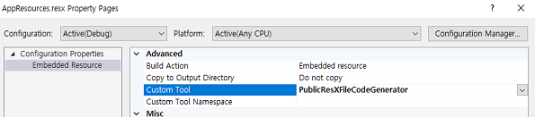
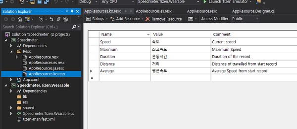
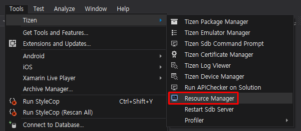
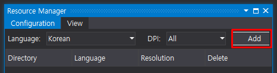
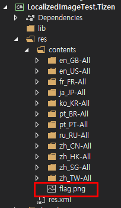

# Localization

This document describes how to localize your Tizen Xamarin.Forms applications with the following types of localization:

- [String localization](#string-localization)
- [Display the correct language](#display-the-correct-language)
- [Image localization](#image-localization)
- [Application name localization](#application-name-localization)

## String localization

You can begin by reading the following how-to article on Xamarin.Forms Localization.

For more information on string localization, see [Xamarin.Forms Localization](https://docs.microsoft.com/en-us/xamarin/xamarin-forms/app-fundamentals/localization/#string-and-image-localization){:target="_blank"}.

### Create a resource file

1. Add the `resx` resource files that will be used to store all the text used in your application.

    

    

2. Change the string visibility from internal to public. Select your `resx` file and click **Properties**. In the **Configuration Properties**, change **Custom Tool** to **PublicResXFileCodeGenerator** as shown in the following images:

    

    

3. Add language-specific resource files, which must follow a specific naming convention and use the same filename as the base resources file.

    

### Use a resource file

1. Use name of texts with string type in the `resx` files in your user interface code:

    ```csharp
    var speedLabel = new Label ();
    var maximumLabel = new Label ();

    speedLabel.Text = AppResources.Speed;
    maximumLabel.Text = AppResources.Maximum;
    ```

2. Use name of texts with string type in the `resx` files in the your `xaml` code:

    ```xml
    <Application
        x:Class="Speedmeter.App"
        xmlns="http://xamarin.com/schemas/2014/forms"
        xmlns:x="http://schemas.microsoft.com/winfx/2009/xaml"
        xmlns:local="clr-namespace:Speedmeter"
        xmlns:resx="clr-namespace:Speedmeter.Resx;"
        xmlns:w="clr-namespace:Tizen.Wearable.CircularUI.Forms;assembly=Tizen.Wearable.CircularUI.Forms">
        <Application.MainPage>
            <w:CirclePage>
                <CirclePage.Content>
                    <AbsoluteLayout>
                        <Label
                            x:Name="SpeedLabel"
                            AbsoluteLayout.LayoutBounds="0.5, 0.3"
                            AbsoluteLayout.LayoutFlags="PositionProportional"
                            Style="{StaticResource LabelStyle-Base}"
                            Text="{x:Static resx:AppResources.Speed}" />
                        <Label
                            x:Name="AverageLabel"
                            AbsoluteLayout.LayoutBounds="0.2, 0.7"
                            AbsoluteLayout.LayoutFlags="PositionProportional"
                            Style="{StaticResource LabelStyle-Base}"
                            Text="{x:Static resx:AppResources.Average}" />
    ```

## Display the correct language

To display the correct language, you must implement additional code in your project to determine which language the user has selected.

Please refer to the following Xamarin.Forms article.
For more information, see [Display the correct Language](https://docs.microsoft.com/en-us/xamarin/xamarin-forms/app-fundamentals/localization/text?tabs=vswin#displaying-the-correct-language){:target="_blank"}.

1. Define an interface to use your `DependencyService`:

    ```csharp
    public interface ILocalize
    {
        CultureInfo CurrentCultureInfo { get; }
        void SetLocale(CultureInfo ci);
    }
    ```

2. Implement the `DependencyService` in the Tizen platform project for getting the current system language setting (`SystemSettings` API is included in Tizen.Net NuGet package):

    ```csharp
    [assembly: Dependency(typeof(LocaleService))]

    namespace Speedmeter.Tizen.Wearable.DependencyService
    {
        class LocaleService : ILocalize
        {
            CultureInfo _currentCultureInfo;

            public LocaleService()
            {
                _currentCultureInfo = GetCurrentCultureInfo();
                // To get notified when system locale settings has been changed
                SystemSettings.LocaleLanguageChanged += LanguageChanged;
            }

            public CultureInfo CurrentCultureInfo
            {
                get
                {
                    return _currentCultureInfo;
                }
            }

            public void SetLocale(CultureInfo info)
            {

                Thread.CurrentThread.CurrentCulture = info;
                Thread.CurrentThread.CurrentUICulture = info;
            }

            CultureInfo GetCurrentCultureInfo()
            {
                var netLanguage = "en";
                var TizenLocale = SystemSettings.LocaleLanguage;
                netLanguage = TizenToDotnetLanguage(TizenLocale.ToString().Replace("_", "-"));
                CultureInfo info = null;
                try
                {
                    info = new CultureInfo(netLanguage);
                }
                catch (CultureNotFoundException e1)
                {
                    Console.WriteLine("cannot find the current cultureInfo. so use 'en'. (" + e1.Message + ")");
                    info = new CultureInfo("en");
                }

                return info;
            }

            private void LanguageChanged(object sender, LocaleLanguageChangedEventArgs e)
            {
                CultureInfo info = GetCurrentCultureInfo();
                _currentCultureInfo = info;
                // Notify the change of locale information
                MessagingCenter.Send<ILocalize, CultureInfo>(this, "LanguageChanged", info);
            }

            string TizenToDotnetLanguage(string tizenLanguage)
            {
                var netLanguage = tizenLanguage;
                //certain languages need to be converted to CultureInfo equivalent
                switch (tizenLanguage)
                {
                    case "zh-CN":   // Chinese Simplified (People's Republic of China)
                        netLanguage = "zh-Hans"; // correct code for .NET
                        break;
                    case "zh-HK":  // Chinese Traditional (Hong Kong)
                    case "zh-hk":
                    case "zh-tw":  // Chinese Traditional (Taiwan)
                    case "zh-TW":
                        netLanguage = "zh-Hant"; // correct code for .NET
                        break;
                }

                Console.WriteLine("[Speedmeter] .NET Language/Locale:" + netLanguage);
                return netLanguage;
            }
        }
    }

    ```

3. Use the `DependencyService` in the Xamarin.Forms application to call the interface and set your `resx` resource culture to the correct value.
You can receive the culture information using `MessagingCenter`. You can also update your application UI when your application is running and the system language has been changed:

    ```csharp
    var ci = DependencyService.Get<ILocalize>().CurrentCultureInfo;
    Resx.AppResources.Culture = ci; // set the RESX for resource localization
    DependencyService.Get<ILocalize>().SetLocale(ci);

    // Whenever language has been changed, CurrentCulture will be updated.
    MessagingCenter.Subscribe<ILocalize, CultureInfo>(this, "LanguageChanged", (obj, culture) =>
    {
        Resx.AppResources.Culture = culture;
        DependencyService.Get<ILocalize>().SetLocale(culture);
        //update your App UI
    });
    ```

## Image localization

Tizen project supports localized images (resources) using different resource directories.
Tizen uses res.xml file to specify the information about the directory, which contains the localized resources (for example: Image, Sound, and so on).
The res.xml file is automatically generated when you build your application.

**To add the localized resource directories in your application in Visual Studio:**

1. In Solution Explorer, select Tizen project. Go to **Tools &gt; Tizen &gt; Resource Manager**.

    

2. Resource Manager window appears. In **Configuration** tab, select from the language drop-down list.

    

3. Select the language, click **Add**.

    

    

4. Resource directories are automatically created in Tizen project as a **res.xml** file. This file is generated in **res** directory of Tizen project after building an application as:

    

    

    > [!NOTE]
    > Your application can sometimes run in a locale, for which you have not provided images. In that case, Tizen loads the default image from the resource content directory (yourApp.Tizen/res/content/). If there is no default image within the resource content directory and the device sets the locale, for which you have not provided images, an error occurs.

    

    When you detect locale changes, you must update the resource culture. Then you must update the texts and images, which you want to localize.
    As for localized images, you can make custom image renderer to load the proper locale-specific images.

    Tizen provides the path of locale-specific images via `ResourceManager.TryGetPath` and `ResourceManager.GetPath` methods. With this, you can change the class **LocalizedImageRenderer :ImageRenderer**:

    ```csharp
    using TizenResourceManager = Tizen.Applications.ResourceManager;

    public LocalizedImageRenderer() : base()
    {
        SystemSettings.LocaleLanguageChanged += SystemSettings_LocaleLanguageChanged;
    }

    // Invoked every time the language setting has been changed
    private void SystemSettings_LocaleLanguageChanged(object sender, LocaleLanguageChangedEventArgs e)
    {
        // Get the path of a proper image based on locale and update the source of an image
        Element.Source = TizenResourceManager.TryGetPath(TizenResourceManager.Category.Image, fileName);
    }
    ```

## Application name localization

You can add localized application names and icons using **tizen-manifest.xml** in the Tizen project using the following methods:

- Open the **tizen-manifest.xml**, select the **Localization** tab and click **Add** to add **Name**.

- Add application names for languages you want to support.


## Related information

- Dependencies
  - Tizen 4.0 and Higher
