# Localization

This document describes how to localize your Tizen .NET applications with the following types of localization:

- [String localization](#string-localization)
- [Display the correct language](#display-the-correct-language)
- [Image localization](#image-localization)
- [Application name localization](#application-name-localization)

## String localization

NUI resolves translatable strings through a standard [System.Resources.ResourceManager](https://learn.microsoft.com/dotnet/api/system.resources.resourcemanager){:target="_blank"}, which you assign to the `NUIApplication.MultilingualResourceManager` property. Text views then take a resource name instead of a literal string, and NUI looks that name up in the culture matching the current system language.

### Create a resource file

1. Add the `resx` resource files that will be used to store all the text used in your application.

    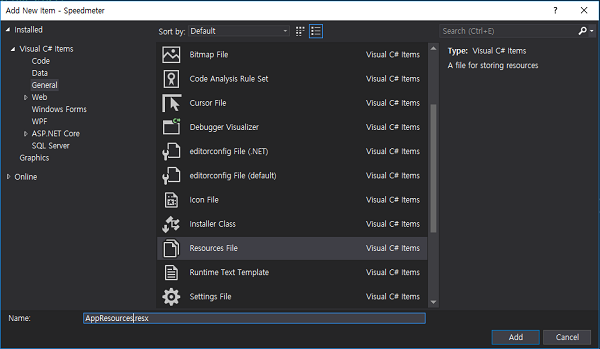

    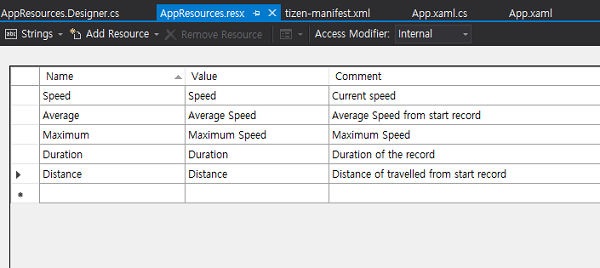

2. Change the string visibility from internal to public. Select your `resx` file and click **Properties**. In the **Configuration Properties**, change **Custom Tool** to **PublicResXFileCodeGenerator** as shown in the following images:

    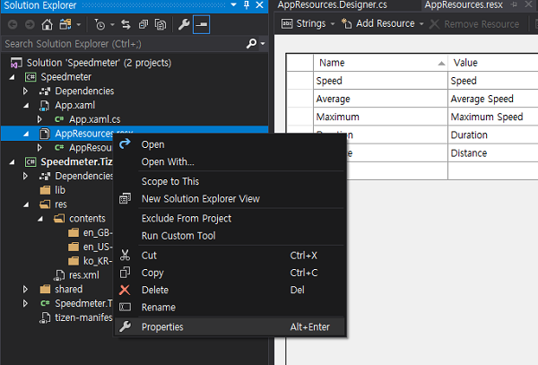

    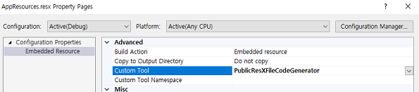

3. Add language-specific resource files, which must follow a specific naming convention and use the same filename as the base resources file.

    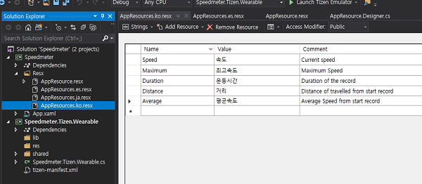

### Use a resource file

1. Register the generated resource manager when your application is created:

    ```csharp
    protected override void OnCreate()
    {
        base.OnCreate();

        NUIApplication.MultilingualResourceManager = AppResources.ResourceManager;
    }
    ```

2. Set the `TranslatableText` property instead of `Text`, and give it the name of the string in the `resx` files:

    ```csharp
    var speedLabel = new TextLabel();
    var maximumLabel = new TextLabel();

    speedLabel.TranslatableText = "Speed";
    maximumLabel.TranslatableText = "Maximum";
    ```

    > [!NOTE]
    > `TranslatableText` throws `ArgumentNullException` if `NUIApplication.MultilingualResourceManager` has not been set.

    `TextField` and `TextEditor` provide the same property, and also `TranslatablePlaceholderText` for their placeholder strings.

3. You can set the same property in XAML:

    ```XML
    <View x:Class="Speedmeter.MainPage"
      xmlns="http://tizen.org/Tizen.NUI/2018/XAML"
      xmlns:x="http://schemas.microsoft.com/winfx/2009/xaml">

      <TextLabel x:Name="SpeedLabel" TranslatableText="Speed" Position2D="100,300" />
      <TextLabel x:Name="AverageLabel" TranslatableText="Average" Position2D="100,400" />

    </View>
    ```

## Display the correct language

Text that you set through `TranslatableText` needs no extra code. `TextLabel`, `TextField`, and `TextEditor` follow the system language setting themselves: when it changes, they look the resource name up again in the new culture and update what they display.

Handle the change yourself only when you have something else to update, such as text you set through `Text`, formatted numbers and dates, or localized images. Override the `OnLocaleChanged` method of your `NUIApplication`:

```csharp
protected override void OnLocaleChanged(LocaleChangedEventArgs e)
{
    base.OnLocaleChanged(e);

    CultureInfo culture;
    try
    {
        culture = new CultureInfo(e.Locale.Replace("_", "-"));
    }
    catch (CultureNotFoundException)
    {
        culture = new CultureInfo("en");
    }

    Thread.CurrentThread.CurrentCulture = culture;
    Thread.CurrentThread.CurrentUICulture = culture;

    // Update anything that is not bound to TranslatableText
}
```

> [!NOTE]
> Call `base.OnLocaleChanged()`. If you do not, the `LocaleChanged` event is not raised.

Tizen reports a locale in the `<LANGUAGE>_<REGION>` syntax, such as `ko_KR`, while `CultureInfo` expects `ko-KR`. Replace the separator before constructing the `CultureInfo`, as in the preceding example. A few Tizen language codes have no direct `CultureInfo` equivalent and need mapping of their own: `zh-CN` corresponds to `zh-Hans`, and `zh-HK` and `zh-TW` correspond to `zh-Hant`.

Take the new locale from the `Locale` property of the event argument rather than reading `SystemSettings.LocaleLanguage`, which is documented as requiring the `http://tizen.org/privilege/systemsettings.admin` privilege at the platform privilege level and throws `UnauthorizedAccessException` without it.

## Image localization

Tizen project supports localized images (resources) using different resource directories.
Tizen uses res.xml file to specify the information about the directory, which contains the localized resources (for example: Image, Sound, and so on).
The res.xml file is automatically generated when you build your application.

**To add the localized resource directories in your application in Visual Studio:**

1. In Solution Explorer, select Tizen project. Go to **Tools &gt; Tizen &gt; Resource Manager**.

    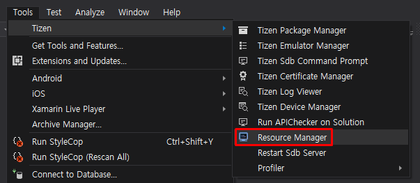

2. Resource Manager window appears. In **Configuration** tab, select from the language drop-down list.

    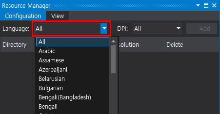

3. Select the language, click **Add**.

    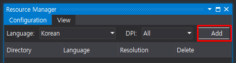

    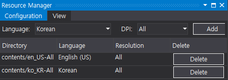

4. Resource directories are automatically created in Tizen project as a **res.xml** file. This file is generated in **res** directory of Tizen project after building an application as:

    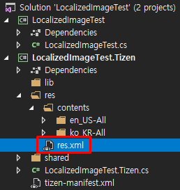

    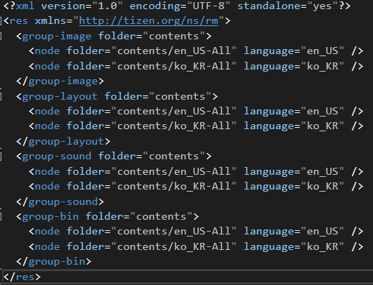

    > [!NOTE]
    > Your application can sometimes run in a locale, for which you have not provided images. In that case, Tizen loads the default image from the resource content directory (res/content/). If there is no default image within the resource content directory and the device sets the locale, for which you have not provided images, an error occurs.

    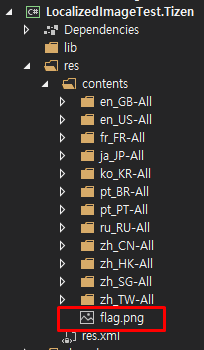

Unlike translatable text, images are not updated for you. Ask `Tizen.Applications.ResourceManager` for the path that matches the current locale and assign it to the `ResourceUrl` property of your `ImageView`:

```csharp
using TizenResourceManager = Tizen.Applications.ResourceManager;

protected override void OnLocaleChanged(LocaleChangedEventArgs e)
{
    base.OnLocaleChanged(e);

    // Get the path of a proper image based on locale and update the source of an image
    icon.ResourceUrl = TizenResourceManager.TryGetPath(TizenResourceManager.Category.Image, fileName);
}
```

> [!NOTE]
> `TryGetPath()` returns `null` when the resource does not exist. `GetPath()` throws `InvalidOperationException` in the same situation.

## Application name localization

You can add localized application names and icons using **tizen-manifest.xml** in the Tizen project using the following methods:

- Open the **tizen-manifest.xml**, select the **Localization** tab and click **Add** to add **Name**.

- Add application names for languages you want to support.

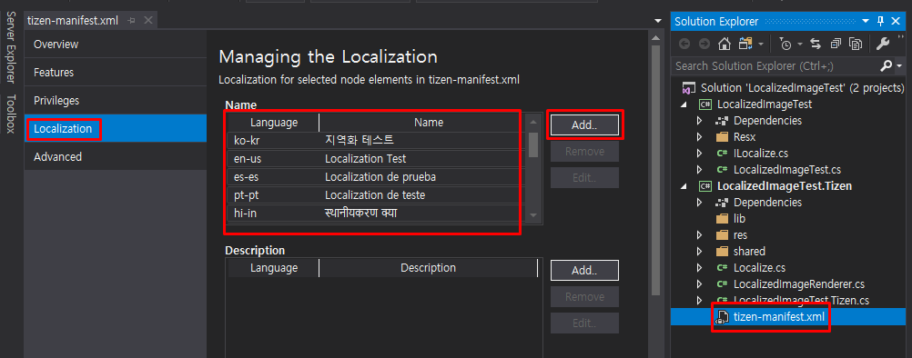

Each name you add becomes a `<label>` element with an `xml:lang` attribute, so you can also edit them directly:

```XML
<ui-application appid="org.tizen.example.Speedmeter" exec="Speedmeter.dll" type="dotnet">
    <label>Speedmeter</label>
    <label xml:lang="en-us">Speedmeter</label>
    <label xml:lang="ko-kr">속도계</label>
</ui-application>
```

The `<label>` element without `xml:lang` is the fallback used when the device locale matches none of the others. Icons are localized the same way, with an `xml:lang` attribute on the `<icon>` element.

## Related information

- Dependencies
  - Tizen 4.0 and Higher
