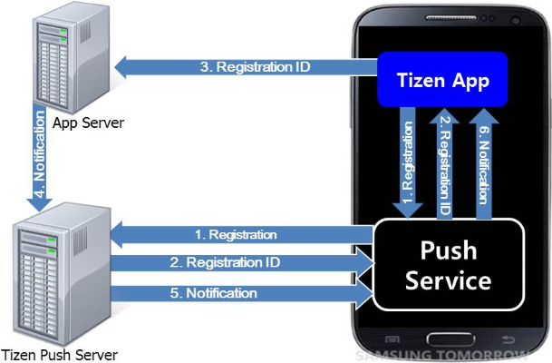

# Push


You can push events from an application server to your application on a Tizen device.

Once your application is successfully registered in the push server through the [push service](#service) (daemon) on the device, your application server can send push messages to the application on that particular device.

If a push message arrives when the application is running, the message is automatically delivered to the application. If the application is not running, the push service makes a sound or vibrates and adds a ticker or a badge notification to notify the user. By touching this notification, the user can check the message. If the application server sends a message with a `LAUNCH` option, the push service forcibly launches the application and hands over the message to the application.

The main features of the Tizen.Messaging.Push namespace include:

-   Connecting to the push service

    You can [establish a socket connection to the push service](#connect).

- Registering with the push server

    You can [obtain a registration ID to receive push notifications](#registration).

- Managing security

    You need to [take care of security issues](#security) when sending notifications containing sensitive information.

- Sending push notifications

    You can [send push notifications](#send) from the application server to an application.

- Receiving push notifications

    You can [receive notifications](#receive_push) in the application at different application states.

**Figure: Push messaging service**


<a name="service"></a>
## Service Architecture

The following figure illustrates the service architecture of the Tizen push messaging service.

**Figure: Service architecture**



The following steps illustrate a typical scenario for using the push messaging service on a Tizen device:

1.  The application on the device registers for the push messaging service.
2. When an application is installed and launched, the device establishes a push session with the Tizen Server by sending a registration request to the Tizen push server through the push service.

    The push session is managed by the Tizen server and device platform, so there is no need to create any code to manage it within the application.

3. If the registration request is approved, the application receives a registration ID through the push service. The registration ID is a unique key used to identify the application installed on that particular device and route the push message.

    The application delivers the registration ID to the application server. This registration ID is used to identify the application installed on that particular device.

4. When the application server needs to send a push message to the application on the particular device, it calls the Tizen server's open API to send the message together with the registration ID. (For more information for server developers on sending push messages, see [Sending Push Notifications](push-server.md#send_server).)

    A text message of up to 1024 bytes can be sent in a push message. If the application needs to download a large amount of data, the application server sends a link to the data in the push message.

5. When the Tizen push server receives the message and the registration ID, it checks which device has the application with the particular registration ID and then routes the message to that device.
6. When the push service receives the message and the registration ID, it sends the message to the destination application, which receives the push message.

## Prerequisites


To enable your application to use the push functionality:

1.  To use the [Tizen.Messaging.Push](https://developer.tizen.org/dev-guide/csapi/api/Tizen.Messaging.Push.html) namespace, the application has to request permission by adding the following privilege to the `tizen-manifest.xml` file:

    ```
    <privileges>
       <privilege>http://tizen.org/privilege/push</privilege>
    </privileges>
    ```

2. Make sure the following requirements are fulfilled:

    -   Internet access

        To connect to the Tizen push server and receive notifications from it, the target device or emulator must be able to contact any IP address with the port 5223. If you are in an enterprise network, ensure that the proxy setting in your local network allows outgoing traffic destined for this port number.

    - Package ID

        When you create a project in the Tizen Studio, you are given the package ID (randomly generated by the Tizen Studio or entered by yourself). The Tizen push server identifies your applications using the package ID.

    - Permission to Tizen push servers

        To use the push messaging service, the application needs the permission to access the Tizen push server. Request the permission from the Tizen push service team using one of the following online request forms:

        -   [Request the permission for a new application](https://developer.tizen.org/webform/request-permission-tizen-push-service)
        -   [Extend the expiration date or change the quota](https://developer.tizen.org/webform/request-extend-expiration-date-or-change-quota) for an application that already has the permission to use the push messaging service

        When the team approves the request, you receive a push app ID corresponding to your package ID.

3. To use the methods and properties of the Tizen.Messaging.Push namespace, include it in your application:

    ```
    using Tizen.Messaging.Push;
    ```


> **Note**   
> The push service supports launching an application in the background. Remember that you can deliver application data to your application without an unwanted UI launch.


<a name="connect"></a>
## Connecting to the Push Service

To manage push service connections:

1.  Define event handlers:

    -   `EventHandlerStateChanged()` is triggered when the connection state changes.
    -   `EventHandlerNotificationReceived()` is triggered when the push notification is received from the push service.

    ```
    public static void EventHandlerStateChanged(object sender, PushConnectionStateEventArgs e)
    {
        /// State change events
    };

    public static void EventHandlerNotificationReceived(object sender, PushMessageEventArgs e)
    {
        /// Notification received events
    };
    ```

2.  Register the event handlers for the `StateChanged` and `NotificationReceived` events of the [Tizen.Messaging.Push.PushClient](https://developer.tizen.org/dev-guide/csapi/api/Tizen.Messaging.Push.PushClient.html) class and connect to the push service with the `PushServiceConnect()` method:

    ```
    try
    {
        string pushAppId = "YOUR_PUSH_APP_ID";

        PushClient.StateChanged += EventHandlerStateChanged;
        PushClient.NotificationReceived += EventHandlerNotificationReceived;

        PushClient.PushServiceConnect(pushAppId);
        PushClient.GetUnreadNotifications();
    }
    catch (Exception e)
    {
        Console.WriteLine("Exception occurred" + e.ToString());
    }
    ```

    After calling the `PushServiceConnect()` method, the application establishes a socket connection to the push service:

    -   The `YOUR_PUSH_APP_ID` parameter is the push app ID received from the Tizen push server team when the access to the server was requested. Keep this push app ID confidential, otherwise your push notifications can be hijacked by malicious applications.
    -   If the `PushServiceConnect()` method catches any exception, it means the connection to the service failed. This happens most likely when the [push privilege](#prerequisites) is not added into the application manifest.

    If the connection with the push service succeeds, the application must request the unread notification messages sent during the disconnected state by using the `GetUnreadNotification()` method.

    Establish a connection to the push service when the application is launched and disconnect from the service when it terminates. The application can be resumed after being paused. To ensure that push notifications are handled fluently, the `PushServiceConnect()` method must be called when the application is resumed.

3.  Disconnect from the push service.

    When the application terminates or no longer uses the push service, close the connection using the `PushServiceDisconnect()` method.

    The `PushServiceDisconnect()` method returns all the resources allocated for the connection.

    ```
    PushClient.PushServiceDisconnect();
    ```

    The connection is automatically closed when the application terminates. Hence, if the application uses the push service while being launched, it does not need this method.

    The application can also disconnect the service in the middle of the application operation. If you add a toggle switch to the application for switching the push service on and off, call this method when the service is switched off. Do not call this method inside any event handlers, however, since it can cause the application to crash.

    The application can be paused by pressing the **Home** or **Back** key. For a proper push operation, the `PushServiceDisconnect()` method must be called when the application is paused.

<a name="state"></a>

4.  Handle state transitions.

    After the connection to the service is made, the application is notified whenever the connection state changes. This notification is conducted through the `EventHandlerStateChanged()` event handler. The following figure illustrates the possible states of the push service.

    

    Once launched, the application is in the `Initial` state. When the application establishes a connection to the service using the `PushServiceConnect()` method, the state becomes either `Unregistered` or `Registered`:

    -   If the application is currently registered to the push server, the service forces it to transit from the `Initial` state to the `Registered` state. In this case, the application can request deregistration from the push server using the `PushServiceDeregister()` method. If this request is approved by the push server, the state transits to `Unregistered`.
    -   If the application is not currently registered to the push server, the state transits from the `Initial` state to the `Unregistered` state. In this case, the application can request registration to the push server using the `PushServiceRegister()` method. If this request is approved by the push server, the state transits to `Registered`.
    -   When an error occurs, the state transits to `Error`.

    When the current state transits, the `EventHandlerStateChanged()` event handler is called and the new state is obtained. Determine the application actions based on the new state:

    ```
    public static void EventHandlerStateChanged(object sender, PushConnectionStateEventArgs e)
    {
        switch (e.state)
        {
            case PushConnectionStateEventArgs.PushState.Unregistered:
                Console.WriteLine("Arrived at STATE_UNREGISTERED");
                OnStateUnregistered();
                break;
            case PushConnectionStateEventArgs.PushState.Registered:
                Console.WriteLine("Arrived at STATE_REGISTERED");
                OnStateRegistered();
                break;
            case PushConnectionStateEventArgs.PushState.StateError:
                Console.WriteLine("Arrived at STATE_ERROR" + e.Error);
                OnStateError();
                break;
            default:
                Console.WriteLine("Unknown State");
                break;
        }
    }
    ```

    In the above example, the `OnStateRegistered()`, `OnStateUnregistered()`, and `OnStateError()` methods contain the actions for the `Registered`, `Unregistered`, and `StateError` states, respectively. The application does not need to handle the `Initial` state, because it is maintained internally, and this event handler is never invoked in that state. The `e.Error` is the error message from the push service when the state becomes `StateError`.

    The registration state is subject to change. Consequently, make sure that the application connects to the push service whenever it is launched.

<a name="registration"></a>
## Registering with the Push Server

To receive push notifications, the application must send a registration request to the Tizen push server. When the server receives this request, it assigns a registration ID that is unique to the application on the particular device. When sending a notification from your application server, this registration ID is used as a destination address of the application. If the application no longer needs to receive push notifications, it needs to send a deregistration request to the server.

To register with the push server:

1.  Request registration.

    After connecting to the push service, request registration using the `PushServerRegister()` method of the [Tizen.Messaging.Push.PushClient](https://developer.tizen.org/dev-guide/csapi/api/Tizen.Messaging.Push.PushClient.html) class.

    ```
    public static void OnStateUnregistered()
    {
        Task<ServerResponse> tr = PushClient.PushServerRegister();
        tr.GetAwaiter().OnCompleted() =>
        {
            ServerResponse res = tr.Result;
        }
    }
    ```

    The `OnStateUnregistered()` method containing the `PushServiceRegister()` method is called when the state transits to `Unregistered`. This sample application is designed to send the registration request as soon as it is connected to the push service. If the application requires users to log in to the service, this registration request must be sent after the login process is complete.

    The registration request is non-blocking. If the push service successfully sends the request to the server and receives an approval, the `res` value is `Success`.

    When an error occurs in the middle of the registration process, the reason is returned. For example, if the push server is not responding, the `ServerResponse res` returns `Timeout`. In this case, the application does not need to request registration again because the push service keeps the previous request and sends it when the network becomes online.

2. Handle the transit to the `Registered` state.

    The application transits to the `Registered` state in one of the following cases:

    -   The registration request sent at the `Unregistered` state is approved.
    -   The already-registered application at the `Initial` state is successfully connected to the push service.

    In both cases, the `EventHandlerStateChanged()` is called with the `Registered` value. The application calls the `OnStateRegistered()` method immediately, [as shown in the state transitions](#state). When defining the actions inside the method, keep the following points in mind:

    -   If the application has already been registered, request the push service for any unread notifications that have arrived before the application is launched.

        Request the unread notifications asynchronously. If there is such a notification, it can be received through the `EventHandlerNotificationReceived()` event handler after the `OnStateRegistered()` method returns.

    - If the application is newly registered, send the registration ID issued by the push server to your application server.

        If the ID is new or updated, you need to send it to your application server. This ID is used as a destination address to the application on a particular device. If the application has already sent the ID, you can skip this step.

    ```
    public static void OnStateRegistered()
    {
        /// Request unread notifications to the push service
        /// EventHandlerNotificationReceived() is called if there are unread notifications
        PushClient.GetUnreadNotifications();

        /// Get the registration ID
        string id = PushClient.GetRegistrationId();

        /// Send registration ID to your application server if necessary
    }
    ```

3. Request deregistration.

    When the application no longer wants to receive push notifications, use the following method to request deregistration:

    ```
    Task<ServerResponse> tu = PushClient.PushServerUnregister();
    tu.GetAwaiter().OnCompleted(() =>
    {
        ServerResponse res = tu.Result;
    }
    ```

    >**Note**
    >
    >The `PushServiceUnregister()` method is not used if the application is intended to receive push notifications continuously while it is installed on the device. When the application is uninstalled, the push service detects the event and deregisters the application automatically.  
    >
    >On the other hand, if the application wants to receive push notifications only when a user logs in, the `PushServiceUnregister()` method must be called whenever the user logs out.


<a name="security"></a>
## Managing Security

When you send a notification with sensitive information, be aware of the chance that the notification gets hijacked by someone else. It is your responsibility to keep such sensitive information safe from malicious access. The following rules are strongly recommended:

-   Keep the push application ID confidential.

    If the application ID is exposed, hackers can try to hijack notifications using a fake application with the exposed ID.

- Do not store the registration ID on the device.

    The registration ID can be considered as the destination address for notifications. Without the ID, hackers cannot send fake notifications to your application.

- Encrypt sensitive information.

    When you send sensitive information, such as personal information and financial transactions, encrypt it and load it to the notification as a payload instead of the message field. When the notification arrives at the device, the application decrypts the payload and retrieves the sensitive information.

- Do not hardcode the AppSecret in the source code.

    The AppSecret is a key to accessing the push server for sending notifications. If notifications are sent from your application server, the application does not need to know the AppSecret at all. Keep the AppSecret on the server and do not load any related information in the application. If you want device-to-device notification delivery without your application server, the application needs the AppSecret to send a notification from a device. In this case, it is your responsibility to keep the AppSecret safe.

<a name="send"></a>
## Sending Push Notifications

Once the application successfully sends its registration ID to the application server, you are ready to send push notifications from the application server to the application on that particular device. This use case describes how to send a simple push notification to the device. For advanced features, see the [Push Server](push-server.md) guide for server developers.

The following example shows a sample push notification:

-   URI: See the [Push RQM (Request Manager) server URLs table](push-server.md#send_server).
- Method: HTTP POST
- Header:

    ```
    appID: 1234567890987654
    appSecret: dYo/o/m11gmWmjs7+5f+2zLNVOc=
    ```

- Body:

    ```
    {
        "regID": "0501a53f4affdcbb98197f188345ff30c04b-5001",
        "requestID": "01231-22EAX-223442",
        "message": "badgeOption=INCREASE&badgeNumber=1&action=ALERT&alertMessage=Hi",
        "appData": "{id:asdf&passwd:1234}", /* Optional, if the message field is not empty */
    }
    ```

To send a notification:

1.  Prepare the `appID`, `appSecret`, `regID`, and `requestID`:
    -   The `appID` and `appSecret` values are given in the email message that you receive when requesting [permission to use Tizen push servers](#permission).
    -   The `regID` value is the one that the application server received from your application installed on a Tizen device. Depending on the `regID` value, the URI of the server to which your application server sends the notification varies.
    -   The `requestID` value is used to identify the notification in the push server. When your application server sends notifications using the same `requestID` value, the last notification overwrites all the previous notifications that are not delivered yet.

2. Use the message field to describe how to process the notification.

    The message field contains not only the message to show in the quick panel on the device, but also the behaviors that the device must take when receiving the notification. The message field is a string that consists of key-value pairs. The available pair options are given in the following table.

    **Table: Message field key-value pairs**

    | Key            | Value                                    | Description                              |
    |--------------|----------------------------------------|----------------------------------------|
    | `action`       | `ALERT`: Store the message and alert the user.<br>`SILENT`: Store the message without alerting the user.<br>`DISCARD`: Discard the message, if the application is not up and running.<br>`LAUNCH`: Forcibly launch the application and deliver the notification.<br>`BACKGROUNDLAUNCH`: Launch the application in the background and deliver the notification. | Action to be performed if the application is not running. If no action is defined, the default behavior is `SILENT`. |
    | `alertMessage` | Up to 127 bytes                          | Alert message shown to the user in the quick panel. If the action is not set as `ALERT`, this value is meaningless. |
    | `badgeOption`  | `INCREASE`: Increase the badge number by the given value.<br>`DECREASE`: Decrease the badge number by the given value.<br>`SET`: Set badge number to the given value. | Option for updating the icon badge number. If the action is set as `DISCARD`, the `badgeOption` is ignored. If the badge option is not included, the icon badge number remains unchanged. |
    | `badgeNumber`  | 0-999                                    | -                                        |

    For example, to show a "Hi" message in the quick panel and increase the badge count by 1 when the notification arrives at the device, the message field of the notification must be the following:

    ```
    "badgeOption=INCREASE&badgeNumber=1&action=ALERT&alertMessage=Hi"
    ```

    If you want to deliver the notification directly to your application, the message field must be the following:

    ```
    "action=LAUNCH"
    ```

    When the push service on the target device receives a notification with this message, it launches your application and delivers the notification. For more information, see how to [receive notifications when the application is not running](#recv_noti_app_not_run).

    The message field takes effect only when the application is not running (more precisely, when the application is not connected to the push service). If a notification with the above message field arrives at the device where the application is running, the push service delivers the notification directly to the application. It does not show the "Hi" message in the quick panel or increase the badge count.

3. Load your own data to the `appData` field as a string.

    This use case focuses on how an application developer can construct a notification. For advanced features, see the [Push Server](push-server.md) guide for server developers.

<a name="receive_push"></a>
## Receiving Push Notifications

When a notification arrives at the device, its delivery mechanism depends on whether the application is running.

To handle incoming push notifications:

-   Receive notifications when the application is running.

    When a notification arrives to the application while it is running (more precisely, while the application is connected to the service), the `EventHandlerNotificationReceived()` event handler is called. You can handle the received notification in the event handler.

    The following example shows how the application can retrieve the app data (payload), message, and timestamp from the received notification. When the `EventHandlerNotificationReceived()` event handler is called, you can retrieve the app data, message, and time stamp from `e.AppData`, `e.Message`, and `e.ReceivedAt` respectively.

    ```
    public static void EventHandlerNotificationReceived(object sender, PushMessageEventArgs e)
    {
        Console.WriteLine("Notification Data: " + e.AppData);
        Console.WriteLine("Notification Message: " + e.Message);
        Console.WriteLine("Notification Timestamp: " + e.ReceivedAt);
        Console.WriteLine("Notification RequestId: " + e.RequestId);
        Console.WriteLine("Notification Sender: " + e.Sender);
        Console.WriteLine("Notification SessionInfo: " + e.SessionInfo);
        Console.WriteLine("Notification Type: " + e.Type);
    }
    ```

- Receive notifications when the application is not running.

    If the notification arrives when the application is not running, it can be handled in 3 ways:

    -   <a name="force_launch"></a>Forcibly launch the application and deliver the notification to it.

        You need to set the action to `LAUNCH` in the message field when sending the notification from the application server. When the notification action arrives at the device, the push service forcibly launches the application and delivers the notification.

        By the way, when the application is launched by the push service, you need to determine the reason for the application launch and react to it appropriately.

        The push service provides launch types when the application is launched by the service. Use the following code to figure out why the application is launched in both cases of receiving notification and changing registration state.

        1.  Get the requested application control:

            ```
            public static Tizen.Applications.AppControl _appCtrl;
            public static Tizen.Applications.AppControl.ExtraDataCollection _extraDataSet;

            _appCtrl = new AppControl();
            _extraDataSet = _appCtrl.ExtraData;
            ```

        2. Determine the reason for the application launch. If the reason for the launch is a notification, retrieve the latest push message.

            ```
            string GettedValue = "";
            bool isGetted = _extraDataSet.TryGet("http://tizen.org/appcontrol/data/push/launch_type", out GettedValue);

            if (isGetted)
            {
                if (GettedValue == "notification")
                    /// Add your code here for when push messages arrive
                else if (GettedValue == "registration_change")
                    /// Add your code here for when registration state is changed
            }
            ```

    - Store the notification at the push service database and request it later when the application is launched.

        You need to set the action to `ALERT` or `SILENT` in the message field when sending the notification from the application server. When such a notification arrives at the device, the push service keeps the notification in the database and waits for the request from the application.

        You can request for unread notifications from the push service. The request can be performed after connecting to the push server when the application is launched.

        ```
        PushClient.GetUnreadNotifications();
        ```

        The difference between the `ALERT` and `SILENT` actions is that the former shows an alert message in the quick panel and changes the badge count, while the latter does not. If the user clicks the alert message in the quick panel, the push service [forcibly launches the application](#force_launch) and delivers the notification through the app control.

    - Discard the notification.

        You need to set the action to `DISCARD` in the message field when sending the notification from the application server. When such a notification arrives at the device, the push service delivers the notification only when the application is up and running. Otherwise, the push service does not store the notification and discards it.


## Related Information
* Dependencies
  -   Tizen 4.0 and Higher
