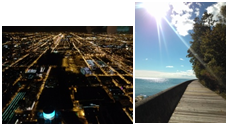
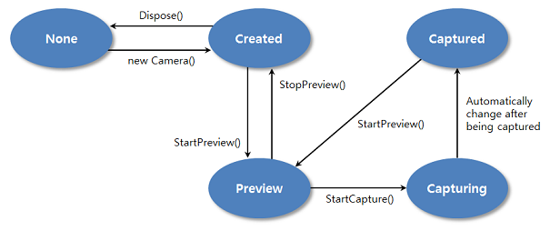

# Camera


You can use basic camera features, including preview and capture. You can capture still images with the device's internal camera and keep images on your target device.

**Figure: Camera image examples**



The main features of the `Tizen.Multimedia.Camera` class include:

-   Configuring the camera

    You can [configure the camera](#configuring_callback) and set the camera and auto-focus event handlers.

-   Setting the display for the camera preview

    You can preview images in real time with the `StartPreview()` method of the `Tizen.Multimedia.Camera` class. The feature provides:

    -   Support for several pixel formats, such as NV12, NV12T, NV16, NV21, YUYV, UYVY, and YUV420P
    -   Preview at the frame rate
    -   Rotation and flip of the preview

    You can also [customize the display settings for the camera preview](#display).

-   Capturing and saving images

    You can start the camera preview and [capture an image](#photo).

-   Setting camera attributes

    You can [control the camera settings](#attributes):

    -   Contrast
    -   Exposure
    -   Brightness
    -   Effects
    -   ISO
    -   White balance
    -   Zoom
    -   Flash
    -   Focus
    -   Metering
    -   EXIF tag (geo, orientation, software info and description)
    -   Scene mode, HDR, theater
    -   Image quality

    Depending on the camera device type, the device can support different orientations, resolutions, or preview and capture formats. You can obtain this information from the device using the `SupportedPreviewResolutions`, `SupportedCapturePixelFormats`, or other `SupportedXXX` properties of the [Tizen.Multimedia.CameraCapabilities](https://developer.tizen.org/dev-guide/csapi/api/Tizen.Multimedia.CameraCapabilities.html) class.

    Since devices can have multiple camera sensors with different capabilities, create a `Tizen.Multimedia.Camera` instance with a proper [Tizen.Multimedia.CameraDevice](https://developer.tizen.org/dev-guide/csapi/api/Tizen.Multimedia.CameraDevice.html) enumeration value, determining which camera sensor is used. Usually the primary sensor is located on the back side and the secondary sensor on the front side of the device. Once the camera sensor is selected, the selected sensor starts working.

    > **Note**
    >
    > Simultaneous use of multiple camera sensors is not allowed.  
    > The target device often supports more functionalities than the emulator.  
    > The behavior of the shutter sound can vary depending on the legislation of each country.


-   Releasing resources

    When you have finished working with the camera, you can [release the resources](#release).

The following figure illustrates the camera state changes in normal mode.

**Figure: Camera states in normal mode**



## Prerequisites

To enable your application to use the camera functionality:

1.  Create a camera instance:

    ```
    try
    {
        Camera camera = new Camera(CameraDevice.Rear);
    }
    catch (Exception ex)
    {
        Log.Error("Camera", "Creating camera instance failed. " + ex.ToString());
    }
    ```

    The `CameraDevice.Rear` parameter means that the currently-activated device camera is the primary camera. You can select between the rear (primary) and front (secondary) camera. The available parameter values are defined in the [Tizen.Multimedia.CameraDevice](https://developer.tizen.org/dev-guide/csapi/api/Tizen.Multimedia.CameraDevice.html) enumeration.

2.  Check the current state of the camera using the `State` property of the [Tizen.Multimedia.Camera](https://developer.tizen.org/dev-guide/csapi/api/Tizen.Multimedia.Camera.html) class:

    ```
    CameraState state;

    /// Check the camera state after creating the camera
    state = camera.State;
    ```

    The returned state is one of the values defined in the [Tizen.Multimedia.CameraState](https://developer.tizen.org/dev-guide/csapi/api/Tizen.Multimedia.CameraState.html) enumeration. If the state is not `Created`, re-initialize the camera by recreating the instance.

<a name="configuring_callback"></a>
## Configuring the Camera

After setting up the necessary prerequisites, configure the camera and set the camera preview event handler.

To configure the camera:

1.  Set the image quality using the `ImageQuality` property of the [Tizen.Multimedia.CameraSettings](https://developer.tizen.org/dev-guide/csapi/api/Tizen.Multimedia.CameraSettings.html) class:

    ```
    camera.Settings.ImageQuality = 100;
    ```

    The image quality value can range from 1 (lowest quality) to 100 (highest quality).

2.  Set the display for showing preview images by using the `Display` property of the [Tizen.Multimedia.Camera](https://developer.tizen.org/dev-guide/csapi/api/Tizen.Multimedia.Camera.html) class with 1 of the camera display types (`ElmSharp.Window` overlay or `Tizen.Multimedia.MediaView` EVAS surface).

    The following examples set the display according to the above display types. The camera state must be `Created`.

    ```
    /// Overlay display type
    camera.Display = new Display(new Window("CameraWindow"));

    /// EVAS surface display type
    camera.Display = new Display(new MediaView(new Window("CameraWindow")));
    ```

3.  Set the camera preview resolution using the `PreviewResolution` property of the `Tizen.Multimedia.CameraSettings` class. You must set this property before previewing.

    To find out which resolutions can be set for the camera preview on a specific device, use the `SupportedPreviewResolutions` property of the [Tizen.Multimedia.CameraCapabilities](https://developer.tizen.org/dev-guide/csapi/api/Tizen.Multimedia.CameraCapabilities.html) class. This property returns an `IEnumerable` variable.

    The following example sets the camera preview resolution to the first found supported resolution:

    ```
    IList supportedResolutions = _camera.Capabilities.SupportedPreviewResolutions.ToList();
    foreach(Size resolution in supportedResolutions)
    {
        camera.Settings.PreviewResolution = resolution;
        break;
    }
    ```

4.  Set the capture format using the `CapturePixelFormat` property of the `Tizen.Multimedia.CameraSettings` class:

    ```
    camera.Settings.CapturePixelFormat = CameraPixelFormat.Jpeg;
    ```

    The [Tizen.Multimedia.CameraPixelFormat](https://developer.tizen.org/dev-guide/csapi/api/Tizen.Multimedia.CameraPixelFormat.html) enumeration defines the available capture formats.

5.  Register event handlers for managing various events of the `Tizen.Multimedia.Camera` class, related to the camera preview, auto-focus, and capturing:
    -   <a name="callbacks_preview"></a>To handle the camera preview, register an event handler for the `Preview` event. The event handler is invoked once per frame during a preview.

        ```
        public static void PreviewEventHandler(object sender, PreviewEventArgs e)
        {
            /// Do something
        }

        camera.Preview += PreviewEventHandler;
        ```

    -   <a name="callbacks_focus"></a>To receive notifications about auto-focus state changes, register an event handler for the `FocusStateChanged` event. The event handler is invoked every time the auto-focus state changes.

        ```
        public static void FocusStateChangedEventHandler(object sender, CameraFocusStateChangedEventArgs e)
        {
            Log.Info("Camera", "Focus state is changed to " + e.State.ToString());
        }

        camera.FocusStateChanged += FocusStateChangedEventHandler;
        ```

        Before auto-focusing starts, the auto-focus state is `Released`. After the `StartFocusing()` method is called, the camera starts auto-focusing and the state changes to `Ongoing`. If auto-focusing finishes successfully, the state changes to `Focused`. If auto-focusing fails, the state changes to `Failed`.

    -   To receive a captured still image, register an event handler for the `Capturing` event. The event handler is invoked once for each captured frame, and is used to get information about the captured image.

        The image is saved in the format set by the `CapturePixelFormat` property of the `Tizen.Multimedia.CameraSettings` class in the previous step.

        The following event handler example saves the captured frame as a JPEG image:

        ```
        public static void CapturingEventHandler(object sender, CameraCapturingEventArgs e)
        {
            if (e.MainImage != null)
            {
                /// PostView and Thumbnail can be null
                if (e.MainImage.Data.Length > 0)
                {
                    File.WriteAllBytes("StillImage.jpg", e.MainImage.Data);
                }
            }
        }

        camera.Capturing += CapturingEventHandler;
        ```

    -   To receive a notification when the image has been captured, register an event handler for the `CaptureCompleted` event. The event handler is invoked after the event handler of the `Capturing` event completes, and is used for notification and for restarting the camera preview.

        The following event handler example restarts the camera preview:

        ```
        public static void CaptureCompletedEventHandler(object sender, EventArgs e)
        {
            camera.StartPreview();
        }

        camera.CaptureCompleted += CaptureCompletedEventHandler;
        ```
<a name="display"></a>
## Setting the Display for the Camera Preview

Before displaying the camera preview on the screen, check the camera display settings. You can use the default display settings provided by the Camera framework, or you can customize the display settings to meet your needs.

To customize the display settings:

-   Camera selection and orientation

    Before you can correctly customize the display settings, you need to know which camera is active (front or back) and at what angle the physical camera is being held (orientation):

    -   To determine the active camera, check the [Tizen.Multimedia.CameraDevice](https://developer.tizen.org/dev-guide/csapi/api/Tizen.Multimedia.CameraDevice.html) enumeration value:

        ```
        public enum CameraDevice
        {
            Rear, /// Rear camera
            Front /// Front camera
        }
        ```

        The rear camera is usually the primary camera, and the front camera is usually the secondary camera. If, for example, you created the camera instance for the primary camera, the camera preview shows the rear camera view.

    -   To determine the current camera angle, use the `LensOrientation` property of the [Tizen.Multimedia.CameraSettings](https://developer.tizen.org/dev-guide/csapi/api/Tizen.Multimedia.CameraSettings.html) class:

        ```
        int angle = camera.Settings.LensOrientation;
        ```

        The returned value of the `angle` variable is in degrees.

    Once you know the active camera and its current orientation angle (or tilt), you can calculate how to rotate the display to match the camera orientation, and whether and how to flip the display to create the mirror effect if the front camera is active.

    To correctly rotate the display as the camera orientation changes, think about the orientation and direction of the physical camera lens relative to the display. If the camera faces away from the display, the camera orientation is calculated clockwise across the display. If the camera faces the same way as the display, the camera orientation is calculated counter-clockwise across the display. For example, if the camera and display face in opposite directions, the right side of the image is at 90 degrees, and if the camera and display face in the same direction, the right side is at 270 degrees (360 - 90).

-   Display rotation

    The display rotation setting is preset to a default value for each camera. Before changing the display rotation value, retrieve the default value using the `Rotation` property of the [Tizen.Multimedia.CameraDisplaySettings](https://developer.tizen.org/dev-guide/csapi/api/Tizen.Multimedia.CameraDisplaySettings.html) class:

    ```
    Rotation rotation = camera.DisplaySettings.Rotation;
    ```

    Calculate and set a new display rotation value based on the current camera orientation:

    ```
    int lengOrientation;
    int displayRotationAngle;
    Rotation displayRotation = Rotation.Rotate0;

    /// Get the recommended display rotation value
    lengOrientation = camera.Settings.LensOrientation;
    displayRotationAngle = (360 - lengOrientation) % 360;

    /// Convert the display rotation value to an enumerator type
    switch (displayRotationAngle)
    {
        case 0:
            displayRotation = Rotation.Rotate0;
            break;
        case 90:
            displayRotation = Rotation.Rotate90;
            break;
        case 180:
            displayRotation = Rotation.Rotate180;
            break;
        case 270:
            displayRotation = Rotation.Rotate270;
            break;
        default:
            displayRotation = Rotation.Rotate0;
            break;
    }

    /// Set the display rotation
    camera.DisplaySettings.Rotation = displayRotation;
    ```

-   Display flip

    The display flip setting is preset to a default value for each camera. For example, to support the mirror mode, the secondary (front) camera is set as flipped by default.

    Before changing the display flip value, retrieve the default value using the `Flip` property of the `Tizen.Multimedia.CameraDisplaySettings` class:

    ```
    Flips displayFlip = camera.DisplaySettings.Flip;
    ```

    Calculate and set a new display flip value based on the direction the camera is facing and the current camera orientation:

    ```
    /// If the camera is facing in the same direction as the display,
    /// apply flip to the front camera because of the mirror effect

    int lengOrientation;
    int displayRotationAngle;
    Flips displayFlip = Flips.None;

    /// Get the recommended display rotation value
    lengOrientation = camera.Settings.LensOrientation;
    displayRotationAngle = (360 - lengOrientation) % 360;

    /// Set the mirror display
    if (displayRotationAngle == 90 || displayRotationAngle == 270)
    {
        displayFlip = Flips.Vertical;
    }
    else
    {
        displayFlip = Flips.Horizontal;
    }

    /// Set the display flip
    camera.DisplaySettings.Flip = displayFlip;
    ```

    The system applies display flip after display rotation, so you must always calculate the correct display flip value after determining the display rotation.

> **Note**
>
> For an overlay surface, when the device orientation changes, the displayed camera preview does not rotate automatically. If you want to rotate the display according to the device orientation, use the `Rotation` property of the `Tizen.Multimedia.CameraDisplaySettings` class.  
>
> For an Evas surface, the Evas object for the camera display is rotated by the window manager used by the application, not by the `Rotation` property.

<a name="photo"></a>
## Taking a Photo

To take a photo:

1.  [After configuring the camera](#configuring_callback), start the camera preview using the `StartPreview()` method of the [Tizen.Multimedia.Camera](https://developer.tizen.org/dev-guide/csapi/api/Tizen.Multimedia.Camera.html) class:

    ```
    camera.StartPreview();
    ```

    The camera preview draws preview frames on the screen and allows you to capture frames as still images.

    After starting the camera preview, the application flows as follows:

    1.  During the camera preview, the application calls the [camera preview event handler](#callbacks_preview) for each frame.
    2.  The camera preview event handler calls the `StartFocusing()` method, which starts the auto-focusing process.
    3.  During auto-focusing, as the auto-focus state changes, the application calls the [camera auto-focus event handler](#callbacks_focus).

2.  When the preview and auto-focus processes are completed, the application can start image capturing.

    To capture an image, use the `StartCapture()` method:

    ```
    camera.StartCapture();
    ```

<a name="attributes"></a>
## Setting Camera Attributes

You can set various camera attributes with the [Tizen.Multimedia.CameraSettings](https://developer.tizen.org/dev-guide/csapi/api/Tizen.Multimedia.CameraSettings.html) class.

To set some attributes:

-   Camera preview attributes:

    The camera preview attributes are a group of attributes that you can set before starting the preview. The following example sets the FPS and image quality attributes:

    ```
    camera.Settings.PreviewFps = CameraFps.Auto;

    camera.Settings.ImageQuality = 100;
    ```

-   Camera zoom attribute:

    Retrieve the range of available zoom level values using the `ZoomRange` property, and set the zoom level using the `ZoomLevel` property. The following example retrieves the available zoom level range and sets the zoom level to minimum:

    ```
    Range zoomRange = camera.Settings.ZoomRange;

    camera.Settings.ZoomLevel = zoomRange.Min;
    ```

-   Camera brightness attribute:

    Retrieve the range of available brightness level values using the `BrightnessRange` property, and the current brightness level using the `Brightness` property. The following example retrieves the available brightness level range and sets the brightness level to minimum:

    ```
    Range brightnessRange = camera.Settings.BrightnessRange;
    int brightness = camera.Settings.Brightness;

    /// Set a new brightness level
    camera.Settings.Brightness = brightnessRange.Min;
    ```

<a name="release"></a>
## Releasing Resources

After you have finished working with the camera, stop the camera and clean up the application environment:

1.  If auto-focus is switched on, switch if off using the `StopFocusing()` method of the [Tizen.Multimedia.Camera](https://developer.tizen.org/dev-guide/csapi/api/Tizen.Multimedia.Camera.html) class:

    ```
    camera.StopFocusing();
    ```

2.  Stop the camera preview using the `StopPreview()` method:

    ```
    camera.StopPreview();
    ```

3.  Destroy the camera handle and release all its resources using the `Dispose()` method:

    ```
    camera.Dispose();
    ```


## Related Information
* Dependencies
  -   Tizen 4.0 and Higher
