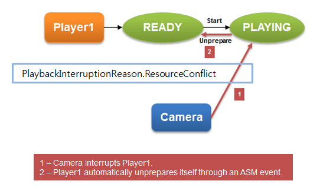

# Media Playback


You can play different audio formats and video in your application.

The main media playback features are:

-   Handling audio

    Enables you to play [audio](#audio) and control the playback.

- Handling video

    Enables you to play [video](#video).

- Using the player [features](#features)

    Enables you manage the player and control the volume, sound mode, display, stream info, and audio effects.

- Streaming playback

    Enables you to set specific URLs for [streaming media playback](#stream).

- Using the WAV player

    Enables you to play audio in the [WAVE format](#wav).

- Using the tone player

    Enables you to play [tones](#tone).

Before you start, [set up the player](#prepare).

<a name="audio"></a>
## Audio Player

You can [play audio](#play_audio) and control functions for using audio resources. The resources can be media files stored on the device in a file or memory, or they can be streamed from a streaming server (defined with a URI) through the network.

The supported audio formats include MP3, AAC, WMA, M4A, 3GA, WAV, and AMR. The available formats depend on the target device.

You can use multiple instances of the player to play several audio data streams concurrently. This means that your application can play multiple uncompressed audio files at the same time.

The following figure illustrates the general player state changes.

**Figure: Player state changes**


The `PlaybackInterrupted` event of the [Tizen.Multimedia.Player](https://developer.tizen.org/dev-guide/csapi/api/Tizen.Multimedia.Player.html) class is triggered when the application is interrupted by another application. The player is paused or moved to the `Idle` state according to the audio session manager (ASM) policy. You must check the state of the current instance and take appropriate action.

<a name="video"></a>
## Video Player

Tizen enables your application to [play video](#play_video), and it uses its own user surface. The surface requires a drawing area, so you have to get an overlay region and set it to the player instance to display the drawing area:

1.  Get the UI component to display from the Graphics module.

    You can display video on a UI layer of Evas, Xamarin, and NUI.

2. Create the player instance.
3. Create the display instance with the UI component you got.
4. Set the display to the player using the `Display` property of the [Tizen.Multimedia.Player](https://developer.tizen.org/dev-guide/csapi/api/Tizen.Multimedia.Player.html) class.

The supported video formats include WMV, ASF, MP4, 3GP, AVI, MKV, and OGG. The available formats depend on the target device.

In the case of a video interruption, the player state can be `Ready` due to the resource restriction in the system.

The following figure illustrates what happens when the player gets interrupted by the system.

**Figure: Player states when interrupted by system**



<a name="features"></a>
## Player Features

The [Tizen.Multimedia.Player](https://developer.tizen.org/dev-guide/csapi/api/Tizen.Multimedia.Player.html) class provides the following features:

-   Operating general controls for the [audio](#audio) and [video](#video) content, such as play, pause, resume, and stop

    The player has events you can use to receive notifications of player status changes during playback. Since the player engine works asynchronously, you must implement event handlers to ensure that the player flows correctly. When each player operation is completed, the `PlaybackCompleted` event of the `Tizen.Multimedia.Player` class is raised. If an error occurs in the player engine, you can be notified through the `ErrorOccurred` event.

- Modifying playback properties

    After the player state is changed to `Ready`, you can modify various playback properties, such as volume, sound type, latency mode, mute mode, and looping mode.

- Moving the audio and video content based on time
- Controlling the volume of the audio and video content based on each instance

    The player works based on the audio session manager policy. This means that an application can be interrupted by another application. You can change the policy directly by using the [Tizen.Multimedia.AudioStreamPolicy](https://developer.tizen.org/dev-guide/csapi/api/Tizen.Multimedia.AudioStreamPolicy.html) class.

- Getting information about the audio and video content

    After the player state is changed to `Ready`, the multimedia resource is available and you can get content information from the media. You can also get content information in the `Playing` state, in some cases of playback streaming.

- Playing multiple audio streams

    The maximum number of player instances is limited by the system and multimedia resources. The maximum number is a system-wide count and it can be applied depending on the CPU model, CPU speed, CPU core number, CPU load from other applications, and the available memory. Thus, the exact number can be smaller than the maximum number, in which case the prepare methods fail. A reasonable working player number is under 10. To free up system resources, [stop unneeded players](#release).

- Display

    Use the `Display` property of the `Tizen.Multimedia.Player` class to play a video stream.

    After the player state is changed to `Idle`, create the display and [set the display settings](#set_parameters).

- Stream information

    Use the `StreamInfo` property of the `Tizen.Multimedia.Player` class to play a video stream.

    After the player state is changed to `Ready`, you can [retrieve stream properties](#get_stream).

- Audio effect

    Use the `AudioEffect` property of the `Tizen.Multimedia.Player` class to set and get audio effects for the playback.

    After the player state is changed to `Idle`, you can adjust the audio effects.

- Subtitles

    Use the `SetSubtitle()` method of the `Tizen.Multimedia.Player` class to set a path for inserting subtitles to a video file.

    After the player state is changed to `Ready`, you can [read the subtitle track](#insert).

<a name="stream"></a>
## Playback Streams

You can set specific URLs for streaming media playback with the [Tizen.Multimedia.MediaUriSource](https://developer.tizen.org/dev-guide/csapi/api/Tizen.Multimedia.MediaUriSource.html) class.

Both Hypertext Transfer Protocol (HTTP) and Real Time Streaming Protocol (RTSP) protocols support streaming media playback. The HTTP request header supports the playback of both complete and download-in-progress media files. The index table (atoms) must be moved in front of the file for progressive download.

For HTTP streaming, buffering can happen when the player is prepared. You can receive the status using the `BufferingProgressChanged` event of the [Tizen.Multimedia.Player](https://developer.tizen.org/dev-guide/csapi/api/Tizen.Multimedia.Player.html) class.

The following table lists the streaming protocol features supported by the player.

**Table: Supported streaming protocol features**

| Streaming protocol                  | Supported feature              |
|-----------------------------------|------------------------------|
| Hypertext Transfer Protocol (HTTP)  | HTTP Streaming                 |
| Hypertext Transfer Protocol (HTTP)  | HTTP Live Streaming            |
| Hypertext Transfer Protocol (HTTP)  | HTTP Progressive Download Play |
| Real Time Streaming Protocol (RTSP) | RTSP Streaming                 |

<a name="wav"></a>
## WAV Player

The [Tizen.Multimedia.WavPlayer](https://developer.tizen.org/dev-guide/csapi/api/Tizen.Multimedia.WavPlayer.html) class allows you to play audio resources (media files stored on the device). Use it to [play audio and control playback](#start_wav). You can use the WAV and OGG audio formats.

Multiple instances of the WAV player can be used to play several audio data streams concurrently. This means that your application can play multiple uncompressed audio files, such as WAV, at the same time.

<a name="tone"></a>
## Tone Player

You can play a tone or a list of tones using the [Tizen.Multimedia.TonePlayer](https://developer.tizen.org/dev-guide/csapi/api/Tizen.Multimedia.TonePlayer.html) class.

To play tones, use a DTMF (Dual Tone Multi Frequency) preset frequency. The possible values are defined in the [Tizen.Multimedia.ToneType](https://developer.tizen.org/dev-guide/csapi/api/Tizen.Multimedia.ToneType.html) enumeration.

You can [start and stop playing a tone](#play_tone), and [play a tone for a specified duration](#duration).

## Prerequisites


To use the methods and properties of the media playback classes, include the [Tizen.Multimedia](https://developer.tizen.org/dev-guide/csapi/api/Tizen.Multimedia.html) namespace in your application:

```
using Tizen.Multimedia;
```

<a name="prepare"></a>
## Preparing the Player

To initialize the player for use:

1.  Create a instance of the [Tizen.Multimedia.Player](https://developer.tizen.org/dev-guide/csapi/api/Tizen.Multimedia.Player.html) class:

    ```
    var player = new Player();
    ```

2. To receive notifications, add event handlers to the appropriate events of the `Tizen.Multimedia.Player` class:
    -   To receive notifications about playback interruptions, register an event handler for the `PlaybackInterrupted` event:

        ```
        player.PlaybackInterrupted += (object sender, PlaybackInterruptedEventArgs e)
        {
            Tizen.Log.Info(LogTag, $"Current player state is {player.State}");
            /// If the state is Paused, update the UI (for example, button)
        };
        ```

        The playback is interrupted and the event is raised when, for example, another multimedia application is run. The player state automatically changes to `Paused` or `Idle` according to the session policy.

    - To receive a notification when the playback ends, register an event handler for the `PlaybackCompleted` event:

        ```
        player.PlaybackCompleted += (object sender, EventArgs e)
        {
           Tizen.Log.Info(LogTag, "Playback End");
        };
        ```

    - To receive notifications about player errors during playback, register an event handler for the `ErrorOccurred` event:

        ```
        player.ErrorOccurred += (object sender, PlayerErrorOccurredEventArgs e)
        {
            Tizen.Log.Error(LogTag, $"Playback failed, error = {e.Error}");
        };
        ```

        The player error event is raised when the player stops working due to an error. You can use the event to try to recover from the error. For example, try to change the player state to `Ready` by calling the `Stop()` method of the `Tizen.Multimedia.Player` class, and then reset the player by calling the `Unprepare()` method.

<a name="play_audio"></a>
## Playing an Audio File

To play an audio file:

1.  After creating the player, specify the audio file to play by creating an instance of the [Tizen.Multimedia.MediaUriSource](https://developer.tizen.org/dev-guide/csapi/api/Tizen.Multimedia.MediaUriSource.html) class with the path to the audio file, and setting that as the `Source` property of the [Tizen.Multimedia.Player](https://developer.tizen.org/dev-guide/csapi/api/Tizen.Multimedia.Player.html) class instance you want to play the file with:

    ```
    player.Source = new MediaUriSource(audioPath);
    ```

2. Prepare the player for playback using the `PrepareAsync()` method of the `Tizen.Multimedia.Player` class:

    ```
    await player.PrepareAsync();
    ```

    The method changes the player state from `Idle` to `Ready`, which is required to start playback.

3. Start playing the audio file using the `Start()` method:

    ```
    player.Start();
    ```

    This changes the player state from `Ready` to `Playing`. The audio file plays until you call the `Stop()` or `Pause()` method.

<a name="play_video"></a>
## Playing a Video File

To play a video file:

1.  After creating the player, specify the video file to play by creating an instance of the [Tizen.Multimedia.MediaUriSource](https://developer.tizen.org/dev-guide/csapi/api/Tizen.Multimedia.MediaUriSource.html) class with the path to the audio file, and setting that as the `Source` property of the [Tizen.Multimedia.Player](https://developer.tizen.org/dev-guide/csapi/api/Tizen.Multimedia.Player.html) class instance you want to play the file with:

    ```
    player.Source = new MediaUriSource(videoPath);
    ```

2. To set the display on which the video is played, use the `Display` property of the `Tizen.Multimedia.Player` class.

    For example, to set the display on a Xamarin-based application, first create an instance of the [Tizen.Xamarin.Forms.Extension.MediaView](https://developer.tizen.org/dev-guide/csapi/api/Tizen.Xamarin.Forms.Extension.MediaView.html) class, cast it to an instance of the [Tizen.Multimedia.MediaView](https://developer.tizen.org/dev-guide/csapi/api/Tizen.Multimedia.MediaView.html) class, and finally set that instance as the `Display` property:

    ```
    var mediaView = new Tizen.Xamarin.Forms.Extension.MediaView();

    mediaView.NativeViewCreated += (s, e) =>
    {
        player.Display = new Display((Tizen.Multimedia.MediaView)mediaView.NativeView);
    };
    ```

3. Prepare the player for playback using the `PrepareAsync()` method of the `Tizen.Multimedia.Player` class:

    ```
    await player.PrepareAsync();
    ```

    This method changes the player state from `Idle` to `Ready`, which is required to start playback.

4. Play the video file, using the `Start()` method:

    ```
    player.Start();
    ```

    This changes the player state from `Ready` to `Playing`. The video file plays until you call the `Stop()` or `Pause()` method.

<a name="release"></a>
## Stopping the Player

To stop and reset the player:

1.  Stop the player using the `Stop()` method of the [Tizen.Multimedia.Player](https://developer.tizen.org/dev-guide/csapi/api/Tizen.Multimedia.Player.html) class:

    ```
    player.Stop();
    ```

2. Reset the player using the `Unprepare()` method:

    ```
    player.Unprepare();
    ```

    After the player is reset, it is in the `Idle` state.

<a name="set_parameters"></a>
## Configuring the Video Playback Display

You set the display parameters of a video file with the `DisplaySettings` property of the [Tizen.Multimedia.Player](https://developer.tizen.org/dev-guide/csapi/api/Tizen.Multimedia.Player.html) class, which takes an instance of the [Tizen.Multimedia.PlayerDisplaySettings](https://developer.tizen.org/dev-guide/csapi/api/Tizen.Multimedia.PlayerDisplaySettings.html) class as its value:

1.  Make sure that the [display is set, and the player prepared and started](#play_video).
2. To make the display visible:
    1.  Check whether the display is already visible using the `IsVisible` property of the `Tizen.Multimedia.PlayerDisplaySettings` class:

        ​```
        Tizen.Log.Info(LogTag, $"Display visible = {player.DisplaySettings.IsVisible}");
        ​```

    2.  If the display is not visible, make it visible by setting the `IsVisible` property to `true`:  

        ```
        if (player.DisplaySettings.IsVisible == false)
        {
            player.DisplaySettings.IsVisible = true;
        }
        ```

3. Set the display mode using the `Mode` property, which takes the display mode as a value of the [Tizen.Multimedia.PlayerDisplayMode](https://developer.tizen.org/dev-guide/csapi/api/Tizen.Multimedia.PlayerDisplayMode.html) enumeration:

    ```
    player.DisplaySettings.Mode = PlayerDisplayMode.FullScreen;
    ```

4. Set the display rotation using the `Rotation` property, which takes the display rotation as a value of the [Tizen.Multimedia.Rotation](https://developer.tizen.org/dev-guide/csapi/api/Tizen.Multimedia.Rotation.html) enumeration:

    ```
    player.DisplaySettings.Rotation = Rotation.Rotate90;
    ```

<a name="get_stream"></a>
## Retrieving Stream Information

To retrieve information about the audio and video streams:

1.  [Prepare and start the player](#play_video), and [set the display parameters](#set_parameters).

    > **Note**   
	> To retrieve the stream information, the player state must be either `Playing` or `Paused`.


2.  Retrieve the stream information:
    -   Duration

        Retrieve the total media running time (in milliseconds) using the `GetDuration()` method of the [Tizen.Multimedia.StreamInfo](https://developer.tizen.org/dev-guide/csapi/api/Tizen.Multimedia.StreamInfo.html) class:

        ```
        Tizen.Log.Info(LogTag, $"Duration = {player.StreamInfo.GetDuration()}");
        ```

    - Audio stream details

        Retrieve the audio stream details using the `GetAudioProperties()` method. The method returns an instance of the [Tizen.Multimedia.AudioStreamProperties](https://developer.tizen.org/dev-guide/csapi/api/Tizen.Multimedia.AudioStreamProperties.html) struct containing the audio sample rate (in Hz), number of audio channels (1 for mono or 2 for stereo), and audio bit rate (in Hz).

        ```
        var audioProperties = player.StreamInfo.GetAudioProperties();

        Tizen.Log.Info(LogTag, $"Sample rate = {audioProperties.SampleRate}, Channels = {audioProperties.Channels}, Bit rate = {audioProperties.BitRate}");
        ```

    - Video stream details

        Retrieve the video stream details using the `GetVideoProperties()` method. The method returns an instance of the [Tizen.Multimedia.VideoStreamProperties](https://developer.tizen.org/dev-guide/csapi/api/Tizen.Multimedia.VideoStreamProperties.html) struct containing the video size, number of frames per second, and video bit rate (in Hz).

        ```
        var videoProperties = player.StreamInfo.GetVideoProperties();

        Tizen.Log.Info(LogTag, $"Video size = {videoProperties.Size}, Fps = {videoProperties.Fps}, Bit rate = {videoProperties.BitRate}");
        ```

    - Audio and video codec names

        Retrieve the audio and video codec names using the `GetAudioCodec()` and the `GetVideoCodec()` methods:

        ```
        Tizen.Log.Info(LogTag, $"Audio codec = {player.StreamInfo.GetAudioCodec()}");
        Tizen.Log.Info(LogTag, $"Video codec = {player.StreamInfo.GetVideoCodec()}");
        ```

    - Content metadata

        Retrieve information about the album, artist, author, genre, title, and year using the `GetMetadata()` method. The available metadata attributes are defined in the [Tizen.Multimedia.StreamMetadataKey](https://developer.tizen.org/dev-guide/csapi/api/Tizen.Multimedia.StreamMetadataKey.html) enumeration.

        ```
        Tizen.Log.Info(LogTag, $"Album = {player.StreamInfo.GetMetadata(StreamMetadataKey.Alarm)}");
        Tizen.Log.Info(LogTag, $"Artist = {player.StreamInfo.GetMetadata(StreamMetadataKey.Artist)}");
        Tizen.Log.Info(LogTag, $"Author = {player.StreamInfo.GetMetadata(StreamMetadataKey.Author)}");
        Tizen.Log.Info(LogTag, $"Genre = {player.StreamInfo.GetMetadata(StreamMetadataKey.Genre)}");
        Tizen.Log.Info(LogTag, $"Title = {player.StreamInfo.GetMetadata(StreamMetadataKey.Title)}");
        Tizen.Log.Info(LogTag, $"Year = {player.StreamInfo.GetMetadata(StreamMetadataKey.Year)}");
        ```

    - Album artwork

        Retrieve the album artwork using the `GetAlbumArt()` method. The method returns the encoded artwork image.

        ```
        byte[] imageData = player.StreamInfo.GetAlbumArt();
        ```

<a name="insert"></a>
## Inserting Subtitles

To insert subtitles to a video file, set the subtitle path using the `SetSubtitle()` method of the [Tizen.Multimedia.Player](https://developer.tizen.org/dev-guide/csapi/api/Tizen.Multimedia.Player.html) class:

```
player.SetSubtitle(subtitlePath);
```

<a name="start_wav"></a>
## Starting and Stopping the WAV Player

To start and stop the WAV player:

1.  To play a WAV file, use the `StartAsync()` method of the [Tizen.Multimedia.WavPlayer](https://developer.tizen.org/dev-guide/csapi/api/Tizen.Multimedia.WavPlayer.html) class:

    ```
    await WavPlayer.StartAsync(wavPath, new AudioStreamPolicy(AudioStreamType.Media));
    ```

    To set the path of your WAV file, you potentially need to retrieve the default path for audio files.

2. To stop the WAV player, use the `StartAsync()` method with the `cancellationToken` parameter:

    ```
    var cancellationTokenSource = new CancellationTokenSource();

    WavPlayer.StartAsync(wavPath, new AudioStreamPolicy(AudioStreamType.Media), cancellationTokenSource);

    cancellationTokenSource.Cancel();
    ```

<a name="play_tone"></a>
## Playing a Tone

To start and stop playing a tone:

1.  To start playback, use the `StartAsync()` method of the [Tizen.Multimedia.TonePlayer](https://developer.tizen.org/dev-guide/csapi/api/Tizen.Multimedia.TonePlayer.html) class.

    The first parameter defines the tone type as a value of the [Tizen.Multimedia.ToneType](https://developer.tizen.org/dev-guide/csapi/api/Tizen.Multimedia.ToneType.html) enumeration.

    ```
    await TonePlayer.StartAsync(ToneType.Default, new AudioStreamPolicy(AudioStreamType.Media));
    ```

2. To stop playback, use the `StartAsync()` method with the `cancellationToken` parameter:

    ```
    var cancellationTokenSource = new CancellationTokenSource();

    TonePlayer.StartAsync(ToneType.Default, new AudioStreamPolicy(AudioStreamType.Media), cancellationTokenSource);

    cancellationTokenSource.Cancel();
    ```

<a name="duration"></a>
## Playing a Tone for a Specified Duration

To play a tone for a specified duration, use the `StartAsync()` method of the [Tizen.Multimedia.TonePlayer](https://developer.tizen.org/dev-guide/csapi/api/Tizen.Multimedia.TonePlayer.html) class with the duration parameter (the number of milliseconds you want playback to last). When you set the duration to a specified time, playback stops automatically after that time.

```
await TonePlayer.StartAsync(ToneType.Default, new AudioStreamPolicy(AudioStreamType.Media), duration);
```


## Related Information
* Dependencies
  -   Tizen 4.0 and Higher
