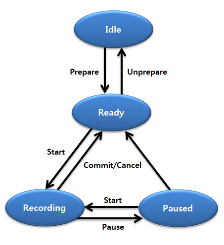

# Media Stream Recording


You can record audio and video from a stream, and control the recording process through various settings. With the stream recorder, live audio and video can be kept on your target.

The main features of the `Tizen.Multimedia.StreamRecorder` class include:

-   Creating a media packet

    You must [create a media packet](#packet) for the stream recording using raw data from the source. The media packet must be created for each buffer captured from the source and passed to the `PushBuffer()` method of the `Tizen.Multimedia.StreamRecorder` class.

-   Recording audio and video, and controlling the recording

    You can [record a stream, pause, stop, and cancel the recording](#record_stream), and push the buffer.

-   Managing recording options

    You can [manage various recording details](#manage), such as the bitrate, codec, maximum recording length, and filename:

    -   You can encode files in various formats:

        -   Video: MP4 and 3GP
        -   Audio: AMR, AAC, and WAV

        The supported file formats are defined in the [Tizen.Multimedia.RecorderFileFormat](https://developer.tizen.org/dev-guide/csapi/api/Tizen.Multimedia.RecorderFileFormat.html) enumeration.

    -   You can use various video and audio encoders.

        The available video and audio codecs are defined in the [Tizen.Multimedia.RecorderVideoCodec](https://developer.tizen.org/dev-guide/csapi/api/Tizen.Multimedia.RecorderVideoCodec.html) and [Tizen.Multimedia.RecorderAudioCodec](https://developer.tizen.org/dev-guide/csapi/api/Tizen.Multimedia.RecorderAudioCodec.html) enumerations.

Valid input sources consist of external sources, such as a live buffer passed by the application. Most operations of the stream recorder work synchronously.

The following figure illustrates general stream recorder state changes. Use the stream recorder methods according to pre and post conditions, by following the state changes.

**Figure: Stream recorder state changes**



## Prerequisites

To use the methods and properties of the [Tizen.Multimedia.StreamRecorder](https://developer.tizen.org/dev-guide/csapi/api/Tizen.Multimedia.StreamRecorder.html) class, include the [Tizen.Multimedia](https://developer.tizen.org/dev-guide/csapi/api/Tizen.Multimedia.html) namespace in your application:

```
using Tizen.Multimedia;
```

<a name="manage"></a>
## Managing Recording Options

To define recording options for video recording:
1.  Create an instance of the [Tizen.Multimedia.StreamRecorderOptions](https://developer.tizen.org/dev-guide/csapi/api/Tizen.Multimedia.StreamRecorderOptions.html) class with the output path and file format for the recorded media stream:

    ```
    var options = new StreamRecorderOptions(SavePath, RecorderFileFormat.Mp4);
    ```

    You can check which file formats the device supports using the `GetSupportedFileFormats()` method of the `Tizen.Multimedia.StreamRecorder` class.

2.  Define the video recording options in the `Video` property of the `Tizen.Multimedia.StreamRecorderOptions` class, using an instance of the [Tizen.Multimedia.StreamRecorderVideoOptions](https://developer.tizen.org/dev-guide/csapi/api/Tizen.Multimedia.StreamRecorderVideoOptions.html) class:

    ```
    options.Video = new StreamRecorderVideoOptions(codec: RecorderVideoCodec.H263,
                                                   resolution: new Size(1920, 1080),
                                                   sourceFormat: StreamRecorderVideoFormat.Nv12,
                                                   frameRate: 30,
                                                   bitRate: 288000);
    ```

    To get a list of video codecs the device supports, use the `GetSupportedVideoCodecs()` method of the [Tizen.Multimedia.StreamRecorder](https://developer.tizen.org/dev-guide/csapi/api/Tizen.Multimedia.StreamRecorder.html) class. The following example retrieves the first supported codec found:

    ```
    var streamRecorder = new StreamRecorder();

    var videoCodec = streamRecorder.GetSupportedVideoCodecs().First();
    ```

     > **Note**   
	 > Even if a higher bitrate is set, the recording bitrate is limited by that of the stream buffer pushed.


Similarly, to record an audio stream, define the audio recording options in the `Audio` property of the `StreamRecorderOptions` class instance, using an instance of the [Tizen.Multimedia.StreamRecorderAudioOptions](https://developer.tizen.org/dev-guide/csapi/api/Tizen.Multimedia.StreamRecorderAudioOptions.html) class.

<a name="packet"></a>
## Creating a Media Packet

When the stream recorder is configured, create the media packet using the raw data from the source:

```
byte[] rawbuffer; /// Data to be passed for recording

var videoFormat = new VideoMediaFormat(MediaFormatVideoMimeType.Mpeg4SP, new Size(640, 480));
var mediaPacket = MediaPacket.Create(videoFormat);

mediaPacket.CopyFrom(rawbuffer, 0, rawbuffer.length);
```

The media packet must be created for each buffer captured from the source and passed to the `PushBuffer()` method of the [Tizen.Multimedia.StreamRecorder](https://developer.tizen.org/dev-guide/csapi/api/Tizen.Multimedia.StreamRecorder.html) class when the stream recorder is prepared to record.

<a name="record_stream"></a>
## Recording a Stream

To record a stream:

1.  Call the `Prepare()` method of the [Tizen.Multimedia.StreamRecorder](https://developer.tizen.org/dev-guide/csapi/api/Tizen.Multimedia.StreamRecorder.html) class with a [Tizen.Multimedia.StreamRecorderOptions](https://developer.tizen.org/dev-guide/csapi/api/Tizen.Multimedia.StreamRecorderOptions.html) instance:

    ```
    streamRecorder.Prepare(options);
    ```

    The stream recorder state changes to `Ready`.

2.  Start recording by calling the `Start()` method:

    ```
    streamRecorder.Start();
    ```

    Once the recording starts, if you set the file path to an existing file, the file is removed automatically and replaced with a new one.

    You can only call the `Start()` method in the `Ready` or `Paused` state. After starting, the state changes to `Recording`.

    Push the media packet to record audio or video, using the `PushBuffer()` method:

    ```
    streamRecorder.PushBuffer(mediaPacket);
    ```

3.  During the recording, you can pause or stop it:
    -   To pause recording, use the `Pause()` method:

        ```
        streamRecorder.Pause();
        ```

        The stream recorder state changes from `Recording` to `Paused`.

        To resume recording, use the `Start()` method.

        Alternatively, you can stop pushing the stream buffers. In this case, the stream recorder remains in the `Recording` state, and continues waiting for buffers. It creates the same effect as a pause in the recording.

    -   To stop recording and save the result, use the `Commit()` method. The recording result is saved to the file path defined in the `Tizen.Multimedia.StreamRecorderOptions` instance.

        ```
        streamRecorder.Commit();
        ```

        You can only call the `Start()` method in the `Recording` or `Paused` state. After committing, the state changes to `Ready`.

    -   To stop recording without saving the result, use the `Cancel()` method.

        The only difference between this method and the `Commit()` method is that the recording data is not written to the file.

        ```
        streamRecorder.Cancel();
        ```

4.  When you have finished recording, use the `Unprepare()` method to reset the stream recorder:

    ```
    streamRecorder.Unprepare();
    ```

    The stream recorder state changes from `Ready` to `Idle`.


## Related Information
* Dependencies
  -   Tizen 4.0 and Higher
