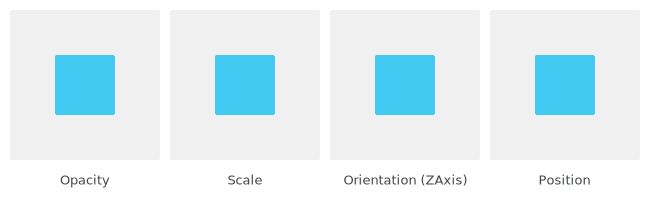

# Palette

The palette APIs is a support library that extracts prominent colors from images to help you create visually engaging apps.

You can use the palette APIs to design layout themes and apply custom colors to visual elements in your app.
For example, you can use a palette to create a color-coordinated title card for a song based on its album cover or to adjust an app’s toolbar color when its background image changes.
The Palette object gives you access to the colors in a Bitmap image while also providing six main color profiles from the bitmap to help inform your design choices.

## Add namespace
To implement Palette, include `Tizen.NUI` namespace in your application:

```csharp
using Tizen.NUI;
```

## Create a palette

Generate a Palette instance using PixelBuffer method to first create a PixelBuffer from a Image.

1. Create PixelBuffer from source image:
    ```csharp
    PixelBuffer imgBitmap = ImageLoading.LoadImageFromFile(imagePath);   
    ```
then generate the palette either synchronously or asynchronously.

2. Generate a Palette synchronously or asynchronously:
    ```csharp
    // Generate a Palette synchronously
    public void PaletteGenerateAsync
    {
        PixelBuffer imgBitmap = ImageLoading.LoadImageFromFile(_imgPath);
        try
        {
            Palette palette = Palette.Generate(imgBitmap);
        }
        catch (ArgumentNullException e)
        {
            //Exception Handling.
        }
    }
    
    // Generate a Palette asynchronously
    public async Task GenerateAsync_CHECK_RETURN_VALUE_WITH_PIXCELBUFFER()
    {
        PixelBuffer imgBitmap = ImageLoading.LoadImageFromFile(_imgPath);
        try
        {
            Palette palette = await Palette.GenerateAsync(imgBitmap);
        }
        catch (ArgumentNullException e)
        {
            //Exception Handling.
        }
    }
    ```
 
 3. Set a region of the pixelBuffer to be used exclusively when calculating the palette. (Optional)
 
    ```csharp
    Rectangle rect = new Rectangle(0, 0, 100, 100);
    ...
    Palette palette = Palette.Generate(imgBitmap, rect);
    ```

## Extract color profiles

Colors extracted from the bitmap image are scored against each profile based on saturation, luminance, and population (number of pixels in the bitmap represented by the color).
For each profile, the color with the best score defines that color profile for the given image.
Palette object contains 16 primary colors from a given image.

The palette library attempts to extract the following six color profiles:

- Light Vibrant
- Vibrant
- Dark Vibrant
- Light Muted
- Muted
- Dark Muted

Each of Palette’s get<Profile>Color() methods returns the color in the palette associated with that particular profile,
where <Profile> is replaced by the name of one of the six color profiles.
For example, the method to get the Dark Vibrant color profile is getDarkVibrantColor().
Since not all images will contain all color profiles, you must also provide a default color to return.

<div style="text-align:center;width:100%;"></div>
    
To access all colors in a palette, the getSwatches() method returns a list of all swatches generated from an image, including the standard six color profiles.
    

## Use swatches to create color schemes

The Palette class also generates Palette.Swatch objects for each color profile.
Palette.Swatch objects contain the associated color for that profile, as well as the color’s population in pixels.

Swatches have additional methods for accessing more information about the color profile, such as HSL values and pixel population.
You can use swatches to help create more comprehensive color schemes and app themes using the getBodyTextColor() and getTitleTextColor() methods.
These methods return colors appropriate for use over the swatch’s color.

Each of Palette’s get<Profile>Swatch() methods returns the swatch associated with that particular profile, where <Profile> is replaced by the name of one of the six color profiles.
Although the palette’s get<Profile>Swatch() methods do not require default value parameters, they return null if that particular profile does not exist in the image.
Therefore, you should check that a swatch is not null before using it. For example, the following code gets the title text color from a palette if the Vibrant swatch is not null
