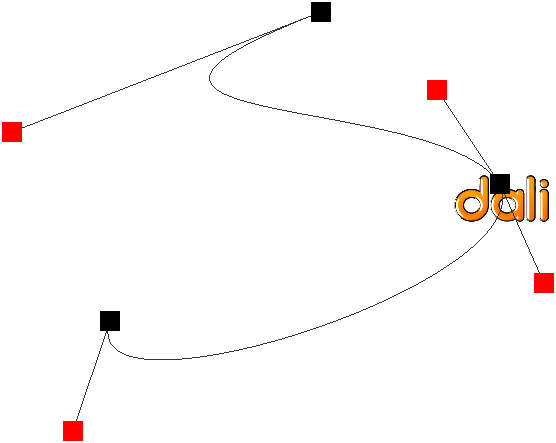

# Animation Types

NUI supports key frame and path animation.

[Key Frame Animation](#1)<br>
[Path Animation](#2)<br>

<a name="1"></a>
## Key Frame Animation

NUI provides support for animating between several different values or key frames.
Key frame takes the progress value between 0.0f and 1.0f (0 and 100%) from the `keyFrames.Add` property and portrays the value of the property when the animation reaches to the progress value.
You can create several key frames:

```
KeyFrames _keyFrames = new KeyFrames();
_keyFrames.Add(0.0f, new Size(0.0f, 0.0f, 0.0f));
_keyFrames.Add(0.3f, new Size(window.Size.Width * 0.7f, window.Size.Height * 0.7f, 0.0f));
_keyFrames.Add(1.0f, new Size(window.Size));

KeyFrames keyFrames = KeyFrames::New();
keyFrames.Add( 0.0f, Vector3( 10.0f, 10.0f, 10.0f ) );
keyFrames.Add( 0.7f, Vector3( 200.0f, 200.0f, 200.0f ) );
keyFrames.Add( 1.0f, Vector3( 100.0f, 100.0f, 100.0f ) );
```

Next, you can add the key frames to your animation:

```
_animation.AnimateBetween(_imageView, "Size", _keyFrames, 4000, 6000, Animation.Interpolation.Linear);
```

When you play the animation, NUI animates the position of `view1` between the specified key frames. `view1` animates from (10.0f, 10.0f, 10.0f) to (200.0f, 200.0f, 200.0f) for 70% of the animation time, and spends the remaining time animating back to (100.0f, 100.0f, 100.0f).

The advantage of specifying a key frame at 0% is that regardless of the position of `view1`, it starts from (10.0f, 10.0f, 10.0f). If `AnimateTo()` is used, then the start position is the current position of `view1`.

The following comprehensive example of using key frame is taken from `FocusEffect.cs`:

```
focusData.ImageItem.Size = new Size(100.0f, 100.0f, 0.0f);
parentItem.Add(focusData.ImageItem);

Size targetSize = focusData.TargetSize;
Size initSize = focusData.InitSize;

KeyFrames keyFrames = new KeyFrames();

keyFrames.Add(0.0f, initSize);
keyFrames.Add(focusData.KeyFrameStart, initSize);
keyFrames.Add(focusData.KeyFrameEnd, targetSize);

// For halo add an extra key frame to shrink it (in 20% of time after it has finished)
if (focusData.Name == "halo")
{
   keyFrames.Add(focusData.KeyFrameEnd + 0.2f, initSize);
}

_animation.AnimateBetween(focusData.ImageItem, "Size", keyFrames, Animation.Interpolation.Linear, new AlphaFunction(AlphaFunction.BuiltinFunctions.EaseOutSine));
```

<a name="2"></a>
## Path Animation

The `Path` class can be used to animate the position and orientation of actors. (a three-dimentional parametric curve)

The black points are the points where the 'dali' logo travels. The red points are the control points which express the curvature of the path on the black points.

**Figure: Path animation**



The following code presents the black points:

```
Path path = new Path();
path.AddPoint(new Vector3( 50.0f, 10.0f, 0.0f ));
path.AddPoint(new Vector3( 90.0f, 50.0f, 0.0f ));
path.AddPoint(new Vector3( 10.0f, 90.0f, 0.0f ));
```

The control points can be added manually using `AddControlPoint`. The `Path` class auto-generates the control points:

```
path.GenerateControlPoints( 0.25f );
```
Here 0.25f represents the curvature of the path you require.

To animate `view1` along this path, use the following function:

```
_animation.AnimatePath( view1, path, Vector3::ZERO );
```

The third parameter is the forward vector (in a local space coordinate system) that is oriented with the path's tangent direction.

Another example:

```
// Black points
Position position0 = new Position(200.0f, 200.0f, 0.0f);
Position position1 = new Position(300.0f, 300.0f, 0.0f);
Position position2 = new Position(400.0f, 400.0f, 0.0f);

Path path = new Path();
path.AddPoint(position0);
path.AddPoint(position1);
path.AddPoint(position2);

// Control points for first segment
path.AddControlPoint(new Vector3(39.0f, 90.0f, 0.0f));
path.AddControlPoint(new Vector3(56.0f, 119.0f, 0.0f));

// Control points for second segment
path.AddControlPoint(new Vector3(78.0f, 120.0f, 0.0f));
path.AddControlPoint(new Vector3(93.0f, 104.0f, 0.0f));

Animation animation = new Animation();
animation.AnimatePath(view, path, Vector3.XAxis, 0, 5000, new AlphaFunction(AlphaFunction.BuiltinFunctions.Linear)); // X Axis
animation.Play();
```

> **Note**
>
> `AnimatePath()` invokes `Animate`.

## Related Information
- Dependencies
  -   Tizen 4.0 and Higher
