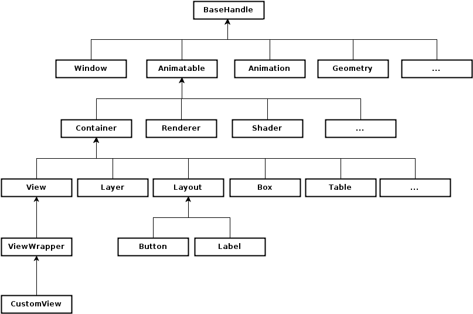

# Animation

You can use animations to allow objects to move around and change their properties for a specified duration. NUI implements an easy-to-use animation framework that allows you to create visually rich applications. The `Tizen.NUI.Animation` class can be used to animate the [animatable properties](#animatableproperties) for any number of objects, typically view object.

NUI animations [occur in a dedicated thread](#multithreading). This allows animations to run smoothly, regardless of the time taken to process the input, events, and other factors in the application code.

The figure shows the NUI class hierarchy:

**Figure: NUI class hierarchy**



-   The `Tizen.NUI.Animatable` class contains methods related to animation properties, such as the `GetProperty()` and `IsPropertyAnimatable()` methods.
-   The `Tizen.NUI.Animation` class contains animation methods, such as the `AnimateBy()` and `AnimateTo()` methods.

To implement a basic animation, specify an animation object that takes place in milliseconds:

```
_animation = new Animation(2000);

/// OR

_animation = new Animation
{
    Duration = 2000;
};
```

<a name="animatableproperties"></a>
## Animation Properties

Some view properties are `animatable`, such as `Position`, `Orientation`, `Scale`, and `Color`.

The controls class is derived from the [Tizen.NUI.BaseComponents.CustomView](https://developer.tizen.org/dev-guide/csapi/api/Tizen.NUI.BaseComponents.CustomView.html) class and set the property to be *animatable*. For standard controls, you can query whether a property is animatable (using the `IsPropertyAnimatable()` method of the [Tizen.NUI.Animatable](https://developer.tizen.org/dev-guide/csapi/api/Tizen.NUI.Animatable.html) class), but cannot change the animatable state.

To animate a property in NUI, you can use two distinct methods:

-   `AnimateTo()`: animates a property to the target value during a given time.

    ```
    /// view1 is first located in (10.0f, 10.0f, 0.0f)
    animation.AnimateTo(view1, "Position", Vector3(10.0f, 50.0f, 0.0f));
    /// view1 position changes to (10.0f, 50.0f, 0.0f)
    ```

-   `AnimateBy()`: animates a property by the specified amount during a given time.

    ```
    /// view2 is first located in (10.0f, 10.0f, 0.0f)
    animation.AnimateBy(view2, "Position", Vector3(10.0f, 50.0f, 0.0f);
    /// view2 position changes by (10.0f, 50.0f, 0.0f) to (20.0f, 60.0f, 0.0f)
    ```

The following example provides a more complex animation:

```
_animation.AnimateTo(_text, "Orientation", new Rotation(new Radian(new Degree(180.0f)), PositionAxis.X), 0, 500, new AlphaFunction(AlphaFunction.BuiltinFunctions.EaseInOutSine));
_animation.AnimateTo(_text, "Orientation", new Rotation(new Radian(new Degree(0.0f)), PositionAxis.X), 500, 1000, new AlphaFunction(AlphaFunction.BuiltinFunctions.EaseInOutSine));

_animation.AnimateBy(_text, "ScaleX", 3, 1000, 1500);
_animation.AnimateBy(_text, "ScaleY", 4.0f, 1500, 2000);
```

You can also pass properties to an animation method through the `Property` class instantiation:

```
_animation.AnimateTo(new Property(_text, View.Property.ORIENTATION), new Property.Value(new Rotation(new Radian(new Degree(180.0f)), ...)));
```

For more information on properties in general and animatable *scriptable properties* in particular, see [Managing Properties](creating-custom-view-controls.md#properties) and [Creating Transitions](creating-custom-view-controls.md#creatingtransitions).

<a name="control"></a>
## Playback and Events

After the animation is created, you can control its playback:

- To play the animation:

    ```
    animation.Play();
    ```

- To pause or stop the animation:

    ```
    animation.Pause();
    animation.Stop();
    ```

- To loop the animation:

    ```
    animation.Looping = true;
    ```

- By default, when the animation ends, the properties that is animating are saved. Additionally, discard the property changes when either the animation ends or stops:

    ```
    animation.EndAction = Animations.EndActions.Discard;
    ```

During the playback, you can receive notifications at various stages of the animation, such as the following:

-   When the animation progress has reached a specific percentage:

    ```
    /// Trigger the 'progress reached' event to 50% of animation time
    _animation.ProgressNotification = 0.5;

    _animation.ProgressReached += progressReached;
    ```

-   When the animation finishes:

    ```
    public void AnimationFinished(object sender, EventArgs e)
    {
        Tizen.Log.Debug("NUI", "AnimationFinished()");
    }

    _animation.Finished += AnimationFinished;
    ```

<a name="alphafunctions"></a>
## Alpha Functions

In animations, alpha functions are used to specify the animation parameter's rate of change over time. This allows the animation to be, for example, accelerated, decelerated, repeated, or bounced. The [Tizen.NUI.AlphaFunction.BuiltinFunctions](https://developer.tizen.org/dev-guide/csapi/api/Tizen.NUI.AlphaFunction.BuiltinFunctions.html) enumeration lists the built-in alpha functions.

You can specify a different alpha function for each animator in an animation object:

```
animation.AnimateTo(view1, "Position", Vector3(10.0f, 50.0f, 0.0f), new AlphaFunction.BuiltinFunctions.Linear);
```

You can also create your own alpha function in two ways:

-   By setting the default alpha function:

    ```
    float alphafunc(float progress)
    {
        if ((progress > 0.2f) && (progress < 0.7f))
        {
            return progress + 0.8f;
        }

        return progress;
    }

    AlphaFunction af(alphafunc);
    animation.SetDefaultAlphaFunction(af);
    ```

- By using delegates:

    ```
    private UserAlphaFunctionDelegate _user_alpha_func;

    /// Declare the user alpha function delegate
    [UnmanagedFunctionPointer(CallingConvention.StdCall)]
    delegate float UserAlphaFunctionDelegate(float progress);

    _user_alpha_func = new UserAlphaFunctionDelegate(alphafunc);

    _animation.AnimateTo(_view2, "Position", new Vector3(150.0f, 150.0f, 0.0f), 5000, 10000, new AlphaFunction(_user_alpha_func));
    ```

<a name="multithreading"></a>
## Animation Multithreading

NUI animations and rendering occur in a dedicated rendering thread, which allows the animations to run smoothly, regardless of the time taken to process input events in the application code. Internally, NUI contains a scene graph that mirrors the view hierarchy. The scene graph objects perform the actual animation and rendering, while the views provide thread-safe code.

The following figure shows a view hierarchy in which one of the views is being animated. The green objects are created by the application code, while the blue private objects are used in the dedicated rendering thread.

**Figure: Animation view hierarchy**


<a name="readvalue"></a>
### Reading Animated Values

When a property is animatable, it can only be modified in the rendering thread. The value returned from a `get` property is the value used to render the previous frame.

For example, `view.Position` has the position value at which the view was last rendered. Since defining a new position for `view.Position` is asynchronous, it does not immediately return the new value.

```
View view = new View();
Window.Instance.Add(view); /// Initial position is 0,0,0
view.Position = new Position(10, 10, 10);

Position current = view.Position;
Console.WriteLine("Current position: " + current.X + ", " + current.Y + ", " + current.Z);
Console.WriteLine("...");

/// Handle another event

current = view.Position;
Console.WriteLine("Current position: " + current.X + ", " + current.Y + ", " + current.Z);
```

The output of the code:

```
Current position: 0, 0, 0
...
Current position: 10, 10, 10
```

<a name="propsetting"></a>
### Setting Properties during Animations

When a property is being animated, the animation overrides all values set using other methods.

The steps to execute in the render thread are:

1.  Process the message and call the `SetPosition()` method.
2.  Apply the animation and call the `SetPosition()` method.
3.  Render the frame.

<a name="sample"></a>
## Sample Animation

You can use an `animation-hello-world.cs` sample to see in practice how the `AnimateBy()` and `AnimateTo()` methods, and alpha functions work.

After setting up your NUI development environment and building the NUI source code, follow the below steps:

1.  Download the [sample file](nui-example-code/animation-hello-world-tutorial.cs).
2.  Copy the sample file to your `nuirun` or `nuirun/tutorials`.
3.  Run the sample application.

## Related Information
- Dependencies
  -   Tizen 4.0 and Higher
