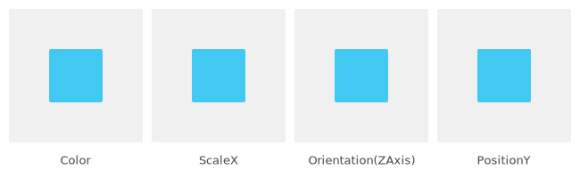
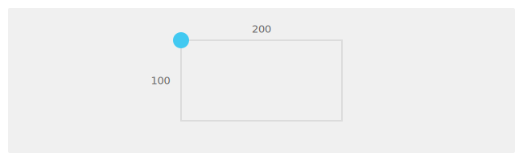

# Animation

You can use animations to allow objects to move around and change their properties for a specified duration. NUI implements an easy-to-use animation framework that allows you to create visually rich applications. The `Tizen.NUI.Animation` class can be used to animate the [animatable properties](#animatableproperties) for any number of `View` objects.

NUI animations occur in a dedicated thread. This allows animations to run smoothly, regardless of the time taken to process the input, events, and other factors in the application code.


<a name="animatableproperties"></a>
## Animatable Properties

Some view properties are `animatable`, such as `Opacity`, `Scale`, `Orientation`, and `Position`.

<div style="text-align:center;width:100%;"></div>

For more information on the animatable properties, see the `Remarks` section of each property in [Tizen.NUI.BaseComponents.View](https://samsung.github.io/TizenFX/latest/api/Tizen.NUI.BaseComponents.View.html).

### Basic Animation Methods

To animate a property in NUI, you can use two distinct methods:


-   `AnimateTo()`: Animates a property to the target value during a given time.
    ```csharp
    // Animates PositionX to 50
    var animation = new Animation(2000/*duration*/);

    animation.AnimateTo(view, "PositionX", 50);
    
    animation.Play();
    ```

-   `AnimateBy()`: Animates a property by the specified amount during a given time.
    ```csharp
    // Animates PositionX to x + 50

    var animation = new Animation(2000/*duration*/);

    animation.AnimateBy(view, "PositionX", 50);

    animation.Play();
    ```

You can define multiple animating behaviors in a single animation:
```csharp
// Animate ScaleX of View1 and PositionY of View2 at once

var animation = new Animation(2000/*duration*/);

animation.AnimateBy(view1, "ScaleX", 2);

animation.AnimateBy(view2, "PositionY", 100);

animation.Play();
```

### KeyFrames Animation
By defining the `KeyFrames` object, NUI supports animation between several different values for a `View`.

The following code shows how to create `KeyFrames` object:
```csharp
KeyFrames keyFrames = new KeyFrames();

keyFrames.Add(0.0f /*  0%*/, new Position(0, 0));
keyFrames.Add(0.25f/* 25%*/, new Position(200, 0));
keyFrames.Add(0.5f /* 50%*/, new Position(200, 100));
keyFrames.Add(0.75f/* 75%*/, new Position(0, 100));
keyFrames.Add(1.0f /*100%*/, new Position(0, 0));
```

You can add it to your animation by using `AnimateBetween()`:

```csharp
animation.AnimateBetween(view, "Position", keyFrames);
animation.Play();
```

Following is the output of the executed command:
<div style="text-align:center;width:100%;"></div>

For more information on animatable properties and methods, see the following:
-   [Path Animation](animation-types.md#path-animation)
-   [Managing Properties](customview.md#properties)
-   [Creating Transitions](customview.md#creatingtransitions)

<a name="playbackAndEvents"></a>
## Playback and Events

After the animation is created, you can control its playback:

- To play the animation:

    ```csharp
    animation.Play();
    ```

- To pause or stop the animation:

    ```csharp
    animation.Pause();
    animation.Stop();
    ```

- To loop the animation:

    ```csharp
    animation.Looping = true;
    ```

- By default, when the animation ends, the properties that animate are saved. Use the following code to discard the property changes when the animation either ends or stops:

    ```csharp
    animation.EndAction = Animations.EndActions.Discard;
    ```

During the playback, you can receive notifications at various stages of the animation, such as the following:

-   `ProgressReached`: Notifies when the animation progress has reached a specific percentage.

    ```csharp
    // Trigger the 'ProgressReached' event to 50% of animation time
    animation.ProgressNotification = 0.5;

    animation.ProgressReached += progressReachedCallback;
    ```

-   `Finished`: Notifies when the animation finishes.
    ```csharp
    animation.Finished += animationFinishedCallback;
    ```

<a name="alphafunctions"></a>
## Alpha Functions

In animations, alpha functions are used to specify an animation progresses over time. The alpha function allows the animation to be accelerated, decelerated, repeated, or bounced.

### Built-in Alpha Function

The simplest way to define an alpha function is to use built-in alpha function that NUI provides for the convenience.
For more information on a supporting list, see [Tizen.NUI.AlphaFunction.BuiltinFunctions](https://samsung.github.io/TizenFX/latest/api/Tizen.NUI.AlphaFunction.BuiltinFunctions.html).

The following example shows how to create an AlphaFunction with a built-in item:
```csharp
var easeOut = new AlphaFunction(AlphaFunction.BuiltinFunctions.EaseOut);
```

You can apply it to the animation by setting it as a `DefaultAlphaFunction`:

```csharp
var animation = new Animation(2000/*duration*/);

animation.DefaultAlphaFunction = easeOut;

animation.AnimateBy(view, "PositionX", 200);

animation.Play();
```

The following image shows how `EaseOut` animation works when compared with other built-in functions:

<div style="text-align:center;width:100%;"></div>

You can also specify the alpha function for each animation method:

```csharp
// Animation in 0 ~ 500ms : speeds up
animation.AnimateBy(view, "PositionX", 100, 0, 500, easeIn);

// Animation in 500 ~ 1000ms : slows to a gradual stop
animation.AnimateBy(view, "PositionX", 100, 500, 1000, easeOut);
```


### Create Your Own Alpha Function
You can create your own alpha function using `Bézier Curves`, by setting two control points, C1 and C2. The control points are for a Bézier curve whose end points are fixed at (0, 0) and (1, 1) respectively.

```csharp
// Define two control points C1, C2
var c1 = new Vector2(0.0f, 0.5f);
var c2 = new Vector2(0.5f, 1.0f);

var customAlphaFunction = new AlphaFunction(c1, c2);
```
In the first graph shown in the following figure, the control points `C1(0, 0.5)` and `C2(0.5, 1)` make a curve that increases rapidly in the start and then slows down to the end. This means that the animation with this alpha function will have constant speed progress. You can see how the circle animates in the following graph:

<div style="text-align:center;width:100%;"></div>

<a name="sample"></a>
## Sample Animation

You can use an `animation-hello-world-tutorial.cs` sample to practice and understand how the `AnimateBy()` and the `AnimateTo()` methods, and alpha functions work.

After setting up your NUI development environment and building the NUI source code, follow these steps:

1.  Download the [sample file](nui-example-code/animation-hello-world-tutorial.cs).
2.  Copy the sample file to your `nuirun` or `nuirun/tutorials`.
3.  Run the sample application.

## Related Information
- Dependencies
  -   Tizen 4.0 and Higher
