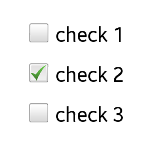

# Button

A button is a NUI control that you can press in order to operate it. You can create push buttons, check box buttons, radio buttons, and toggle buttons. All different buttons are implemented through the [Tizen.NUI.UIComponents.Button](https://developer.tizen.org/dev-guide/csapi/api/Tizen.NUI.UIComponents.Button.html) base class.

A button can be selectable, disabled, and togglable. These states can be set with the `Toggable` and `Selected` properties of the `Tizen.NUI.UIComponents.Button` class and the `Disabled` property of the [Tizen.NUI.BaseComponents.View](https://developer.tizen.org/dev-guide/csapi/api/Tizen.NUI.BaseComponents.View.html) class.

<a name="creation"></a>
## Creating Buttons

To create various button controls:

-   Push button

    The [Tizen.NUI.UIComponents.PushButton](https://developer.tizen.org/dev-guide/csapi/api/Tizen.NUI.UIComponents.PushButton.html) class allows you to create a button that can be operated by pressing it. A push button changes its appearance when pressed and returns to its original appearance when released.

    **Figure: Push button**

    

    To create a push button and add it to a `TableView` UI component:


    ```
    private TableView _contentContainer;

    _window = Window.Instance;
    _contentContainer = new TableView(6, 5);

    /// Other UI components

    PushButton button = new PushButton();
    button.LabelText = "Unselected";
    button.ParentOrigin = ParentOrigin.BottomLeft;

    _contentContainer.AddChild(button, new TableView.CellPosition(...);
    _window.Add(_contentContainer);
    ```

-   Check box button

    The [Tizen.NUI.UIComponents.CheckBoxButton](https://developer.tizen.org/dev-guide/csapi/api/Tizen.NUI.UIComponents.CheckBoxButton.html) class allows you to create a check box button, which can be selected or cleared.

    **Figure: Check box button**

    

    A check box button triggers all four [button events](#events), but often you can simply handle the `StateChanged` event to be notified when the button changes its state to selected or unselected.

    To create a check box button:

    ```
    CheckBoxButton checkBoxbutton = new CheckBoxButton();
    checkBoxbutton.LabelText = "check 1";
    checkBoxbutton.BackgroundColor = Color.White;
    ```

-   Radio button

    The [Tizen.NUI.UIComponents.RadioButton](https://developer.tizen.org/dev-guide/csapi/api/Tizen.NUI.UIComponents.RadioButton.html) class allows you to create a radio button with 2 states: selected and unselected.

    **Figure: Radio button**

    

    Usually, radio buttons are grouped. In each group, only 1 radio button can be selected at a given time. You can use the `StateChanged` event to check when the radio button is selected.

    To create a group of radio buttons:

    ```
    View radioGroup = new View();
    radioGroup.SetParentOrigin.Centre;

    RadioButton button1 = new RadioButton();
    button1.LabelText = "Select enabled";
    button1.Selected = true;
    radioGroup.Add(button1);

    RadioButton button2 = new RadioButton();
    button2.LabelText = "Select disabled";
    radioGroup.Add(button2);
    ```

-   Toggle button

    The [Tizen.NUI.ToggleButton](https://developer.tizen.org/dev-guide/csapi/api/Tizen.NUI.ToggleButton.html) class allows you to create a button with which the user can switch a feature on or off. Toggle buttons also support tooltips.

    **Figure: Toggle button**

    

    To create a toggle button:

    ```
    ToggleButton toggleButton = new ToggleButton();
    ```

<a name="events"></a>
## Handling Button Events

User actions on a button trigger events, which you can react to by defining event handlers. The following table lists the events provided by the [Tizen.NUI.UIComponents.Button](https://developer.tizen.org/dev-guide/csapi/api/Tizen.NUI.UIComponents.Button.html) class.

**Table: Button events**  

| Event |  Description |
|----|----|
|  `Clicked` |     Button is touched, and the touch point does not leave the boundary of the button |
| `Pressed` |   Button is touched |
| `Released` |   Button is touched, and the touch point leaves the boundary of the button |
| `StateChanged` |  Button state is changed |

For example, to add an event handler for the `Clicked` event on a push button:

```
pushButton.Clicked += (obj, e) =>
{
    PushButton sender = obj as PushButton;
    sender.LabelText = "Click Me";

    return true;
};
```

Some button properties can modify the event triggering logic:

-   If a button's `Disabled` property is `true`, its events are not triggered.
-   While a button is touched, if the button's `AutoRepeating` property is `true`, the `Pressed`, `Released`, and `Clicked` events are fired at regular intervals. You can modify the time interval using the `InitialAutoRepeatingDelay` and `NextAutoRepeatingDelay` properties.
-   If the `Togglable` property is set to `true`, a `StateChanged` event is fired with the selected state.
-   The `Togglable` and `AutoRepeating` properties cannot both be `true`. If the `AutoRepeating` property is set to `true`, the `Togglable` property is set to `false` but no event is fired.

<a name="visuals"></a>
## Defining Button Visuals

You can add images or icons to buttons using [visuals](visuals.md). Visuals provide reusable rendering logic which can be used by all controls. If the button has a text label, it is always shown over the visual.

To modify a button's appearance, set the visual properties for each state:

-   A control has 3 states: `NORMAL`, `FOCUSED`, and `DISABLED`.

    When the button is disabled, the background, button, and selected visuals are replaced by their `DISABLED` counterparts.

-   Button controls also have 2 substates for each state: `SELECTED` and `UNSELECTED`.

    When a button is pressed, the `UNSELECTED` visuals are replaced by the `SELECTED` visuals.

A visual must be defined for each state and substate. You can share the same visual across multiple states.

The following toggle button defines its state visuals as an array in the `StateVisuals` property:

```
ToggleButton toggleButton = new ToggleButton();

PropertyArray array = new PropertyArray();
array.Add(new PropertyValue("./images/star-highlight.png"));
array.Add(new PropertyValue("./images/star-mod.png"));
array.Add(new PropertyValue("./images/star-dim.png"));
toggleButton.StateVisuals = array;

PropertyArray tooltips = new PropertyArray();
tooltips.Add(new PropertyValue("State A"));
tooltips.Add(new PropertyValue("State B"));
tooltips.Add(new PropertyValue("State C"));
toggleButton.Tooltips = tooltips;

toggleButton.WidthResizePolicy = ResizePolicyType.FillToParent;
toggleButton.HeightResizePolicy = ResizePolicyType.FillToParent;
```

For more information on styling buttons with visuals using a JSON stylesheet, see [Styling Controls with JSON](styling-controls-with-JSON.md).

<a name="tooltips"></a>
## Defining Tooltips

To add a tooltip to a button:

-   Use the `TooltipText` property, which is inherited from the [Tizen.NUI.BaseComponents.View](https://developer.tizen.org/dev-guide/csapi/api/Tizen.NUI.BaseComponents.View.html) class:

    ```
    PushButton button = new PushButton();

    /// Add a simple text-only tooltip
    button.TooltipText = "Simple Tooltip";
    ```

-   Use a property array:

    ```
    ToggleButton toggleButton = new ToggleButton();

    PropertyArray tooltips = new PropertyArray();
    tooltips.Add(new PropertyValue("State A"));
    tooltips.Add(new PropertyValue("State B"));
    tooltips.Add(new PropertyValue("State C"));
    toggleButton.Tooltips = tooltips;
    ```

-   Use property maps. The `Tooltip` property is inherited from the `Tizen.NUI.BaseComponents.View` class.

    To define a tooltip with an icon and a text visual, create an array of property maps:  

    ```
    PushButton button = new PushButton();

    /// Create a property map for a tooltip with 1 icon and 1 text
    PropertyArray iconTooltipContent = new Property.Array();

    /// Icon
    PropertyMap iconVisual = new PropertyMap();
    iconVisual.Add(Constants.Visual.Property.Type, new PropertyValue((int)Constants.Visual.Type.Image))
              .Add(Constants.ImageVisualProperty.URL, new PropertyValue("./images/star-highlight.png"));

    iconTooltipContent.Add(new PropertyValue(iconVisual));

    /// Text
    PropertyMap textVisual = new PropertyMap();
    textVisual.Add(Constants.Visual.Property.Type, new PropertyValue((int)Constants.Visual.Type.Text))
              .Add(Constants.TextVisualProperty.Text, new PropertyValue("Tooltip with Icon"));

    iconTooltipContent.Add(new PropertyValue(textVisual));

    /// Icon tooltip
    PropertyMap iconTooltip = new PropertyMap();
    iconTooltip.Add(Constants.Tooltip.Property.Content, new Property.Value(iconTooltipContent))
               .Add(Constants.Tooltip.Property.Tail, new PropertyValue(true));

    /// Add the tooltip with icon and text to the push button
    button.Tooltip = iconTooltip;
    ```

## Related Information
- Dependencies
  -   Tizen 4.0 and Higher
