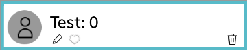
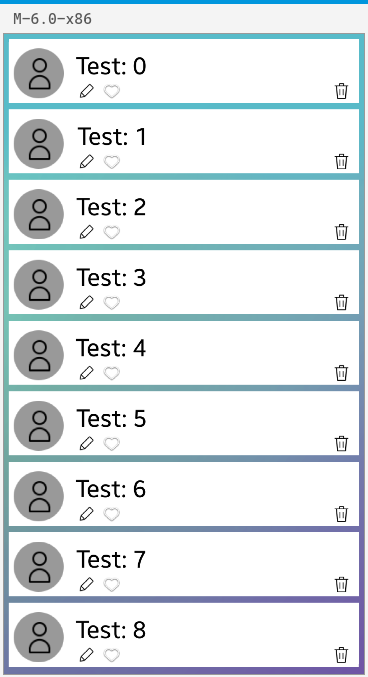

# CustomView

You can create custom views with NUI, following some general guidelines:

-   Derive your view from the `Tizen.NUI.BaseComponents.CustomView` class, which provides common functionality required by all views.

-   Use properties as much as possible, as views must be data-driven.

    - Custom views are used through JavaScript files.

-   The view can be updated when the properties (such as styles) change.

    - Ensure that the view handles property changes gracefully, on both the first and subsequent changes.

-   Use visuals, instead of creating multiple child views, to make the rendering pipeline more efficient.

-   Use events to make the application react to view state changes.

-   Use of gestures instead of analyzing raw touch events.

The `Tizen.NUI.BaseComponents.CustomView` class is derived from the [Tizen.NUI.ViewWrapper](https://samsung.github.io/TizenFX/latest/api/Tizen.NUI.ViewWrapper.html) class, which in turn is derived from the [Tizen.NUI.BaseComponents.View](https://samsung.github.io/TizenFX/latest/api/Tizen.NUI.BaseComponents.View.html) class:

```
public class CustomView : ViewWrapper

public class ViewWrapper : View
```
NUI contains predefined custom controls already derived from `CustomView` objects, including:

-   [Tizen.NUI.Spin](https://samsung.github.io/TizenFX/latest/api/Tizen.NUI.Spin.html) control, which is used for continuously changing values when the user can easily predict a set of values.

-   [Tizen.NUI.BaseComponents.VisualView](https://samsung.github.io/TizenFX/latest/api/Tizen.NUI.BaseComponents.VisualView.html) control, which enables you to add any visual. For more information, see [Visuals](visuals.md).

<a name="creation"></a>
## Creating a Custom View

To create a custom view:

1.  Create a view with the `new` operator:

    ```
    contactView = new ContactView();
    ```

2.  Define a static constructor for the view.

    Each custom view must have its static constructor called before you can use the custom view. Static constructors for a class only run once. The constructors run per view and not per instance. The view must register its type inside the static constructor.

    The Type Registry is used to register your custom view. Use `Register()` of the [Tizen.NUI.CustomViewRegistry](https://samsung.github.io/TizenFX/latest/api/Tizen.NUI.CustomViewRegistry.html) class to register the views and any scriptable properties views have:

    ```
    static ContactView()
    {
        CustomViewRegistry.Instance.Register(CreateInstance, typeof(ContactView));
    }
    ```

3.  Define a `CreateInstance()` method for the custom view.

    Each custom view must provide a `CreateInstance()`, which is passed to `Register()` as a parameter:

    ```
    static CustomView CreateInstance()
    {
        return new ContactView();
    }
    ```

4.  Override the `OnInitialize()` method, if necessary. It is called after the view has been initialized.

    ```
    public override void OnInitialize()
    {
        /// Create a container for the star images
        View view = new View();
        view.WidthResizePolicy = ResizePolicyType.FillToParent;
        view.HeightResizePolicy = ResizePolicyType.FillToParent;
        this.Add(view);
    }
    ```

5. Define the constructor to create an instance of the custom view. In this case, the `ContactView` is created with the `contactName` parameter, and the resource directory path points to the icons. Additionally, the `base` constructor has to be called with the type name and view behavior as described in the subsequent section. In a nonstatic constructor, `Visuals` used to create a custom view should be created. For instance, in the following `ContactView` example, one label, background, and a few icons are shown:

    

    ```
    public ContactView(string contactName, string resDir) : base(typeof(ContactView).Name, CustomViewBehaviour.ViewBehaviourDefault)
        {
            CreateBackground(new Vector4(1.0f, 1.0f, 1.0f, 1.0f));
            CreateIcon(resDir + "/images/cbg.png", 10.0f, 5.0f, 100.0f, 100.0f, CONTACT_BG_ICON_INDEX);
            CreateIcon(resDir + "/images/contact.png", 10.0f, 5.0f, 100.0f, 100.0f, CONTACT_ICON_INDEX);
            CreateIcon(resDir + "/images/edit.png", 130.0f, 40.0f, 50.0f, 50.0f, CONTACT_EDIT_INDEX);
            CreateIcon(resDir + "/images/favorite.png", 180.0f, 40.0f, 50.0f, 50.0f, CONTACT_FAVORITE_INDEX);
            CreateIcon(resDir + "/images/delete.png", 640.0f, 40.0f, 50.0f, 50.0f, CONTACT_DELETE_INDEX);
            CreateLabel(name);
        }
    ```

6. Implementation of `Visuals` used in the `ContactView` example is shown in the following example:

    > [!NOTE] 
    > It is recommended to get yourself familiarized with [Visuals](visuals.md) before you start implementing your own `CustomView`.
    
    To start with, you need to define valid indexes for registering `Visuals` in the `CustomView`. These indexes help you in setting a layer depth of a visual and bind it with the current view. In the `ContactView` example following indexes are used: 

    ```
        private const int BASE_INDEX = 10000;
        private const int BACKGROUND_VISUAL_INDEX = BASE_INDEX + 1;
        private const int LABEL_VISUAL_INDEX = BASE_INDEX + 2;
        private const int CONTACT_BG_ICON_INDEX = BASE_INDEX + 3;
        private const int CONTACT_ICON_INDEX = BASE_INDEX + 4;
        private const int CONTACT_EDIT_INDEX = BASE_INDEX + 5;
        private const int CONTACT_FAVORITE_INDEX = BASE_INDEX + 6;
        private const int CONTACT_DELETE_INDEX = BASE_INDEX + 7;
    ```

    The following code snippet shows how `Visuals` can be created:

    ```
    private void CreateBackground(Vector4 color)
        {
            PropertyMap map = new PropertyMap();
            map.Add(Visual.Property.Type, new PropertyValue((int)Visual.Type.Color))
            .Add(ColorVisualProperty.MixColor, new PropertyValue(color));
            VisualBase background = VisualFactory.Instance.CreateVisual(map);
            RegisterVisual(BACKGROUND_VISUAL_INDEX, background);
            background.DepthIndex = BACKGROUND_VISUAL_INDEX;
        }

    private void CreateLabel(string text)
        {
            PropertyMap textVisual = new PropertyMap();
            textVisual.Add(Visual.Property.Type, new PropertyValue((int)Visual.Type.Text))
                    .Add(TextVisualProperty.Text, new PropertyValue(text))
                    .Add(TextVisualProperty.TextColor, new PropertyValue(Color.Black))
                    .Add(TextVisualProperty.PointSize, new PropertyValue(12))
                    .Add(TextVisualProperty.HorizontalAlignment, new PropertyValue("CENTER"))
                    .Add(TextVisualProperty.VerticalAlignment, new PropertyValue("CENTER"));
            VisualBase label = VisualFactory.Instance.CreateVisual(textVisual);
            RegisterVisual(LABEL_VISUAL_INDEX, label);
            label.DepthIndex = LABEL_VISUAL_INDEX;
            //Setup position and size policy for visual
            PropertyMap imageVisualTransform = new PropertyMap();
            imageVisualTransform.Add((int)VisualTransformPropertyType.Offset, new PropertyValue(new Vector2(30, 5)))
                                .Add((int)VisualTransformPropertyType.OffsetPolicy, new PropertyValue(new Vector2((int)VisualTransformPolicyType.Absolute, (int)VisualTransformPolicyType.Absolute)))
                                .Add((int)VisualTransformPropertyType.SizePolicy, new PropertyValue(new Vector2((int)VisualTransformPolicyType.Absolute, (int)VisualTransformPolicyType.Absolute)))
                                .Add((int)VisualTransformPropertyType.Size, new PropertyValue(new Vector2(350, 100)));
            label.SetTransformAndSize(imageVisualTransform, new Vector2(this.SizeWidth, this.SizeHeight));
        }

    private void CreateIcon(string url, float x, float y, float w, float h, int index)
        {
            PropertyMap map = new PropertyMap();
            PropertyMap transformMap = new PropertyMap();
            map.Add(Visual.Property.Type, new PropertyValue((int)Visual.Type.Image))
            .Add(ImageVisualProperty.URL, new PropertyValue(url));
            VisualBase icon = VisualFactory.Instance.CreateVisual(map);
            PropertyMap imageVisualTransform = new PropertyMap();
            imageVisualTransform.Add((int)VisualTransformPropertyType.Offset, new PropertyValue(new Vector2(x, y)))
                                .Add((int)VisualTransformPropertyType.OffsetPolicy, new PropertyValue(new Vector2((int)VisualTransformPolicyType.Absolute, (int)VisualTransformPolicyType.Absolute)))
                                .Add((int)VisualTransformPropertyType.SizePolicy, new PropertyValue(new Vector2((int)VisualTransformPolicyType.Absolute, (int)VisualTransformPolicyType.Absolute)))
                                .Add((int)VisualTransformPropertyType.Size, new PropertyValue(new Vector2(w, h)))
                                .Add((int)VisualTransformPropertyType.Origin, new PropertyValue((int)Visual.AlignType.CenterBegin))
                                .Add((int)VisualTransformPropertyType.AnchorPoint, new PropertyValue((int)Visual.AlignType.CenterBegin));
            icon.SetTransformAndSize(imageVisualTransform, new Vector2(this.SizeWidth, this.SizeHeight));
            RegisterVisual(index, icon);
            icon.DepthIndex = index;
        }
    ```
7. In the main application class, `ContactView` can be used to create a contact list view as shown in the `Initialize()` as follows:

    ```
    void Initialize()
        {
            Window window = Window.Instance;

            ImageView background = new ImageView(DirectoryInfo.Resource + "/images/bg.png");
            background.Size2D = new Size2D(window.Size.Width, window.Size.Height);
            window.Add(background);

            //Create View with linear layout 
            View mainView = new View();
            LinearLayout ly = new LinearLayout();
            ly.LinearOrientation = LinearLayout.Orientation.Vertical;
            ly.CellPadding = new Size2D(0, 13);
            ly.Padding = new Extents(10, 10, 10, 10);

            mainView.Layout = ly;
            window.Add(mainView);

            //Add 9 example items to linear view
            for (int i = 0; i < 9; i++)
            {
                NUI_CustomView.ContactView contactView = new ContactView("Test: " + i.ToString(), DirectoryInfo.Resource);
                contactView.Size2D = new Size2D(window.Size.Width - 20, window.Size.Height / 10);
                mainView.Add(contactView);
            }
        }
    ```

    The following screenshot shows the final outlook of the application:

    


The following table lists other important custom view methods that you can use to manage the view:

**Table: Custom view methods**

| Name |    Description |
|----|----|
   |  `SetBackground()` |       Set the background with a property map.|
   |  `EnableGestureDetection()` | Allow deriving classes to enable any of the gesture detectors that are available.|
   |  `RegisterVisual()` |      Register a visual by a property index, linking a view to a visual, when required.|
   |   `CreateTransition()` |     Create a transition effect on the view for animations.|
   |  `RelayoutRequest()` |   Request a re-layout, which means performing a size negotiation on the view, its parent, and children (and potentially whole scene). |
   |  `OnStageConnection()`  |    If a notification is required when a custom view is connected to a stage default window, override the `OnStageConnection()` method. You can use the `OnStageDisconnection()` method similarly to react to a view getting disconnected from the window.|

<a name="viewbehaviour"> </a>
You can manage the general behavior of your custom view by defining a value for the `CustomViewBehaviour` enumeration of the [Tizen.NUI.BaseComponents.CustomView](https://samsung.github.io/TizenFX/latest/api/Tizen.NUI.BaseComponents.CustomView.html) class during object construction. You can determine how the custom view reacts to size negotiation, style changes, event callbacks, and keyboard navigation:

```
public VisualView() : base(typeof(VisualView).Name, CustomViewBehaviour.ViewBehaviourDefault)
{
}

public ContactView() : base(typeof(ContactView).Name, CustomViewBehaviour.RequiresKeyboardNavigationSupport)
{
}
```

<a name="rendering"></a>
## Rendering Content

To render content, use or reuse [visuals](visuals.md). You can also render content by creating and adding more views to the control itself as its children. However, this solution is not fully optimized and means extra views are added, requiring additional processing.

The following example shows how you can create and register an image visual:

-   Define a [scriptable property](#properties) (in this case, `ImageURL`) which creates the visual when being set. A scriptable property automatically generates indices.
-   Create the visual with a property map. For more information on the property maps that can be used for each visual type, see [Visuals](visuals.md).
-   The `RegisterVisual()` method of the [Tizen.NUI.BaseComponents.CustomView](https://samsung.github.io/TizenFX/latest/api/Tizen.NUI.BaseComponents.CustomView.html) class registers a visual by a property index, linking a view to a visual when required.
-   The `GetPropertyIndex()` method of the [Tizen.NUI.Animatable](https://samsung.github.io/TizenFX/latest/api/Tizen.NUI.Animatable.html) class gets the generated index corresponding to the property name.

  A range of property indices are provided for `ImageVisualPropertyIndex`, 0 by default.

```
/// ContactView.cs

private VisualBase _imageVisual;

[ScriptableProperty()]
public string ImageURL
{
    get
    {
        return _imageURL;
    }
    set
    {
        _imageURL = value;

        /// Create and register an image visual
        PropertyMap imageVisual = new PropertyMap();
        imageVisual.Add(Visual.Property.Type, new PropertyValue((int)Visual.Type.Image))
                   .Add(ImageVisualProperty.URL, new PropertyValue(_imageURL))
                   .Add(ImageVisualProperty.AlphaMaskURL, new PropertyValue(_maskURL));
       _imageVisual = VisualFactory.Get().CreateVisual(imageVisual);

        RegisterVisual(GetPropertyIndex("ImageURL"), _imageVisual);

        /// Set the depth index for the image visual
       _imageVisual.DepthIndex = ImageVisualPropertyIndex;
    }
}
```

<a name="properties"></a>
## Managing Properties

Properties can be animatable or non-animatable. Examples of animatable [Tizen.NUI.BaseComponents.View](https://samsung.github.io/TizenFX/latest/api/Tizen.NUI.BaseComponents.View.html) class properties are `Position`, `Orientation`, and `Scale`. For more information on the NUI animation framework, see [Animation](animation.md).

Properties can be accessed through a unique index. The index can be set manually in code (hard-coded), or calculated automatically. The `ContactView.cs` file example (in [Rendering Content](#rendering)) shows both indexing methods: fixed for depth index, and automatic for registering visuals. The NUI code base is currently being modified (as of July 2017) to utilize property registration based solely on automatic generation of indices.

Property indices are generated automatically in the [Tizen.NUI.ScriptableProperty](https://samsung.github.io/TizenFX/latest/api/Tizen.NUI.ScriptableProperty.html) class. Using the property indices, you can register a property with the Type Registry. To obtain a unique index for each property, use the `GetPropertyIndex()` of the [Tizen.NUI.Animatable](https://samsung.github.io/TizenFX/latest/api/Tizen.NUI.Animatable.html) class with the name of the property as a parameter:

```
internal class ScriptableProperty : System.Attribute
```

<a name="creatingtransitions"></a>
## Creating Transitions

Controls change states based on user interaction. All controls can move between the `NORMAL`, `FOCUSED`, and `DISABLED` states. Whilst in those states, a button has the `SELECTED` and `UNSELECTED` substates. As a control moves between states and substates, transition animations can be used to show visually how the control state changes.

You can create a specific entry and exit animation for each state and substate, or a more common transition animation that is run when a control moves between specific states. You can also use a predefined effect during the transition. Currently, only a `CROSSFADE` effect is available, animating the opacity of visuals fading in and out.

You can implement transition effects as follows:

-   Using the `CreateTransition()` method of the [Tizen.NUI.BaseComponents.CustomView](https://samsung.github.io/TizenFX/latest/api/Tizen.NUI.BaseComponents.CustomView.html) class

    You can animate scriptable properties by using the `CreateTransition()` method from `Tizen.NUI.BaseComponents.CustomView`-derived classes. The method creates a transition effect on the view. The `transitionData` parameter describes the effect to create, and the return value is a handle to an animation defined with the given effect, or an empty handle if no properties match.

    ```
    protected Animation CreateTransition(TransitionData transitionData);
    ```

    The following example is taken from the `AnimateVisual()` method in the [Tizen.NUI.BaseComponents.VisualView](https://samsung.github.io/TizenFX/latest/api/Tizen.NUI.BaseComponents.VisualView.html) class, which is a `CustomView`-derived class:

    ```
    _alphaFunction = "EASE_IN_OUT_SINE";

    PropertyMap _animator = new PropertyMap();
    if (_alphaFunction != null)
    {
        _animator.Add("alphaFunction", new PropertyValue(_alphaFunction));
    }

    PropertyMap _timePeriod = new PropertyMap();
    _timePeriod.Add("duration", new PropertyValue((endTime - startTime) / 1000.0f));
    _timePeriod.Add("delay", new PropertyValue(startTime / 1000.0f));
    _animator.Add("timePeriod", new PropertyValue(_timePeriod));

    string _str1 = property.Substring(0, 1);
    string _str2 = property.Substring(1);
    string _str = _str1.ToLower() + _str2;
    if (_str == "position")
    {
        _str = "offset";
    }

    PropertyValue destVal = PropertyValue.CreateFromObject(destinationValue);

    PropertyMap _transition = new PropertyMap();
    _transition.Add("target", new PropertyValue(target.Name));
    _transition.Add("property", new PropertyValue(_str));
    if (initialValue != null)
    {
        PropertyValue initVal = PropertyValue.CreateFromObject(initialValue);
        _transition.Add("initialValue", new PropertyValue(initVal));
    }

    _transition.Add("targetValue", destVal);
    _transition.Add("animator", new PropertyValue(_animator));

    TransitionData _transitionData = new TransitionData(_transition);

    return this.CreateTransition(_transitionData);
    ```

<a name="events"></a>
## Handling Events and Gestures

You can monitor the following [Tizen.NUI.BaseComponents.View](https://samsung.github.io/TizenFX/latest/api/Tizen.NUI.BaseComponents.View.html) class events for your custom view:

-   `TouchEvent` is triggered when any touch occurs within the bounds of the custom view.
-   `HoverEvent` is triggered when a pointer moves within the bounds of the custom view (for example, mouse pointer or hover pointer).
-   `WheelEvent` is triggered when the mouse wheel (or similar) is moved while hovering over the custom view (through a mouse pointer or hover pointer).

NUI has a gesture system which analyses a stream of touch events and attempts to determine the intention of the user. Detectors are provided for the following gestures:

-   **Pan**: When the user starts panning (or dragging) 1 or more fingers.

    The panning must start from within the bounds of the view.

-   **Pinch**: Detects when 2 touch points move towards or away from each other.

    The center point of the pinch must be within the bounds of the view.

-   **Tap**: When the user taps within the bounds of the view.
-   **Long press**: When the user presses and holds on a certain point within the bounds of the view.

To use gesture detectors:

1.  Specify a gesture detector in the `OnInitialize()` method:
    ```
    public override void OnInitialize()
    {
        /// Enable the tap gesture
        EnableGestureDetection(Gesture.GestureType.Tap);
    }
    ```

    The `EnableGestureDetection()` method of the [Tizen.NUI.BaseComponents.CustomView](https://samsung.github.io/TizenFX/latest/api/Tizen.NUI.BaseComponents.CustomView.html) class allows deriving classes to enable any available gesture detectors. The above example only enables the default gesture detection for each type. If customization is required for the gesture detection, the gesture detector can be retrieved and set up accordingly in the same method:

    ```
    PanGestureDetector panGestureDetector = GetPanGestureDetector();
    panGestureDetector.AddDirection(PanGestureDetector.DIRECTION_VERTICAL);
    ```

2.  Override the appropriate method for handling the gesture:

    -   `OnPan(PanGesture& pan)` for handling the pan gesture
    -   `OnPinch(PinchGesture& pinch)` for handling the pinch gesture
    -   `OnTap(TapGesture& tap)` for handling the tap gesture
    -   `OnLongPress(LongPressGesture& longPress)` for handling the long-press gesture

    ```
    public override void OnTap(TapGesture tap)
    {
        /// Change the color visual to a random color
        Random random = new Random();
        float nextRed   = (random.Next(0, 256) / 255.0f);
        float nextGreen = (random.Next(0, 256) / 255.0f);
        float nextBlue  = (random.Next(0, 256) / 255.0f);
        Animation anim = AnimateBackgroundColor(new Color(nextRed, nextGreen, nextBlue, 1.0f), 0, 2000);
        anim.Play();
    }
    ```

<a name="sizenegotiation"></a>
## Managing Size Negotiation

Size negotiation controls the view sizes in a container, based on dependency rules between the views. The [Tizen.NUI.ResizePolicyType](https://samsung.github.io/TizenFX/latest/api/Tizen.NUI.ResizePolicyType.html) enumeration specifies a range of options for controlling the way views resize. These options enable automatic resizing.

**Table: Resize policy types**

| `ResizePolicyType` enumerator |  Description |
|----|----|
|   `DimensionDependency`  |      Use this option to make one dimension depend on another. This option covers width-for-height and height-for-width rules.|
|  `FillToParent` |    Use this option to maintain a size similar to the parent's size. Aspect ratio is not maintained.|
|  `FitToChildren`    |       Use this option to scale the size of the view around the size of its children. For example, the height of a pop-up can be resized to fit its content.|
|  `Fixed`  |     Use this option to maintain a specific size as set by the `Size2D` property of the [Tizen.NUI.BaseComponents.View](https://samsung.github.io/TizenFX/latest/api/Tizen.NUI.BaseComponents.View.html) class. This is the default for all views.|
| `SizeFixedOffsetFromParent` |   Use this option to maintain a size is similar to the parent's size with a fixed offset. Use the `SetSizeModeFactor()` method of the `Tizen.NUI.BaseComponents.View` class to specify the offset.|
|     `SizeRelativeToParent`  |       Use this option to maintain a size is similar to the parent's size with a relative scale. Use the `SetSizeModeFactor()` method of the `Tizen.NUI.BaseComponents.View` class to specify the ratio.|
|     `UseAssignedSize`   |         Use this option to make the view use a size assigned to it. THis option is not an actual resize policy, but more of an implementation detail.|
|     `UseNaturalSize`  |      Use this option for objects, such as images or text, to get their natural size. This can mean the dimensions of an image or the size of text with no wrapping. You can also use this option with table views when the size of the table depends on its children.|

To set a resize policy for a custom view:

```
contactView = new ContactView();
contactView.WidthResizePolicy = ResizePolicyType.FillToParent;
contactView.HeightResizePolicy = ResizePolicyType.FillToParent;
```

The view is positioned and resized (relaid out) automatically when a view property or stage hierarchy changes. Although you do not usually need to request for relayouting manually, you can use the `RelayoutRequest()` method of the [Tizen.NUI.BaseComponents.CustomView](https://samsung.github.io/TizenFX/latest/api/Tizen.NUI.BaseComponents.CustomView.html) class for deriving views when the derived view wants to be relaid out.

The following overridable methods of the `Tizen.NUI.BaseComponents.CustomView` class provide customization points for the size negotiation algorithm:

-   The `GetNaturalSize()` method returns the natural size of the view.
-   The `GetHeightForWidth()` method returns the height for a given width. It is invoked by the size negotiation algorithm if the width is fixed.
-   The `GetWidthForHeight()` method returns the width for a given height. It is invoked by the size negotiation algorithm if the height is fixed.
-   The `OnRelayout()` method is called during the relayout process at the end of the frame, immediately after size negotiation is complete and the new size has been set on the view. The method can be overridden to position and resize the view.
-   The `OnSetResizePolicy()` method is called when a resize policy is set on a view, and it allows deriving views to respond to changes in the resize policy. The method can be overridden to receive notice that the resize policy has changed on the view and action can be taken.

Size negotiation is enabled on views by default. To [disable size negotiation](#viewbehaviour), pass the `DisableSizeNegotiation` behavior flag into the view constructor.

## Related Information
- Dependencies
  -   Tizen 4.0 and Higher
