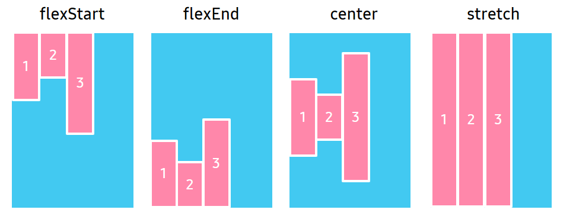
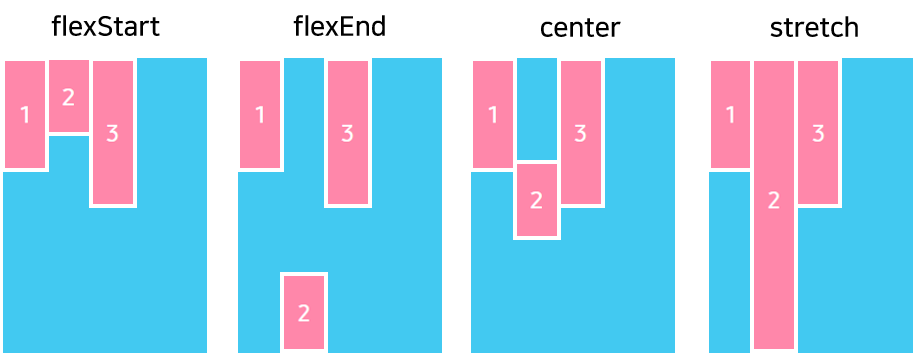
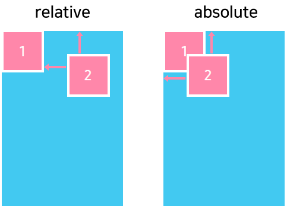
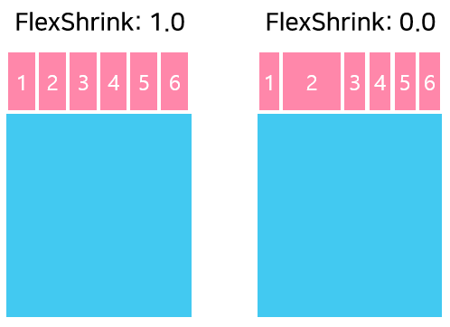
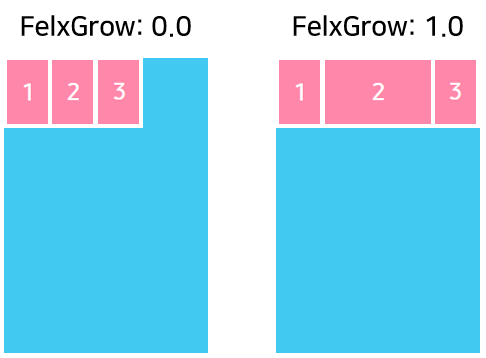

# Flex Layout

`FlexLayout` is a flexible box layout, that provides a more efficient way to layout, align, and distribute space among items in the container, even when their size is unknown or dynamic.

A layout provides features such as wrapping that automatically positions items that do not fit on an axis to another row or column.

`FlexLayout` defines four properties that affect the size, orientation, and alignment of child views.
Following are the properties:

| Property               | Type            | Description  |
| -----------------------| --------------- | ------------ |
| `Direction`            | FlexDirection   | Orientation of the flex items are laid out in columns or rows |
| `Justification`        | FlexJustification | Alignment of items along the flex axis when free space is available |
| `Alignment`            | AlignmentType     | Alignment of items along the cross axis when free space is available |
| `WrapType`             | FlexWrapType    | Enable wrapping of items |

Natural size of items are used, which can be different for each item. Additionally, setting the size of an item has no effect.

`Justification` applies to the flex `Direction` axis while `Alignment` applies to the cross axis. If you change the flex `Direction` axis, then the base of the `Justification` axis will also change.


## FlexDirection

`Direction` property specifies the main axis direction along which the flex items are placed.


| Property value |  Description |
|----------------|--------------|
| `Row`          | Place items horizontally in a row. |
| `RowReverse`   | Place items horizontally in a row, but in reverse order. |
| `Column`       | Place items vertically in a column. |
| `ColumnReverse` | Place items vertically in a column, but in reverse order. |

The following code shows how to set the `Direction` property using `FlexDirection`:

```csharp
View layoutView = new View();
var flexLayout = new FlexLayout();
flexLayout.Direction = FlexLayout.FlexDirection.Column;
layoutView.Layout = flexLayout;
```


## FlexJustification

`Justification` property specifies the alignment for flex items, when they do not use all available space on the main axis.


| Property value  |   Description |
|-----------------|---------------|
| `FlexStart`     | Position items at the beginning of the container. |
| `FlexEnd`       | Position items at the end of the container. |
| `Center`        | Position items at the center of the container. |
| `SpaceBetween`  |  Position items with equal spacing between them. |
| `SpaceAround`   |  Position items with equal spacing before, between, and after them. |

The following code shows how to set the `Justification` property using `FlexJustification`:

```csharp
View layoutView = new View();
var flexLayout = new FlexLayout();
flexLayout.Justification = FlexLayout.FlexJustification.SpaceBetween;
layoutView.Layout = flexLayout;
```


## AlignmentType

`Alignment` property specifies the alignment for flex items when they do not use all the available space on the cross axis.



|  Property value  |   Description  |
|------------------|----------------|
|  `Auto`          | Inherit the same alignment from the parent. |
|  `FlexStart`     | Align items to the beginning of the container. |
|  `FlexEnd`       | Align items to the end of the container. |
|  `Center`        | Align items to the center of the container. |
|  `Stretch`       | Stretch items to fit the container. |

The following code shows how to set the `Alignment` property using `AlignmentType`:

```csharp
View layoutView = new View();
var flexLayout = new FlexLayout();
flexLayout.Alignment = FlexLayout.AlignmentType.Center;
layoutView.Layout = flexLayout;
```


## FlexWrapType

`WrapType` property specifies whether the flex items must wrap if there is not enough room for them on one flex line.


| Property value |  Description  |
|----------------|---------------|
|  `NoWrap`      | Reduce item sizes to fit them in a single line along the main axis. |
|  `Wrap`        | Show items over multiple lines, if needed. |

The following code shows how to set the `WrapType` property using `FlexWrapType`:

```csharp
View layoutView = new View();
var flexLayout = new FlexLayout();
flexLayout.WrapType = FlexLayout.FlexWrapType.NoWrap;
layoutView.Layout = flexLayout;
```
There are six properties that affect the specified child view.

> [!NOTE]
> These properties are added in Tizen 6.0.

Following are the properties:

| Property               | Type            | Description  |
| -----------------------| --------------- | ------------ |
| `FlexAlignmentSelf`    | AlignmentType   | The alignment of item along the cross axis when free space is available. |
| `FlexPositionType`     | PositionType    | The position type that defines how it is positioned within its parent. |
| `FlexAspectRatio`      | float           | The ratio between the width and the height of a item |
| `FlexBasis`            | float           | The axis-independent way of providing the default size of an item along the main axis. |
| `FlexShrink`           | float           | The Flex shrink describes how to shrink children along the main axis in the case that the total size of the children overflow the size of the container on the main axis. |
| `FlexGrow`             | float           | The Flex grow describes how any space within a container should be distributed among its children along the main axis. |

## FlexAlignmentSelf property

> [!NOTE]
> This property is added in Tizen 6.0.

The `FlexAlignmentSelf` has the same options and effect as `Alignment` but instead of affecting the children within a container, you can apply this property to a single child to change its alignment within its parent.
The align self overrides any option set by the parent with align items.

The following figure shows how the second item works with `FlexAlignmentSelf` property:



## FlexPositionType property

> [!NOTE]
> This property is added in Tizen 6.0.

The `FlexPositionType` property of an element defines how it is positioned within its parent.

By default an element is positioned relatively. This means an element is positioned according to the normal flow of the layout, and then offset relative to that margin based on the values of start, end, top, and bottom.
The offset does not affect the position of any sibling or parent elements.

When positioned absolutely an element doesn't take part in the normal layout flow.
It is instead laid out independent of its siblings. The position is determined based on the position property.

The following figure shows how the second item works with `FlexPositionType` property:



## FlexAspectRatio property

> [!NOTE]
> This property is added in Tizen 6.0.

The `FlexAspectRatio` property has the following properties:

 - Accepts any floating point value > 0, the default is undefined.
 - Defined as the ratio between the width and the height of a node e.g. if a node has an aspect ratio of 2 then its width is twice the size of its height.
 - Respects the min and max dimensions of an item.
 - Has higher priority than `FlexGrow` property.
 - If aspect ratio, width, and height are set then the cross axis dimension is overridden.

## FlexBasis property

> [!NOTE]
> This property is added in Tizen 6.0.

The `FlexBasis` property is an axis-independent way of providing the default size of an item along the main axis.
Setting the flex basis of a child is similar to setting the width of that child if its parent is a container with flex direction: row or setting the height of a child if its parent is a container with flex direction: column.
The flex basis of an item is the default size of that item, the size of the item before any flex grow and flex shrink calculations are performed.

## FlexShrink property

> [!NOTE]
> This property is added in Tizen 6.0.

The `FlexShrink` describes how to shrink children along the main axis in the case that the total size of the children overflow the size of the container on the main axis.
The flex shrink is very similar to flex grow and can be thought of in the same way if any overflowing size is considered to be negative remaining space. These two properties also work well together by allowing children to grow and shrink as needed.

The flex shrink accepts any floating point value >= 0, with 1 being the default value. A container will shrink its children weighted by the child’s flex shrink value.

The following figure shows how the second item works with `FlexShrink` property:



## FlexGrow property

> [!NOTE]
> This property is added in Tizen 6.0.

The `FlexGrow` property describes how any space within a container should be distributed among its children along the main axis. After laying out its children, a container will distribute any remaining space according to the flex grow values specified by its children.

The flex grow accepts any floating point value >= 0, with 0 being the default value. A container will distribute any remaining space among its children weighted by the child’s flex grow value.

The following figure shows how the second item works with `FlexGrow` property:



## Related Information

- Dependencies
  -  Tizen 5.5 and Higher
