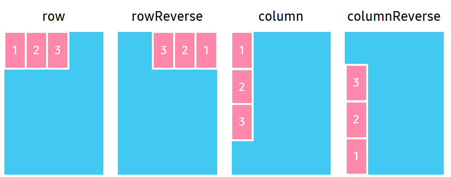
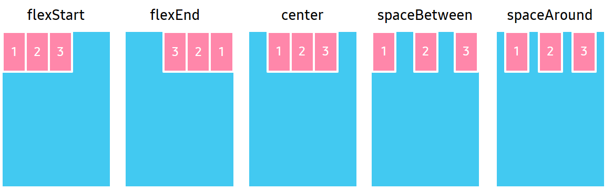
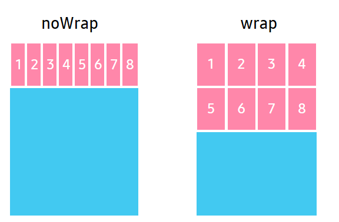

# Flex Layout

`FlexLayout` is a flexible box layout, that provides a more efficient way to layout, align, and distribute space among items in the container, even when their size is unknown or dynamic.

A layout provides features such as wrapping that automatically positions items that do not fit on an axis to another row or column.

`FlexLayout` defines four properties that affect the size, orientation, and alignment of child views.
Following are the properties:

| Property               | Type            | Description  |
| -----------------------| --------------- | ------------ |
| `Direction`            | FlexDirection   | Orientation of the flex items are laid out in columns or rows |
| `Justification`        | FlexJustification | Alignment of items along the flex axis when free space is available |
| `Alignment`            | AlignmentType     | Alignment of items along the cross axis when free space is available |
| `WrapType`             | FlexWrapType    | Enable wrapping of items |

Natural size of items are used, which can be different for each item. Additionally, setting the size of an item has no effect.

`Justification` applies to the flex `Direction` axis while `Alignment` applies to the cross axis. If you change the flex `Direction` axis, then the base of the `Justification` axis will also change.


## FlexDirection

`Direction` property specifies the main axis direction along which the flex items are placed.



| Property value |  Description |
|----------------|--------------|
| `Row`          | Place items horizontally in a row. |
| `RowReverse`   | Place items horizontally in a row, but in reverse order. |
| `Column`       | Place items vertically in a column. |
| `ColumnReverse` | Place items vertically in a column, but in reverse order. |

The following code shows how to set the `Direction` property using `FlexDirection`:

```csharp
View layoutView = new View();
var flexLayout = new FlexLayout();
flexLayout.Direction = FlexLayout.FlexDirection.Column;
layoutView.Layout = flexLayout;
```


## FlexJustification

`Justification` property specifies the alignment for flex items, when they do not use all available space on the main axis.



| Property value  |   Description |
|-----------------|---------------|
| `FlexStart`     | Position items at the beginning of the container. |
| `FlexEnd`       | Position items at the end of the container. |
| `Center`        | Position items at the center of the container. |
| `SpaceBetween`  |  Position items with equal spacing between them. |
| `SpaceAround`   |  Position items with equal spacing before, between, and after them. |

The following code shows how to set the `Justification` property using `FlexJustification`:

```csharp
View layoutView = new View();
var flexLayout = new FlexLayout();
flexLayout.Justification = FlexLayout.FlexJustification.SpaceBetween;
layoutView.Layout = flexLayout;
```


## AlignmentType

`Alignment` property specifies the alignment for flex items when they do not use all the available space on the cross axis.


|  Property value  |   Description  |
|------------------|----------------|
|  `Auto`          | Inherit the same alignment from the parent. |
|  `FlexStart`     | Align items to the beginning of the container. |
|  `FlexEnd`       | Align items to the end of the container. |
|  `Center`        | Align items to the center of the container. |
|  `Stretch`       | Stretch items to fit the container. |

The following code shows how to set the `Alignment` property using `AlignmentType`:

```csharp
View layoutView = new View();
var flexLayout = new FlexLayout();
flexLayout.Alignment = FlexLayout.AlignmentType.Center;
layoutView.Layout = flexLayout;
```


## FlexWrapType

`WrapType` property specifies whether the flex items must wrap if there is not enough room for them on one flex line.



| Property value |  Description  |
|----------------|---------------|
|  `NoWrap`      | Reduce item sizes to fit them in a single line along the main axis. |
|  `Wrap`        | Show items over multiple lines, if needed. |

The following code shows how to set the `WrapType` property using `FlexWrapType`:

```csharp
View layoutView = new View();
var flexLayout = new FlexLayout();
flexLayout.WrapType = FlexLayout.FlexWrapType.NoWrap;
layoutView.Layout = flexLayout;
```


## Related Information

- Dependencies
  -  Tizen 5.5 and Higher
