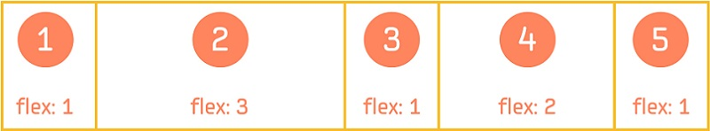

# Flex Container

A flex container contains items, such as buttons, text labels, and images.

`Flexbox` is a CSS3 Web layout model which allows responsive elements within a container, automatically arranged to different size screens or devices. The `FlexContainer` class implements a subset of the W3C [CSS Flexible Box Layout Module Level 1](https://www.w3.org/TR/css-flexbox-1/) specification.

The flex container has the ability to alter the width and/or height of its children (flex items), to optimally fill the available space on any display device. The container expands items to fill available free space, or shrinks them to prevent overflow.

The following figure illustrates of the various directions and terms as applied to a flex container with the `FlexDirection` defined as `row`.

**Figure: Flex container diagram**


NUI supports the following subset of `Flexbox` properties:

-   [ContentDirection](#content-direction)
-   [FlexDirection](#flex-direction)
-   [FlexWrap](#flex-wrap)
-   [JustifyContent](#justify-content)
-   [AlignItems](#align-items)
-   [AlignContent](#align-content)

<a name="content-direction"></a>
## ContentDirection

The `ContentDirection` property specifies the primary direction in which content is ordered on a line.

**Table: ContentDirection values**

| LTR (left-to-right)                      | RTL (right-to-left)                      |
|----------------------------------------|----------------------------------------|
|  |  |

The possible values for this property are:

The possible values for this property are:

| Property value | Description                            |
|--------------|--------------------------------------|
| `Inherit`      | Inherits the direction from the parent |
| `LTR`          | From left to right                     |
| `RTL`          | From right to left                     |

### Usage

```
FlexContainer flexContainer = new FlexContainer();
flexContainer.ContentDirection = FlexContainer.ContentDirectionType.RTL;
```

<a name="flex-direction"></a>
## FlexDirection

The `FlexDirection` property specifies the direction of the main axis which determines the direction in which flex items are laid out.

**Figure: FlexDirection values**


The possible values for this property are:

| Property value  | Description                              |
|---------------|----------------------------------------|
| `Column`        | Flex items are laid out vertically as a column |
| `ColumnReverse` | Flex items are laid out vertically as a column, but in reverse order |
| `Row`           | Flex items are laid out horizontally as a row |
| `RowReverse`    | Flex items are laid out horizontally as a row, but in reverse order |

### Usage

```
FlexContainer flexContainer = new FlexContainer();
flexContainer.FlexDirection = FlexContainer.FlexDirectionType.RowReverse;
```

<a name="flex-wrap"></a>
## FlexWrap

The `FlexWrap` property specifies whether the flex items must wrap if there is not enough room for them on one flex line.

**Figure: FlexWrap values**


The possible values for this property are:

| Property value | Description                              |
|--------------|----------------------------------------|
| `NoWrap`       | Flex items are laid out in single line (shrunk to fit the flex container along the main axis) |
| `Wrap`         | Flex items are laid out in multiple lines if needed |

### Usage

```
FlexContainer flexContainer = new FlexContainer();
flexContainer.FlexWrap = FlexContainer.WrapType.NoWrap;
```

<a name="justify-content"></a>
## JustifyContent

The `JustifyContent` property specifies the alignment of flex items when they do not use all available space on the main axis.

**Figure: JustifyContent values**


The possible values for this property are:

| Property value        | Description                              |
|---------------------|----------------------------------------|
| `JustifyFlexStart`    | Flex items are positioned at the beginning of the container |
| `JustifyCenter`       | Flex items are positioned at the center of the container |
| `JustifyFlexEnd`      | Flex items are positioned at the end of the container |
| `JustifySpaceBetween` | Flex items are positioned with equal space between the lines |
| `JustifySpaceAround`  | Flex items are positioned with equal space before, between, and after the lines |

### Usage

```
FlexContainer flexContainer = new FlexContainer();
flexContainer.JustifyContent = FlexContainer.Justification.JustifySpaceBetween;
```

<a name="align-items"></a>
## AlignItems

The `AlignItems` property specifies the alignment of flex items when they do not use all available space on the cross axis.

**Figure: AlignItems values**


The possible values for this property are:

| Property value   | Description                              |
|----------------|----------------------------------------|
| `AlignAuto`      | Inherits the alignment from the parent (only valid for the [AlignSelf](#align-self) property) |
| `AlignFlexStart` | Items are aligned at the beginning of the container |
| `AlignCenter`    | Items are aligned at the center of the container |
| `AlignFlexEnd`   | Items are aligned at the end of the container |
| `AlignStretch`   | Items are stretched to fit the container |

### Usage

```
FlexContainer flexContainer = new FlexContainer();
flexContainer.AlignItems = FlexContainer.Alignment.AlignFlexStart;
```

<a name="align-content"></a>
## AlignContent

The `AlignContent` property specifies the alignment of flex lines when they do not use all available space on the cross axis. It works when there are multiple lines.

**Figure: AlignContent values**


The possible values for this property are:

| Property value   | Description                              |
|----------------|----------------------------------------|
| `AlignAuto`      | Inherits the alignment from the parent (only valid for the [AlignSelf](#align-self) property) |
| `AlignFlexStart` | Items are aligned at the beginning of the container |
| `AlignCenter`    | Items are aligned at the center of the container |
| `AlignFlexEnd`   | Items are aligned at the end of the container |
| `AlignStretch`   | Items are stretched to fit the container |

### Usage

```
FlexContainer flexContainer = new FlexContainer();
flexContainer.AlignContent = FlexContainer.Alignment.AlignFlexEnd;
```

<a name="custom-properties"></a>
Custom Properties Supported by Flex Items

-   [Flex](#flex)
-   [AlignSelf](#align-self)
-   [FlexMargin](#flex-margin)

These non-animatable properties are registered dynamically to each child which is to be added to the flex container, and once added their values cannot be changed.

When a view is added to the flex container, these properties are checked to decide how to lay out the view inside the flex container.

### Flex

By default, the items in the flex container are not flexible. Setting the `Flex` property makes the item flexible, which means the item can alter its width/height in order to receive the specified proportion of the free space in the flex container. If all items in the flex container use this pattern, their sizes are proportional to the specified flex factor. Flex items do not shrink below their minimum size (if set using the `View` `MinimumSize()` method).

**Figure: Flex property**



#### Usage

Here is the example code for items to achieve the proportion of free space as illustrated above.

```
// Create the flex container
FlexContainer flexContainer = new FlexContainer();

// Set the flex direction to lay out the items horizontally
flexContainer.FlexDirection = FlexContainer.FlexDirectionType.Row;

// Create flex items and set the proportion
View item1 = new View();
item1.Flex = 1.0f;
flexContainer.Add(item1);

View item2 = new View();
item2.Flex = 3.0f;
flexContainer.Add(item2);

View item3 = new View();
item3.Flex = 1.0f;
flexContainer.Add(item3);

View item4 = new View();
item4.Flex = 2.0f;
flexContainer.Add(item4);

View item5 = new View();
item5.Flex = 1.0f;
flexContainer.Add(item5);
```
<a name="align-self"></a>
### AlignSelf {#align-self}

The `AlignSelf` property specifies how the item aligns along the cross axis. If set, this property overrides the default alignment for all items defined by the container’s [AlignItems](#align-items) property.

**Figure: AlignSelf property**


#### Usage

Below is the example code for the items to achieve the alignment on the cross axis as illustrated above.

```
// Create the flex container
FlexContainer flexContainer = new FlexContainer();

// Set the flex direction to lay out the items horizontally
flexContainer.FlexDirection = FlexContainer.FlexDirectionType.Row;

// Set the items to be aligned at the beginning of the container on the cross axis by default
flexContainer.AlignItems = FlexContainer.Alignment.AlignFlexStart;

// Create flex items and add them to the flex container
View item1 = new View();
item1.AlignSelf = FlexContainer.Alignment.AlignCenter; // Align item1 at the center of the container
flexContainer.Add(item1);

View item2 = new View();
flexContainer.Add(item2); // item2 is aligned at the beginning of the container

View item3 = new View();
item3.AlignSelf = FlexContainer.Alignment.AlignFlexEnd); // Align item3 at the bottom of the container
flexContainer.Add(item3);

View item4 = new View();
flexContainer.Add(item4); // item4 is aligned at the beginning of the container
```

<a name="flex-margin"></a>
## FlexMargin

Each flex item inside the flex container is treated as a box (in CSS terms) made up of:

-   Content: The content of the item.
-   Padding: The space around the content (inside the border) of the item.
-   Border: The border that goes around the padding and the content of the item.
-   Margin: The space outside the border.

**Figure: Flex item inside a container**


In NUI, the size of the flex item = content size + padding + border.

The `FlexMargin` property specifies the space around the flex item.

### Usage

```
// Create the flex container
FlexContainer flexContainer = new FlexContainer();

// Create flex item
View item = new View();

// Add the margin around the item
item.FlexMargin = new Vector4(10.0f, 10.0f, 10.0f, 10.0f);

// Add the item to the container
flexContainer.Add(item);
```

<a name="layoutexample"></a>
## FlexContainer Usage Example

This example creates a Gallery-like layout (as shown in the following figure) using `FlexContainer`.

**Figure: FlexContainer usage example**


1.  Create a flex container as the whole view, and set its resize policy to `FillToParent` (the parent is the `Window`):

    ```
    // Create the main flex container
    FlexContainer flexContainer = new FlexContainer();
    flexContainer.ParentOrigin = ParentOrigin.TopLeft;
    flexContainer.PivotPoint = PivotPoint.TopLeft;
    flexContainer.WidthResizePolicy = ResizePolicyType.FillToParent;
    flexContainer.HeightResizePolicy = ResizePolicyType.FillToParent;
    flexContainer.BackgroundColor = Color.White; // Set the background color to be white

    // Add the flex container to the window
    Window.Instance.Add(flexContainer);
    ```

2. Set the flex direction of this main container to `Column`, to display the toolbar and content vertically:

    ```
    // Display toolbar and content vertically
    flexContainer.FlexDirection = FlexContainer.FlexDirectionType.Column;
    ```

3. Create a flex container for the toolbar and add it to the main container. Because the flex direction in the main container is `Column`, the toolbar is arranged on the top of the main container.

    ```
    // Create the toolbar
    FlexContainer toolBar = new FlexContainer();
    toolBar.ParentOrigin = ParentOrigin.TopLeft );
    toolBar.PivotPoint = PivotPoint.TopLeft;
    toolBar.BackgroundColor = Color.Cyan; // Set the background color for the toolbar

    // Add the toolbar to the main container
    flexContainer.Add(toolBar);
    ```

4. To display the buttons and title horizontally, and align them vertically to the center of the toolbar, set the toolbar flex direction to `Row`, and set its `alignItems` property to `Center`. To have the toolbar occupy 10 percent of the whole vertical space, and the content to occupy the rest, set the `Flex` property accordingly:

    ```
    toolBar.FlexDirection = FlexContainer.FlexDirectionType.Row; // Display toolbar items horizontally
    toolBar.AlignItems = FlexContainer.Alignment.AlignCenter; // Center toolbar items vertically
    toolBar.Flex = 0.1f; // 10 percent of available space in the cross axis
    ```

5. Create a third flex container as the content area in the bottom of the main container, to display the image. Items inside it are horizontally and vertically centered to align the image in the center of the content area.

    ```
    // Create the content area
    FlexContainer content = new FlexContainer();
    content.ParentOrigin = ParentOrigin.TopLeft;
    content.PivotPoint = PivotPoint.TopLeft;
    content.FlexDirection = FlexContainer.FlexDirectionType.Row // Display items horizontally
    content.JustifyContent = FlexContainer.Justification.JustifyCenter; // Center toolbar items horizontally
    content.AlignItems = FlexContainer.Alignment.AlignCenter; // Center toolbar items vertically
    content.Flex = 0.9f; // 90 percent of available space in the cross axis

    // Add the content area to the main container
    flexContainer.Add(content);
    ```

6. Add items to the toolbar. The toolbar has 1 button on the left, 1 button on the right, and a title always in the center (regardless of the screen size). To achieve that, make the title flexible so that it automatically takes all the available horizontal space left. Also add some space around the items with the `FlexMargin` property, so that the layout looks nicer.

    ```
    // Add a button to the left of the toolbar
    PushButton prevButton = new PushButton();
    prevButton.ParentOrigin = ParentOrigin.TopLeft;
    prevButton.PivotPoint = PivotPoint.TopLeft;
    prevButton.MinimumSize = new Vector2( 100.0f, 60.0f ); // This is the minimum size the button should keep
    prevButton.FlexMargin = new Vector4(10.0f, 10.0f, 10.0f, 10.0f); // Set 10 pixel margin around the button
    toolBar.Add(prevButton);

    // Set the button text
    PropertyMap labelMap = new PropertyMap();
    labelMap.Add("text", new PropertyValue("Prev"));
    labelMap.Add("textColor", new PropertyValue(Color.Black));
    prevButton.Label = labelMap;

    // Add a title to the center of the toolbar
    TextLabel title = new TextLabel( "Gallery" );
    title.ParentOrigin = ParentOrigin.TopLeft;
    title.PivotPoint = PivotPoint.TopLeft;
    title.WidthResizePolicy = ResizePolicyType.UseNaturalSize;
    title.HeightResizePolicy = ResizePolicyType.UseNaturalSize;
    title.HorizontalAlignment = HorizontalAlignment.Center;
    title.VerticalAlignment = VerticalAlignment.Center;
    title.Flex = 1.0f; // Take all the available space left apart from the two buttons
    title.FlexMargin = new Vector4(10.0f, 10.0f, 10.0f, 10.0f); // Set 10 pixel margin around the title
    toolBar.Add(title);

    // Add a button to the right of the toolbar
    PushButton nextButton = new PushButton();
    nextButton.ParentOrigin = ParentOrigin.TopLeft;
    nextButton.PivotPoint = PivotPoint.TopLeft;
    nextButton.MinimumSize = new Vector2( 100.0f, 60.0f ); // This is the minimum size the button should keep
    nextButton.FlexMargin = new Vector4(10.0f, 10.0f, 10.0f, 10.0f); // Set 10 pixel margin around the button
    toolBar.Add(nextButton);

    // Set the button text
    PropertyMap labelMap2 = new PropertyMap();
    labelMap2.Add("text", new PropertyValue("Next"));
    labelMap2.Add("textColor", new PropertyValue(Color.Black));
    nextButton.Label = labelMap2;
    ```

    The above settings enable the application to run on different-sized devices, or when changing the screen orientation. The toolbar does not expand or shrink based on the available space and the title is always in the center, therefore the layout of the toolbar remains the same.

7. Finally, add the image to the content area:

    ```
    // Add an image to the center of the content area
    ImageView imageView = new ImageView( "image.jpg" );
    imageView.ParentOrigin = ParentOrigin.TopLeft;
    imageView.PivotPoint = PivotPoint.TopLeft;
    content.Add(imageView);
    ```

## Related Information
* Dependencies
  -   Tizen 4.0 and Higher
