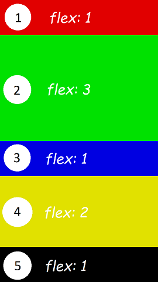

# FlexContainer

A flex container is a NUI container control that contains items, such as buttons, text labels, and images. It is implemented through the `Tizen.NUI.BaseComponents.FlexContainer` class, which in turn implements a subset of the W3C [CSS Flexible Box Layout Module Level 1](https://www.w3.org/TR/css-flexbox-1/) specification. The flexible box (flexbox) is a CSS3 Web layout model, which allows you to create containers with responsive elements inside that are automatically arranged to fit different devices or screen sizes.

The flex container can alter the width and height of the flex items within it, so that they optimally fill the available space on any display size. It expands items to fill available free space, or reduces their size to prevent overflow.

The following figure illustrates flex container terminology and alignment axes, based on a flex container where the **flex direction** is defined as **row**.

**Figure: Flex container terminology**


> [!NOTE]
> Use FlexLayout instead of FlexContainer class. FlexContainer class is deprecated since Tizen 6.0 and will be supported for the subsequent two releases only.

## Creating a Flexbox layout

The following example shows how to create a gallery-like flexbox layout using the [Tizen.NUI.BaseComponents.FlexContainer](https://samsung.github.io/TizenFX/latest/api/Tizen.NUI.BaseComponents.FlexContainer.html) object.

**Figure: Flex container example**


1.  Add the following namespaces:

    ```csharp
    using Tizen.NUI;
    using Tizen.NUI.BaseComponents;
    using Tizen.NUI.UIComponents;
    ```

2.  Create a flex container as the whole view by setting the resize policy to fill the window:

    ```csharp
    /// Create the main flex container
    FlexContainer flexContainer = new FlexContainer();
    flexContainer.ParentOrigin = ParentOrigin.TopLeft;
    flexContainer.PivotPoint = PivotPoint.TopLeft;
    flexContainer.WidthResizePolicy = ResizePolicyType.FillToParent;
    flexContainer.HeightResizePolicy = ResizePolicyType.FillToParent;
    /// Set the background color to white
    flexContainer.BackgroundColor = Color.White;
    /// Add the container to the window
    Window.Instance.Add(flexContainer);
    ```

3.  To make the toolbar and main content display vertically, set the flex direction of the main container to **column**:

    ```csharp
    /// Display toolbar and content vertically
    flexContainer.FlexDirection = FlexContainer.FlexDirectionType.Column;
    ```

4.  Create a new flex container as the toolbar and add it to the main container. Since the flex direction in the main container is set to **column**, the toolbar is placed at the top:

    ```csharp
    /// Create the toolbar
    FlexContainer toolBar = new FlexContainer();
    toolBar.ParentOrigin = ParentOrigin.TopLeft;
    toolBar.PivotPoint = PivotPoint.TopLeft;
    /// Set the toolbar background color
    toolBar.BackgroundColor = Color.Cyan;
    /// Add the toolbar to the main container
    flexContainer.Add(toolBar);
    ```

5.  Change the display of toolbar by setting the `FlexDirection` property to **row**, `AlignItems` property to **center**, and `JustifyContent` property to **spaceBetween**. It displays buttons and title horizontally with vertical alignment to the center of the toolbar and having equal space between them.:

    ```csharp
    /// Display toolbar items horizontally
    toolBar.FlexDirection = FlexContainer.FlexDirectionType.Row;
    /// Align toolbar items vertically center
    toolBar.AlignItems = FlexContainer.Alignment.AlignCenter;
    /// Create equal empty spaces between children
    toolBar.JustifyContent = FlexContainer.Justification.JustifySpaceBetween;
    ```


6.  To display the image, create the content area by adding a third flex container at the bottom of the main container. Show the image in the center of the content area container by centering the item horizontally and vertically inside the area:

    ```csharp
    /// Create the content area
    FlexContainer content = new FlexContainer();
    content.ParentOrigin = ParentOrigin.TopLeft;
    content.PivotPoint = PivotPoint.TopLeft;
    /// Place items horizontally
    content.FlexDirection = FlexContainer.FlexDirectionType.Row;
    /// Align items horizontally center
    content.JustifyContent = FlexContainer.Justification.JustifyCenter;
    /// Align items vertically center
    content.AlignItems = FlexContainer.Alignment.AlignCenter;
    /// Add the content area to the main container
    flexContainer.Add(content);
    ```

7.  Use `Flex` property of the `FlexContainer` class to specify the area to be occupied within the main container. Since the main container displays items vertically, its height is shared between the toolbar and the content. Setting `toolbar.Flex` to 0.1 and `content.Flex` to 0.9 means that `toolbar` will occupy 10% of vertical space and `content` will occupy 90% of vertical space of the main container. The width of the items will be equal to the width of the main container:

    ```csharp
    /// Occupy 10 percent of available space on the cross axis
    toolBar.Flex = 0.1f;
    /// Occupy 90 percent of available space on the cross axis
    content.Flex = 0.9f;
    ``` 

8.  Add items to the toolbar.

    The toolbar has 1 button on the left, 1 button on the right, and a title in the center. To keep the title in the center, make the title flexible so that it automatically takes all remaining horizontal space. To make the layout look nicer, also add some space around the items.

    Creating the toolbar with a flex container allows you to keep the toolbar layout consistent, even as it expands or reduces in size based on screen size and orientation:

    ```csharp
    /// Add a button to the left of the toolbar
    PushButton prevButton = new PushButton();
    prevButton.ParentOrigin = ParentOrigin.TopLeft;
    prevButton.PivotPoint = PivotPoint.TopLeft;
    /// Minimum size the button must keep
    prevButton.MinimumSize = new Vector2(100.0f, 60.0f);
    /// Set a 10-pixel margin around the button
    prevButton.FlexMargin = new Vector4(10.0f, 10.0f, 10.0f, 10.0f);
    toolBar.Add(prevButton);

    /// Set the button text
    PropertyMap labelMap = new PropertyMap();
    labelMap.Add("text", new PropertyValue("Prev"));
    labelMap.Add("textColor", new PropertyValue(Color.Black));
    prevButton.Label = labelMap;

    /// Add a title to the center of the toolbar
    TextLabel title = new TextLabel("Gallery");
    title.ParentOrigin = ParentOrigin.TopLeft;
    title.PivotPoint = PivotPoint.TopLeft;
    title.WidthResizePolicy = ResizePolicyType.UseNaturalSize;
    title.HeightResizePolicy = ResizePolicyType.UseNaturalSize;
    title.HorizontalAlignment = HorizontalAlignment.Center;
    title.VerticalAlignment = VerticalAlignment.Center;
    /// Set a 10-pixel margin around the title
    title.FlexMargin = new Vector4(10.0f, 10.0f, 10.0f, 10.0f);
    toolBar.Add(title);

    /// Add a button to the right of the toolbar
    PushButton nextButton = new PushButton();
    nextButton.ParentOrigin = ParentOrigin.TopLeft;
    nextButton.PivotPoint = PivotPoint.TopLeft;
    /// Minimum size the button must keep
    nextButton.MinimumSize = new Vector2(100.0f, 60.0f);
    /// Set a 10-pixel margin around the button
    nextButton.FlexMargin = new Vector4(10.0f, 10.0f, 10.0f, 10.0f);
    toolBar.Add(nextButton);

    /// Set the button text
    PropertyMap labelMap2 = new PropertyMap();
    labelMap2.Add("text", new PropertyValue("Next"));
    labelMap2.Add("textColor", new PropertyValue(Color.Black));
    nextButton.Label = labelMap2;
    ```

9.  Add the image to the content area:

    ```csharp
    /// Add an image to the center of the content area
    ImageView imageView = new ImageView(DirectoryInfo.Resource + "image.png");
    imageView.ParentOrigin = ParentOrigin.TopLeft;
    imageView.PivotPoint = PivotPoint.TopLeft;
    content.Add(imageView);
    ```

## Modifying FlexContainer properties

You can modify the flex container appearance and behavior through the following properties:

-   `ContentDirection`

    This property specifies the primary direction in which content is ordered along a line:

    **Figure: ContentDirection LTR**

    

    **Figure: ContentDirection RTL**

    

    **Table: ContentDirection values**

    | Property value |  Description|
    |----------------|-------------|
    | `Inherit` |   Inherit the direction from the parent|
    | `LTR`     |    Place content from left to right|
    | `RTL`     |   Place content from right to left |

    **Usage:**

    ```csharp
    FlexContainer flexContainer = new FlexContainer();
    flexContainer.ContentDirection = FlexContainer.ContentDirectionType.RTL;
    ```

-   `FlexDirection`

    This property specifies the main axis direction along which flex items are placed. The default property is `Column`:

    **Figure: FlexDirection**

    

    **Table: FlexDirection values**

    | Property value |  Description |
    |----------------|--------------|
    |  `Column`    |    Place items vertically in a column |
    |  `ColumnReverse` |  Place items vertically in a column, but in reverse order |
    |   `Row`    |      Place items horizontally in a row |
    |  `RowReverse`   |   Place items horizontally in a row, but in reverse order |

    **Usage:**

    ```csharp
    FlexContainer flexContainer = new FlexContainer();
    flexContainer.FlexDirection = FlexContainer.FlexDirectionType.RowReverse;
    ```

-   `FlexWrap`

    This property specifies whether the flex items must wrap if there is not enough room for them on 1 flex line:

    **Figure: FlexWrap**

    

    **Table: FlexWrap values**

    | Property value |  Description |
    |----------------|--------------|
    |  `NoWrap` |    Reduce item sizes to fit them in a single line along the main axis |
    |  `Wrap`   |    Show items over multiple lines, if needed |

    **Usage:**

    ```csharp
    FlexContainer flexContainer = new FlexContainer();
    flexContainer.FlexWrap = FlexContainer.WrapType.NoWrap;
    ```

-   `JustifyContent`

    This property specifies the alignment for flex items when all the available space on the main axis is not used:

    **Figure: JustifyContent**

    

    **Table: JustifyContent values**

    | Property value  |   Description |
    |-----------------|---------------|
    | `JustifyFlexStart` | Position items at the beginning of the container |
    | `JustifyCenter`  |    Position items at the center of the container |
    |  `JustifyFlexEnd` |     Position items at the end of the container |
    |  `JustifySpaceBetween` |  Position items with equal spacing between them |
    |  `JustifySpaceAround`  |  Position items with equal spacing before, between, and after them |

    **Usage:**

    ```csharp
    FlexContainer flexContainer = new FlexContainer();
    flexContainer.JustifyContent = FlexContainer.Justification.JustifySpaceBetween;
    ```

-   `AlignItems`

    This property specifies the alignment for flex items when all the available space on the cross axis is not used:

    **Figure: AlignItems**

    

    **Table: AlignItems values**

    |  Property value  |   Description |
    |------------------|---------------|
    |  `AlignAuto`    |    Inherit the alignment from the parent (only valid for the [AlignSelf](#align-self) property) |
    |  `AlignFlexStart` |  Align items to the beginning of the container |
    |  `AlignCenter`   |   Align items to the center of the container |
    |  `AlignFlexEnd`  |   Align items to the end of the container |
    |  `AlignStretch`  |   Stretch items to fit the container |

    **Usage:**

    ```csharp
    FlexContainer flexContainer = new FlexContainer();
    flexContainer.AlignItems = FlexContainer.Alignment.AlignFlexStart;
    ```

-   `AlignContent`

    This property specifies the alignment for flex lines when all the available space on the cross axis is not used. It is only valid when there are multiple lines:

    **Figure: AlignContent**

    

    **Table: AlignContent values**

    | Property value  |   Description |
    |-----------------|---------------|
    |  `AlignAuto`    |  Inherit the alignment from the parent (only valid for the [AlignSelf](#align-self) property) |
    |  `AlignFlexStart` |  Align the lines to the beginning of the container |
    |  `AlignCenter`  |  Align the lines to the center of the container |
    |  `AlignFlexEnd` |    Align the lines to the end of the container |
    |  `AlignStretch`  |   Stretch the lines to fit the container |

    **Usage:**

    ```csharp
    FlexContainer flexContainer = new FlexContainer();
    flexContainer.AlignContent = FlexContainer.Alignment.AlignFlexEnd;
    ```

## Modifying FlexItem properties

Flex items have non-animatable properties, which are registered dynamically to each child before it is added to the flex container. Once the item is added to the container, these values cannot be changed. These properties determine the item's placement inside the flex container.

You can modify the flex item placement through the following properties:

-   `Flex`

    By default, items in a flex container are not flexible. To make an item flexible, so that it alters its width and height to occupy a specified proportion of free space in the flex container, you can set the item's `Flex` property. If all items in the flex container use this pattern, their sizes are proportional to the specified flex factor. If you have specified a minimum size for the item, using the `MinimumSize()` method of the [Tizen.NUI.BaseComponents.View](https://samsung.github.io/TizenFX/latest/api/Tizen.NUI.BaseComponents.View.html) class, the item cannot become smaller than the minimum:

    **Figure: Flex**

    

    To create a layout with the proportions shown in the above figure:

    ```csharp
    /// Create the flex container
    FlexContainer flexContainer = new FlexContainer();

    /// Resize flex container to window size
    flexContainer.WidthResizePolicy = ResizePolicyType.FillToParent;
    flexContainer.HeightResizePolicy = ResizePolicyType.FillToParent;

    /// Add the container to the window
    Window.Instance.Add(flexContainer);

    /// Create flex items and set their proportions
    View item1 = new View();
    item1.BackgroundColor = Color.Red;
    item1.Flex = 1.0f;
    flexContainer.Add(item1);

    View item2 = new View();
    item2.BackgroundColor = Color.Green;
    item2.Flex = 3.0f;
    flexContainer.Add(item2);

    View item3 = new View();
    item3.BackgroundColor = Color.Blue;
    item3.Flex = 1.0f;
    flexContainer.Add(item3);

    View item4 = new View();
    item4.BackgroundColor = Color.Yellow;
    item4.Flex = 2.0f;
    flexContainer.Add(item4);

    View item5 = new View();
    item5.Flex = 1.0f;
    flexContainer.Add(item5);
    ```

-   `AlignSelf`

    This property specifies how the item aligns along the cross axis. If the `AlignSelf` property is set, it overrides the default alignment defined by the container's `AlignItems` property:

    **Figure: AlignSelf**

    

    To create the item alignment shown in the above figure:

    ```csharp
    /// Create the flex container
    FlexContainer flexContainer = new FlexContainer();

    /// Set the default alignment along the cross axis to the beginning of the container
    flexContainer.AlignItems = FlexContainer.Alignment.AlignFlexStart;
    flexContainer.WidthResizePolicy = ResizePolicyType.FillToParent;
    flexContainer.HeightResizePolicy = ResizePolicyType.FillToParent;
    flexContainer.FlexDirection = FlexContainer.FlexDirectionType.Row;
    Window.Instance.Add(flexContainer);

    /// Create flex items and add them to the flex container
    View item1 = new View();

    /// Align item1 to the center of the container
    item1.AlignSelf = (int)FlexContainer.Alignment.AlignCenter;
    item1.Size2D = new Size2D(150, 150);
    item1.BackgroundColor = Color.Red;
    flexContainer.Add(item1);

    View item2 = new View();

    /// Align item2 to the beginning of the container based on the default alignment
    item2.Size2D = new Size2D(150, 150);
    item2.BackgroundColor = Color.Green;
    flexContainer.Add(item2);

    View item3 = new View();

    /// Align item3 to the bottom of the container
    item3.AlignSelf = (int)FlexContainer.Alignment.AlignFlexEnd;
    item3.Size2D = new Size2D(150, 150);
    item3.BackgroundColor = Color.Blue;
    flexContainer.Add(item3);

    View item4 = new View();

    /// Align item4 to the beginning of the container based on the default alignment
    item4.AlignSelf = (int)FlexContainer.Alignment.AlignFlexStart;
    item4.Size2D = new Size2D(150, 150);
    item4.BackgroundColor = Color.Magenta;
    flexContainer.Add(item4);
    ```

-   `FlexMargin`

    Each flex item inside the flex container is treated like a CSS box, consisting of the following areas:

    -   Content: Item content
    -   Padding: Space around the content, but inside the border
    -   Border: Border around the padding and content
    -   Margin: Space outside the border

    In NUI, the total size of the flex item includes the content size, padding, and border. The flex margin specifies the space around the flex item:

    **Figure: FlexMargin**

    

    To add space around an item:

    ```csharp
    /// Create the flex container
    FlexContainer flexContainer = new FlexContainer();
    Window.Instance.Add(flexContainer);

    /// Create a flex item
    View item = new View();

    /// Add a margin around the item
    item.FlexMargin = new Vector4(10.0f, 10.0f, 10.0f, 10.0f);
    item.Size2D = new Size2D(200, 200);
    item.BackgroundColor = Color.Red;
    flexContainer.Add(item);
    ```

## Related information 
- Example
  - [FlexContainer Sample](https://github.com/Samsung/Tizen-CSharp-Samples/blob/master/TV/FlexContainerSample)
- Dependencies
  -   Tizen 4.0 and Higher
