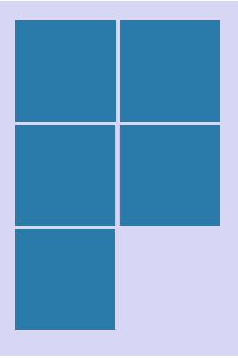

# Grid Layout

`GridLayout` is a grid box for the two dimensional layout. It constraints the x and y position, width, and height of the child actors.

Positioning children in a grid form, the cells are of uniform size based on the first child added to the parent View.

You can set the number of **columns**, however the rows automatically increase to hold the children. After the available space is used, the remaining rows become invisible by default.

| Property               | Type            | Description |
| -----------------------| --------------- | ------------ |
| `Columns`              | int             | Gets or sets the number of columns in the grid. |


## Column



```csharp
View layoutView = new View();
var gridLayout = new GridLayout();
gridLayout.Columns = 2;
layoutView.Layout = gridLayout;
```


## Related Information

- Dependencies
  -  Tizen 5.5 and Higher
