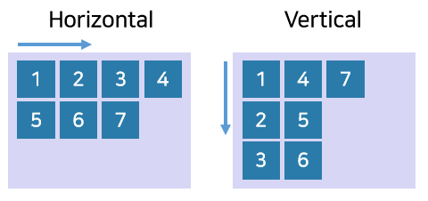
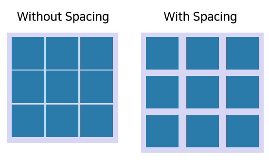
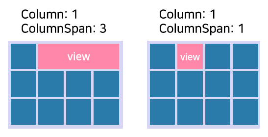
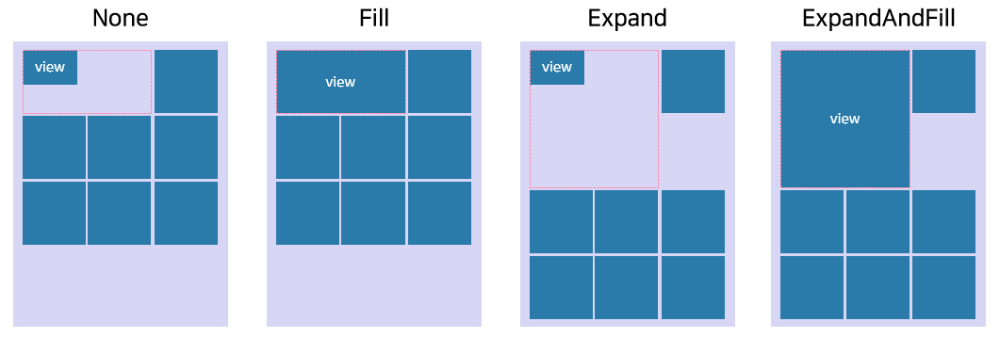
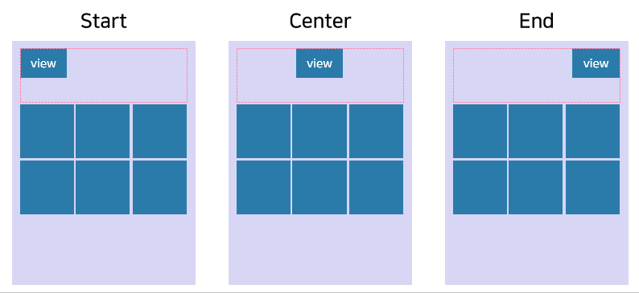

# Grid layout

> [!NOTE]
> Only `Columns` property is supported on Tizen 5.5.

`GridLayout` is a grid box for the two dimensional layout. It constraints the x and y position, width, and height of the child actors. It positions the children in a grid form, where the size of each column and row is set to the largest size of the cells belonging to their axis.

There are two types of properties that affect the `GridLayout`. One is the properties for the grid layout and other is the properties that affect the specified child.

The following table describes the properties of `GridLayout`:

| Property               | Type            | Description |
| -----------------------| --------------- | ------------ |
| `Columns`              | int             | Gets or sets the number of columns in the grid. |
| `Rows`                 | int             | Gets or sets the number of rows in the grid. |
| `GridOrientation`      | Orientation     | Gets or sets the orientation in the grid. |
| `ColumnSpacing`        | float           | Gets or sets the distance between columns. |
| `RowSpacing`           | float           | Gets or sets the distance between rows. |

<a name="columns-and-rows"></a>
## Columns and rows

The `Columns` and the `Rows` properties specify the maximum number of cells on a horizontal or vertical axis.

When the `Column` or `Row` of child is automatically set without a specified value, the value cannot exceed the number of main-axis cell which is the `Columns` value on horizontal orientation, or the `Rows` value on vertical orientation. However, it can be assigned a value that exceeds the number of cross-axis cell.

The following figure shows how to set the `Colomns` and the `Rows` properties. Since the `GridOrientation` is set to horizontal, the row index of last item can be `2` that exceeds the `Rows` property.


```csharp
View layoutView = new View();
var gridLayout = new GridLayout();
gridLayout.GridOrientation = GridLayout.Orientation.Horizontal;
gridLayout.Columns = 2;
gridLayout.Rows = 1;
layoutView.Layout = gridLayout;
```
<a name="grid-orientation"></a>
## Grid orientation

The `GridOrientation` only works when a child is added without the specified `Row` or `Column` property.

 - On horizontal orientation, the children will automatically occupy empty cells from left to right.
 - On vertical orientation, the children will automatically occupy empty cells from top to bottom.

The following figure shows how the `GridOrientation` property works:



## Column spacing and row spacing

The `ColumnSpacing` and `rowSpacing` properties are the distance between columns or rows. In order to set same space between the children, you can use `ColumnSpacing` and `rowSpacing` properties instead of setting the same margin for each child.

The following figure shows how the `ColumnSpacing` and `RowSpacing` properties work:



The following table describes the properties that affect the specified child:

| Property               | Type            | Description |
| -----------------------| --------------- | ----------- |
| `Column`               | int             | Gets or sets the column index of the child. |
| `Row`                  | int             | Gets or sets the row index of the child. |
| `ColumnSpan`           | int             | Gets or sets the number of columns that the child occupy. |
| `RowSpan`              | int             | Gets or sets the number of rows that the child occupy. |
| `HorizontalStretch`    | StretchFlags    | Gets or sets the value how child is resized within horizontal space of the cell where child occupy. |
| `VerticalStretch`      | StretchFlags    | Gets or sets the value how child is resized within vertical space of the cell where child occupy. |
| `HorizontalAlignment`  | Alignment       | Gets or sets the horizontal alignment of the child within the cell. |
| `VerticalAlignment`    | Alignment       | Gets or sets the vertical alignment of the child within the cell. |

## Column and row

The `Column` and `row` properties specify the cell index of the child. If these properties aren't assigned, they are automatically set depending on [`GridOrientation`](#grid-orientation), [`Columns`](#columns-and-rows) and [`Rows`](#columns-and-rows).

The following figure shows how to position child on the grid using `Column` and `Row` properties:


## Column span and row span

The `ColumnSpan` and `rowSpan` properties specify the number of cells that the child can occupy. The sum of cell index and cell span should be less than the maximum number of cells specified by `Columns` or `Rows` properties.

The following figure shows how to position child on the grid using `Column` and `ColumnSpan` properties:



## Horizontal stretch and vertical stretch

The `HorizontalStretch` and `VerticalStretch` properties define how a child is resized within the space of the cell. The values can be specified as `Stretchflags` enum:



| Value           | Description |
| --------------- | ----------- |
| `None`          | Fits to the measured size. |
| `Fill`          | Resizes to completely fill the space. |
| `Expand`        | Expands to share available space. |
| `ExpandAndFill` | Expands to share available space and fill the space.

## Horizontal alignment and vertical alignment

The `HorizontalAlignment` and `VerticalAlignment` properties specify the alignment for the child within its cells:



## Related information

- Dependencies
  -  Tizen 5.5 and Higher
