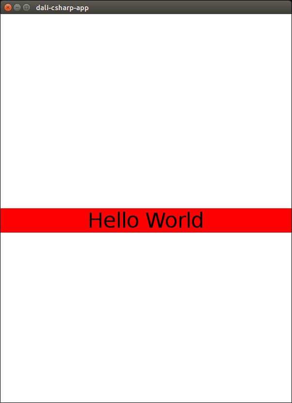

# NUI Hello World Tutorial

The topic shows how to create and display a "Hello World" text using a text label. It also demonstrates how you can react to touch events on the application screen.

To build and run the application, you must use Visual Studio on Windows&reg; or Visual Studio Code on Linux.

**Figure: Hello World**



To create an application that displays the "Hello World" text label:

1.  Declare the required system and NUI namespaces:

    ```
    using System;
    using System.Runtime.InteropServices;
    using Tizen.NUI;
    using Tizen.NUI.UIComponents;
    using Tizen.NUI.BaseComponents;
    using Tizen.NUI.Constants;
    ```

2.  Scope the application to the `HelloTest` namespace:

    ```
    namespace HelloTest
    ```

3.  Derive the application from the [Tizen.NUI.NUIApplication](https://developer.tizen.org/dev-guide/csapi/api/Tizen.NUI.NUIApplication.html) class:

    ```
    class Example : NUIApplication
    ```

    The `Tizen.NUI.NUIApplication` class includes constructors that allow you to create applications with various stylesheets and window modes.

4.  To handle behavior when the application is launched, override the `OnCreate()` method of the `Tizen.NUI.NUIApplication` class and call the initialization method:

    ```
    protected override void OnCreate()
    {
        base.OnCreate();
        Initialize();
    }
    ```

    > **Note**  
    > To invoke the `Created` event of the [Tizen.Applications.CoreApplication](https://developer.tizen.org/dev-guide/csapi/api/Tizen.Applications.CoreApplication.html) class, you must call the `base.OnCreate()` method inside the override.

5.  Within the `Initialize()` method, set the text label properties:

    1.  Create the text label object from the [Tizen.NUI.BaseComponents.TextLabel](https://developer.tizen.org/dev-guide/csapi/api/Tizen.NUI.BaseComponents.TextLabel.html) class:

        ```
        _text = new TextLabel("Hello World");
        ```

    2.  Position the text in the center of the application window. The `ParentOrigin` property defines a point within the parent view area. If the text label size is not specified, the text label is at least as wide as the screen.

        ```
        _text.ParentOrigin = ParentOrigin.CenterLeft;
        ```

    3.  Align the text horizontally to the center of the available area:

        ```
        _text.HorizontalAlignment = HorizontalAlignment.Center;
        ```

    4.  To illustrate the label width, set the label background color:

        ```
        _text.BackgroundColor = Color.Red;
        ```

    5.  Define the text size in points:

        ```
        _text.PointSize = 32.0f;
        ```

    For more information on the key properties of the `Tizen.NUI.BaseComponents.TextLabel` class, see [TextLabel](textlabel.md).

6.  Implement the main application window:
    1.  Create the window and add an event handler for the `TouchEvent` event of the [Tizen.NUI.Window](https://developer.tizen.org/dev-guide/csapi/api/Tizen.NUI.Window.html) class. This event handler is invoked whenever the application window is clicked.

        ```
        Window window = Window.Instance;
        window.TouchEvent += WindowTouched;
        ```

    2.  Add the text label to the window's root layer:

        ```
        window.Add(_text);
        ```

7.  Define the event handler to change the label text:

    ```
    private void WindowTouched(object sender, Window.TouchEventArgs e)
    {
        _text.Text = "I have been touched!";
    }
    ```

8.  To handle behavior when the window close button is clicked and the application is about to terminate, override the `OnTerminate()` method of the `Tizen.NUI.NUIApplication` class:

    ```
    protected override void OnTerminate()
    {
        base.OnTerminate();
        _text = null;
    }
    ```

    >  **Note**  
    > To invoke the `Terminated` event of the `Tizen.Applications.CoreApplication` class, you must call the `base.OnTerminate()` method inside the override.

9.  Implement the `Main()` method:
    1.  Create the application through the default constructor:

        ```
        Example example = new Example();
        ```

    2.  Start the application main loop.

        This ensures that images are displayed, and that events and signals are dispatched and captured.

        In this simple tutorial, the `Main()` method resides within the class. For significant application development, the `Main()` method must be placed in a separate `.cs` file.

        ```
        example.Run(args);
        ```

The following example shows the full source code of the tutorial application described above.

```
using System;
using System.Runtime.InteropServices;
using Tizen.NUI;
using Tizen.NUI.UIComponents;
using Tizen.NUI.BaseComponents;
using Tizen.NUI.Constants;

namespace HelloTest
{
    class Example : NUIApplication
    {
        TextLabel _text;

        protected override void OnCreate()
        {
            base.OnCreate();
            Initialize();
        }

        private void Initialize()
        {
            /// Add a simple text label to the main window
            _text = new TextLabel("Hello World");
            _text.ParentOrigin = ParentOrigin.CenterLeft;
            _text.HorizontalAlignment = HorizontalAlignment.Center;
            _text.BackgroundColor = Color.Red;
            _text.PointSize = 32.0f;

            /// Add the touch signal event handler
            Window window = Window.Instance;
            window.TouchEvent += WindowTouched;

            window.Add(_text);
        }

        /// Event handler for window touched signal
        private void WindowTouched(object sender, Window.TouchEventArgs e)
        {
            _text.Text = "I have been touched!";
        }

        protected override void OnTerminate()
        {
            base.OnTerminate();
            _text = null;
        }

        static void Main(string[] args)
        {
            Example example = new Example();
            example.Run(args);
        }
    }
}
```

## Related Information
- Dependencies
  -   Tizen 4.0 and Higher
