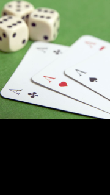

# ImageView

An image view is a NUI control that displays an image. It is implemented through the `Tizen.NUI.BaseComponents.ImageView` class.

**Figure: Image view example**



<a name="usage"></a>
## Creating an Image View

To create an image view:

1.  Create an instance of the [Tizen.NUI.BaseComponents.ImageView](https://samsung.github.io/TizenFX/latest/api/Tizen.NUI.BaseComponents.ImageView.html) class and define the image file as a parameter:

    ```
    imageView = new ImageView(DirectoryInfo.Resource + "images/gallery-3.jpg");
    ```

    You can also create the `Tizen.NUI.BaseComponents.ImageView` class instance separately and define the file path by setting its `ResourceUrl` property:

    ```
    imageView = new ImageView();
    imageView.ResourceUrl = DirectoryInfo.Resource + "images/gallery-3.jpg";
    ```

2.  To change the image path after the instance has been created, use the `SetImage()` method of the `Tizen.NUI.BaseComponents.ImageView` class:

    ```
    imageView.SetImage(DirectoryInfo.Resource + "images/gallery-4.jpg");
    ```

<a name="properties"></a>
## Image View Properties

The following table defines the [Tizen.NUI.BaseComponents.ImageView](https://samsung.github.io/TizenFX/latest/api/Tizen.NUI.BaseComponents.ImageView.html) class control properties.

**Table: Image view control properties**

| Property             | Type        | Description                              |
|--------------------|-----------|----------------------------------------|
| `ResourceUrl`        | `string`    | The file path of the Image.        |
| `ImageMap`           | `Map`       | Property map associated with a given image. |
| `PreMultipliedAlpha` | `bool`      | Whether the image is opacity-adjusted<br>If `PreMultipliedAlpha` is `true`, the RGB  components represent the color of the object or pixel, adjusted for its opacity by multiplication. If `false`, the opacity is ignored.  |
| `PixelArea`          | `Vector4`   | Image subarea defined with relative area  values: x coordinate for the top-left corner, y coordinate for the top-left corner, width, and height. To set the subarea as the whole image area, use `[0.0, 0.0, 1.0, 1.0]`.<br>For example, on a 200 x 200 pixel image, the  value `[0.25, 0.5, 0.5, 0.5]` represents a subarea of   that image with the  following coordinates:<br><br>-   Top left: 50, 100<br>-   Top right: 150, 100<br>-   Bottom left: 50, 200<br>-   Bottom right: 150, 200        |
| `Border`             | `Rectangle` | Image border, specified  in the following order:  left, right, bottom, and  top. For N-Patch images only.         |
| `BorderOnly`         | `bool`      | Whether to draw only the borders. For N-Patch  images only.  |
| `SynchronousLoading` | `bool`      | Whether the image is synchronous. For N-Patch images only.     |


## Related Information
- Dependencies
  -   Tizen 4.0 and Higher
