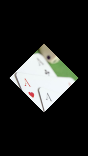

# ImageView

An image view is a NUI control that displays an image. It is implemented through the [ImageView](https://samsung.github.io/TizenFX/latest/api/Tizen.NUI.BaseComponents.ImageView.html) class:

## Creating an ImageView

To create an image view:

**Figure: ImageView**

 

1.  To use the `ImageView` class, add the following namespaces:

    ```csharp
    using Tizen.NUI;
    using Tizen.NUI.BaseComponents;
    ```

2.  It is assumed that image is in the resources directory. Create an instance of the `ImageView` class and pass path to image file as an constructor argument:

    ```csharp
    ImageView imageView = new ImageView(DirectoryInfo.Resource + "your-image.jpg");
    Window.Instance.Add(imageView);
    ```

    You can also create the `ImageView` class instance separately and define the file path by setting its `ResourceUrl` property:

    ```csharp
    imageView = new ImageView();
    imageView.ResourceUrl = DirectoryInfo.Resource + "your-image.jpg";
    Window.Instance.Add(imageView);
    ```

2.  To change the image path after the instance has been created, use the `SetImage()` method of the `ImageView` class:

    ```csharp
    imageView = new ImageView();
    imageView.SetImage(DirectoryInfo.Resource + "your-image.jpg");
    Window.Instance.Add(imageView);
    ```
## Manipulating an Image View


**Figure: Manipulated ImageView**

 

1.  Create object, set `Size2D` property and display it at the center of the window by setting `ParentOrigin` and `Position2D` properties:

    ```csharp
    ImageView imageView = new ImageView(DirectoryInfo.Resource + "your-image.jpg");
    imageView.Size2D = new Size2D(400, 400);
    imageView.ParentOrigin = ParentOrigin.Center;
    imageView.Position2D = new Position2D(-200, -200);
    Window.Instance.Add(imageView);
    ```

2.  Use `PixelArea` property to apply zoom effect:

    ```csharp
    imageView.PixelArea = new RelativeVector4(0.25f, 0.25f, 0.5f, 0.5f);
    ```

3.  To rotate image by 45 degrees, set `Orientation` property as follow:

    ```csharp
    imageView.Orientation = new Rotation(new Radian((float)System.Math.PI / 4), 
                                         new Vector3(0.0f, 0.0f, 1.0f));
    ```

## ImageView Event

It is possible to take some action after all resources required by a control are loaded and ready.

1. Create handler:

    ```csharp
    public void onResourceReady(object sender, ImageView.ResourceReadyEventArgs e)
    {
        // Resource is ready, do something
    } 
    ```

2. Add handler to `ImageView` by using `ResouceReady` property:

    ```csharp
    imageView.ResourceReady += onResourceReady;
    ```

## ImageView Properties


The following table defines the `ImageView` class control properties.

**Table: Image view control properties**

| Property             | Type        | Description                              |
|--------------------|-----------|----------------------------------------|
| `ResourceUrl`        | `string`    | The file path of the Image.        |
| `ImageMap`           | `Map`       | Property map associated with a given image. |
| `PreMultipliedAlpha` | `bool`      | Whether the image is opacity-adjusted<br>If `PreMultipliedAlpha` is `true`, the RGB  components represent the color of the object or pixel, adjusted for its opacity by multiplication. If `false`, the opacity is ignored.  |
| `PixelArea`          | `Vector4`   | Image subarea defined with relative area  values: x coordinate for the top-left corner, y coordinate for the top-left corner, width, and height. To set the subarea as the whole image area, use `[0.0, 0.0, 1.0, 1.0]`.<br>For example, on a 200 x 200 pixel image, the  value `[0.25, 0.5, 0.5, 0.5]` represents a subarea of   that image with the  following coordinates:<br><br>-   Top left: 50, 100<br>-   Top right: 150, 100<br>-   Bottom left: 50, 200<br>-   Bottom right: 150, 200        |
| `Border`             | `Rectangle` | Image border, specified  in the following order:  left, right, bottom, and  top. For N-Patch images only.         |
| `BorderOnly`         | `bool`      | Whether to draw only the borders. For N-Patch  images only.  |
| `SynchronousLoading` | `bool`      | Whether the image is synchronous. For N-Patch images only.     |


## Related Information
- Example
  - [WearableImageSample](https://github.com/Samsung/Tizen-CSharp-Samples/tree/master/Wearable/ImageSample)
- Dependencies
  -   Tizen 4.0 and Higher
