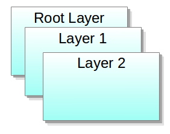
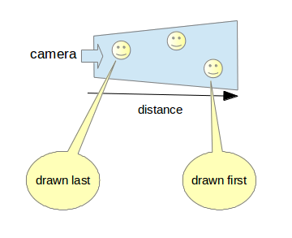

# Layer

A layer is a transparent sheet upon which shapes are placed. It supports sub layers within layers to any desired depth.
Layers provide a mechanism for overlaying groups of views on top of each other.
Layers can also clip their contents, to exclude any content outside a user defined area.

Layers can be two-dimensional or three-dimensional, defined by their _behavior_ property.

 

When a layer is added to the Window, it assigns a unique depth value. By default, the stage has a root layer with a depth value of 0.

Layers provide a mechanism for overlaying groups of actors on top of each other. Layers are drawn in order to determined the **depth** value of the layer.


```
// C# example of adding an ImageView to the layer

// Gets the default (root) layer
Window window = Window.Instance;
Layer layer = window.GetDefaultLayer();
_layer1 = new Layer();
window.AddLayer(_layer1);

// Adds a child view to this layer
ImageView _imageView = new ImageView();
layer.Add(_imageView);
```

## Layer Specific Properties

 - `Behavior`: Specifies the behavior of the layer. The value can be `LayerUI` (default) or `Layer3D`.
 - `ChildCount`: To get the number of children the layer holds.
 - `Depth`: To query the depth of the layer.
 - `Name`: To set or get the name of the layer.
 - `Opacity`: To retrieve and set the opacity of the layer.
 - `Viewport`: To set the viewport(in window coordinate) of the layer.
 - `Visibility`: To retrieve and set the visibility of the layer.

### Re-ordering layers

A range of functions are provided to change the draw order of the layers.

### LayerUI

#### Background

 - Graphics are drawn using renderers
 - Views can have zero or many renderers
 - Renderers can be shared by views
 - Renderers have a depth index property

With `LayerUI`, the draw order of the renderers is defined by both:
 - Renderer depth index
 - Position of view in the layer tree

### Layer3D

When you set the behavior of the layer to `Layer3D`, the opaque renderers are drawn first and written to the depth buffer.

Transparent renderers are drawn in order of distance from the camera ( painter's algorithm ).

 


## Related Information
- Dependencies
  -   Tizen 4.0 and Higher
