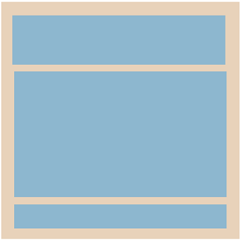

# Layouting

This tutorial describes the NUI Layouting framework, covering the following subjects:

## Layouting Overview

The Layouting framework enables [View](https://samsung.github.io/TizenFX/latest/api/Tizen.NUI.BaseComponents.View.html) to be automatically positioned within a parent View that has been assigned a Layout.

The framework offers a common method to layout **Views** with just minimal setup in the application.

Especially, NUI Layouting provides advanced layouting capabilities in a reusable manner. It attempts to separate out the layouting logic from Views into distinct Layouters, so that a View's responsibility is just building and rendering the content.

Layouts are instances of specific Layouts. For example, the first screenshot below shows LinearLayout with Horizontal Layout and Vertical Layout.

<table style="width:100%">
<tr>
<td style="width:100%" align="center">

</td>
</tr>
</table>

NUI supports default layouts, such as [Linear Layout](./linear-layout.md) and [Grid Layout](./grid-layout.md).
The default layouts can be assigned to a View, and then children added to this View will be positioned and sized according to that layout in conjunction with specification and properties set on the layout and Views.

Also, the layouting framework allows nested layouting: View with a layout can be added to another View with a layout.

A View can be assigned any Layout and re-assigned to a different Layout but a Layout can only be used with one View at a time.

New layouts can be implemented by deriving from the Layouting base class and positioning the children in any way required. If you want to create `Custom Layout`, see [Creating custom Layouts](./custom-layout.md) for instructions.


## Lay out a View

### Setting a layout to a View

For a View to perform the desired layouting for its children, it needs to have a layout created and set to it. NUI Layout may need extra settings to be provided. For example, a `GridLayout` can have the number of columns set on it.

Below code snippet creates a View, creates a LinearLayout and then sets the layout on the View.

```csharp
View parentView = new View();

var layout = new LinearLayout();
layout.LinearOrientation = LinearLayout.Orientation.Horizontal;

parentView.Layout = layout;
```

In the case, the linear layout has the Horizontal orientation set on it as `LinearLayout` can be vertical or horizontal.

A View can be assigned a new layout. This will cause its children to be repositioned as described by the new layout.
A Layout can only be assigned to a single View at a time, trying to assign the same layout to multiple Views will result in only the last assigned View to have that layout.
A default Layout will be assigned if a layout is moved from one View to another.

```csharp
View parentView = new View();

var layoutLinear = new LinearLayout();
layout.LinearOrientation = LinearLayout.Orientation.Horizontal;

parentView.Layout = layoutLinear;

...

someAction.Event += (sender, e) =>
{
  parentView.Layout = new GridLayout();
}
```

Code above changes the layout from `LinearLayout` to `GridLayout` on a event occurance.


### Sizing and Specifications

There are 2 size specifications available for Views : Setting **explicit value** and Using **Layout Parameters**.

Size specifications are ways to specify the preferred size of Views within the layouting framework. Height and Width are individual, so each can be set with a different specification.

1. An **explicit value** can be provided, either using the existing [Size](https://samsung.github.io/TizenFX/latest/api/Tizen.NUI.Size.html) API or setting a pixel value to the specification. User can specify the width and height with the exact measurement.

- Using [Specification](https://samsung.github.io/TizenFX/latest/api/Tizen.NUI.BaseComponents.View.html#Tizen_NUI_BaseComponents_View_HeightSpecification) API

  <table style="width:100%">
  <tr>
  <td style="width:100%" align="center">
  
  </td>
  </tr>
  </table>

  ```csharp
  View child1 = new View();
  child1.WidthSpecification = 90;
  child1.HeightSpecification = 90;

  View child2 = new View();
  child2.WidthSpecification = 120;
  child2.HeightSpecification = 120;

  View child3 = new View();
  child3.WidthSpecification = 90;
  child3.HeightSpecification = 90;
  ```


2. **Layout Parameters** can set the width or height with the relative value of its children or its parent.

- [LayoutParamPolicies.WrapContent]

  : Setting a `View`'s height or width specification to `WrapContent` will cause the View to grow or shrink to wrap around the size of its children.

  

  ```csharp
  View childView = new View();
  childView.WidthSpecification = LayoutParamPolicies.WrapContent;
  childView.HeightSpecification = LayoutParamPolicies.WrapContent;
  ```

- [LayoutParamPolicies.MatchParent]

   : Setting a `View`'s height or width specification to `MatchParent` will cause the View to fill the size of its parent.

  
  ```csharp
  View childView = new View();
  childView.WidthSpecification = LayoutParamPolicies.MatchParent;
  childView.HeightSpecification = LayoutParamPolicies.MatchParent;
  ```

### Padding and Margin

<table style="width:100%">
<tr>
<td style="width:100%" align="center">

</td>
</tr>
</table>

`Padding` and `Margin` provide additional control within a layout to achieve a desired look.

Both padding and margin are 4 values represented by the [Extents](https://samsung.github.io/TizenFX/latest/api/Tizen.NUI.Extents.html) class : start, top, end, bottom.

#### Padding

`Padding` is the internal space between the boundary of the View and its content. A View with a layout will have child Views as content whilst a leaf View (for example, `ImageView`) would have an ImageVisual as its content.

`Padding` can be provided to a Layout View to give an offset to its children.

<table style="width:100%">
<tr>
<td style="width:100%" align="center">

</td>
</tr>
</table>

```csharp
View container = new View();
var layout = new LinearLayout();
container.Layout = layout;

container.Padding = new Extents(10, 10, 10, 10);

View childView = new View();
childView.WidthSpecification = LayoutParamPolicies.MatchParent;
childView.HeightSpecification = LayoutParamPolicies.MatchParent;

container.Add(childView);
```

#### Margin

`Margin` is the external space around a View. Providing a child View with a margin will offset the positioning of just that child. Whilst setting the padding on the parent View will offset all the children.

<table style="width:100%">
<tr>
<td style="width:100%" align="center">

</td>
</tr>
</table>

```csharp
View container = new View();
var layout = new LinearLayout();
container.Layout = layout;

View childView = new View();
childView.WidthSpecification = LayoutParamPolicies.WrapContent;
childView.HeightSpecification = LayoutParamPolicies.WrapContent;
childView.Margin = new Extents(10, 10, 10, 10);

View childView2 = new View();
childView2.WidthSpecification = LayoutParamPolicies.WrapContent;
childView2.HeightSpecification = LayoutParamPolicies.WrapContent;
childView2.Margin = new Extents(10, 10, 10, 10);

container.Add(childView);
container.Add(childView2);

```


### Minimum and Maximum Sizes

The layouting framework has control over the size of the Views it lays out.  The size of a child view may need to be smaller or larger than its natural size or specified size.

In NUI layouting framework, a preferred minimum and maximum size can be provided if a preference exists. Then, the layouting system will try to keep the size of the View within the given values.

Minimum or maximum sizes could be used with the `MatchParent` or `WrapContent` of `LayoutParamPolicies`.

If specifying an explicit size and setting the minimum or maximum, it ensures the explicit size is within the minimum and maximum boundary.

```csharp
View childView = new View();
childView.WidthSpecification = LayoutParamPolicies.WrapContent;
childView.HeightSpecification = LayoutParamPolicies.WrapContent;

childView.MinimumSize.width = 200;
childView.MinimumSize.height = 200;
childView.MaximumSize.width = 400;
childView.MaximumSize.height = 400;
```


## Common Layouts

Below are the available Layouts that have been implemented and ready to be assigned to Views.

Each Layout has its own unique properties, such as `AlignmentType` in `LinearLayout`.

<table style="width:100%">
<tr>
<td style="width:33%" align="center">
<a href="./linear-layout.md">Linear Layout</a>
</td>
<td style="width:33%" align="center">
<a href="./grid-layout.md">Grid Layout</a>
</td>
<td style="width:33%" align="center">
<a href="./flex-layout.md">Flex Layout</a>
</td>
</tr>
<tr>
<tr>
<td style="width:33%" align="center">

</td>
<td style="width:33%" align="center">

</td>
<td style="width:33%" align="center">

</td>
</tr>
<tr>
<td style="width:33%" align="center">
A linear box for vertical or horizontal layout
</td>
<td style="width:33%" align="center">
A grid box for the two-dimensional layout
</td>
<td style="width:33%" align="center">
A flexible box for efficient and dynamic layout
</td>
</tr>
</table>


## Related information

- Dependencies
  -  Tizen 5.5 and Higher
