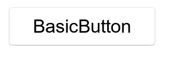
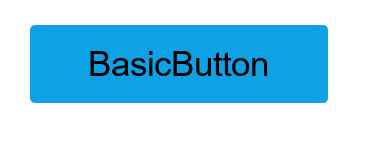

# Button

Button is a common component and describes what action will occur when you select it.  
A Button can either contain a text or an icon, and can be created using property.



## Add namespace
To implement button, include `Tizen.NUI.Components` namespace in your application:

```cs
using Tizen.NUI;
using Tizen.NUI.Components;
```

## Create with property

To create a Button using property, follow these steps:

1. Create Button using the default constructor:

    ```cs
    utilityBasicButton = new Button();
    ```

2. Set the Button property:

    ```cs
    NPatchVisual nvisual = new NPatchVisual();
    nvisual.URL = "rectangle_point_btn_normal.png";
    nvisual.Border = new Rectangle(5, 5, 5, 5);
    utilityBasicButton.IsSelectable = true;
    utilityBasicButton.Background = nvisual.OutputVisualMap;

    utilityBasicButton.TextColorSelector = new ColorSelector
    {
        Normal = new Color(0, 0, 0, 1),
        Pressed = new Color(0, 0, 0, 0.7f),
        Selected = new Color(0.058f, 0.631f, 0.92f, 1),
        Disabled = new Color(0, 0, 0, 0.4f)
    };

    utilityBasicButton.Size = new Size(300, 80);
    utilityBasicButton.Position = new Position(100, 300);
    utilityBasicButton.PointSize = 20;
    utilityBasicButton.Text = "BasicButton";
    root.Add(utilityBasicButton);
    ```

Following output is generated when the Button is created using property:



## Create with style

To create a Button using style, follow these steps:

1. Create a style for Button:

    ```cs
    ButtonStyle style = new ButtonStyle
    {
        IsSelectable = true,
        BackgroundImage = "rectangle_point_btn_normal.png",
        BackgroundImageBorder = new Rectangle(5, 5, 5, 5),
        Text = new TextLabelStyle
        {
            Text = "BasicButton",
            PointSize = 20,
            TextColor = new Selector<Color>
            {
                Normal = new Color(0, 0, 0, 1),
                Pressed = new Color(0, 0, 0, 0.7f),
                Selected = new Color(0.058f, 0.631f, 0.92f, 1),
                Disabled = new Color(0, 0, 0, 0.4f)
            }
        }
    };
    ```

2. Use the style to create a Button and add it to parent:

    ```cs
    familyBasicButton = new Button(style);
    familyBasicButton.Size = new Size(300, 80);
    familyBasicButton.Position = new Position(100, 300);
    root.Add(familyBasicButton);
    ```

Following output is generated when the Button is created using style:


## Create with defined styles

You can define a style based on the user experience (UX) and then use this style to create a Button.

1. Define a custom style:

    ```cs
    internal class CustomButtonStyle : StyleBase
    {
        protected override ViewStyle GetViewStyle()
        {
            ButtonStyle style = new ButtonStyle
            {
                IsSelectable = true,
                BackgroundImage = "rectangle_point_btn_normal.png",
                BackgroundImageBorder = new Rectangle(5, 5, 5, 5),
                Text = new TextLabelStyle
                {
                    Text = "BasicButton",
                    PointSize = 20,
                    TextColor = new Selector<Color>
                    {
                        Normal = new Color(0, 0, 0, 1),
                        Pressed = new Color(0, 0, 0, 0.7f),
                        Selected = new Color(0.058f, 0.631f, 0.92f, 1),
                        Disabled = new Color(0, 0, 0, 0.4f)
                    }
                }
            };
            return style;
        }
    }
    ```

2. Register your custom style:

    ```cs
    StyleManager.Instance.RegisterStyle("CustomButton", null, typeof(YourNameSpace.CustomButtonStyle));
    ```

3. Use your custom style to create a Button instance:

    ```cs
    familyBasicButton = new Button("CustomButton");
    familyBasicButton.Size2D = new Size2D(300, 80);
    familyBasicButton.Position2D = new Position2D(100, 300);
    root.Add(familyBasicButton);
    ```

Following output is generated when the Button is created using the defined style:


## Responding to Clicked

When you click a Button, the Button instance receives a clicked event.
You can declare the clicked event handler as follows:

```cs
Button button = new Button();
button.Clicked += OnClicked;
```

```cs
private void OnClicked(object sender, ClickedEventArgs e)
{
    // Do something in response to button click
}
```

## Responding to StateChangedEvent

Button has the following eight states `Normal`, `Focused`, `Disabled`, `Selected`, `Pressed`, `DisabledFocused`, `SelectedFocused`, and `DisabledSelected`.  
When you change the Button state to focus or disable, the Button instance receives a state changed event:

```cs
Button button = new Button();
button.ControlStateChangedEvent += OnStateChange;
```

```cs
private void OnStateChange(object sender, Control.ControlStateChangedEventArgs e)
{
    // Do something in response to state change
}
```

## Related Information

- Dependencies
  -   Tizen 5.5 and Higher
