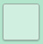

# CheckBox
CheckBox is a common component and describes what action will occur when you select it.  
A CheckBox can only contain an icon, and can be created using style.



## Create with Style

To create a checkbox using style, follow these steps:

1. Create CheckBox using the default constructor:

    ```csharp
    CheckBox utilityCheckBox = new CheckBox();
    ```

2. Apply style to the CheckBox:

    ```csharp
    ButtonStyle utilityStyle = new ButtonStyle
    {
        Icon = new ImageViewStyle
        {
            Size =  new Size(48, 48),
            ResourceUrl = new Selector<string>
            {
                Normal = "btn_check_off.png",
                Selected = "btn_check_on_24c447.png",
                Disabled = "btn_check_off.png",
                DisabledSelected = "btn_check_on_24c447.png",
            }
        }
    }
    utilityCheckBox.ApplyStyle(utilityStyle);
    utilityCheckBox.Size = new Size(48, 48);
    root.Add(utilityCheckBox);
    ```

Following output is generated when a checkbox is created using style:


## Responding to Clicked
When you click a CheckBox, the CheckBox instance receives a clicked event.
You can declare the clicked event handler as follows:

```csharp
CheckBox ck = new CheckBox();
ck.Clicked += OnClicked;
```

```csharp
private void OnClicked(object sender, ClickedEventArgs e)
{
    // Do something in response to CheckBox click
}
```

## Responding to StateChangedEvent
CheckBox has the following eight states `Normal`, `Focused`, `Disabled`, `Selected`, `Pressed`, `DisabledFocused`, `SelectedFocused`, and `DisabledSelected`.  
When you change the CheckBox state to focus or disable, the CheckBox instance receives a state changed event:

```csharp
CheckBox ck = new CheckBox();
ck.ControlStateChangedEvent += OnStateChange;
```

```csharp
private void OnStateChange(object sender, Control.ControlStateChangedEventArgs e)
{
    // Do something in response to state change
}
```

## Related Information
- Dependencies
  -   Tizen 6.0 and Higher
