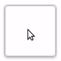
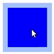
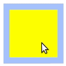
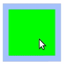
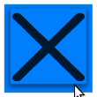
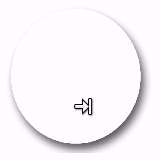

# CheckBox

Checkbox is a UI component connected with the click events. The base class for a `CheckBox` class is a [Tizen.NUI.Components.Button](https://samsung.github.io/TizenFX/latest/api/Tizen.NUI.Components.Button.html). The `Button` properties can be used to specify the checkbox. In opposite to a button, that can contain both an icon and a text, a checkbox can only contain an icon. The default checkbox created with NUI is as follows:



## Create with property

To create checkbox using property, follow these steps:

1. Create an instance of a `CheckBox` class using the default constructor:
   ```cs
   CheckBox _checkBox = new CheckBox();
   ```

2. Set the checkbox properties:
   ```cs
   // Path to the directory with images
   string _URL = Tizen.Applications.Application.Current.DirectoryInfo.Resource + "images/";

   _checkBox.Size = new Size(200, 200);
   _checkBox.ParentOrigin = ParentOrigin.Center;
   _checkBox.PositionUsesPivotPoint = true;
   _checkBox.PivotPoint = PivotPoint.Center;

   // Set the icon images for different checkbox states 
   StringSelector _iconURL = new StringSelector()
   {
      Normal           = _URL + "blue.png",
      Selected         = _URL + "blue_checked.png",
      Pressed          = _URL + "red.png",
      Disabled         = _URL + "green.png",
      DisabledSelected = _URL + "yellow.png"
   };
   _checkBox.IconURLSelector = _iconURL;
   _checkBox.Icon.Opacity = 1.0f;
   _checkBox.Icon.Size = new Size2D(160,160);
   _checkBox.BackgroundColor = new Color(0.57f, 0.7f, 1.0f, 0.8f);

   // CheckBox initial state set to be unselected
   _checkBox.IsSelected = false;
   ```

   To set the absolute path of the images that are used, the `Tizen.Applications.Application.Current.DirectoryInfo.Resource` path is used. For more information, see [Class Application](https://samsung.github.io/TizenFX/latest/api/Tizen.Applications.Application.html) and [Class DirectoryInfo](https://samsung.github.io/TizenFX/latest/api/Tizen.Applications.DirectoryInfo.html).

3. Add checkbox to the view:
   ```cs
   _rootView.Add(_checkBox);
   ```

The following output is generated when the checkbox is created using properties:

 

A checkbox selection can be disabled by adding the following code:
   ```cs
   // CheckBox can not be selected 
   _checkBox.IsSelectable = false;
   ```
The result is as follows:

 

To disable the checkbox completely use the following code:
   ```cs
   // CheckBox is disabled
   _checkBox.IsEnabled = false;
   ```
This sets the checkbox state to `Disabled` or `DisabledSelected` depending on the `IsSelected` value. Adding the preceding option changes the checkbox appearance as follows:

|              |                |
|:--------------------------------------------------------:|:---------------------------------------------------------:|
| `IsEnabled` set to `false`<br>`IsSelected` set to `true` | `IsEnabled` set to `false`<br>`IsSelected` set to `false` |

## Create with Style

To create checkbox using style, follow these steps:

1. Create a style for checkbox:
   ```cs
   // Path to the directory with images
   string _URL = Tizen.Applications.Application.Current.DirectoryInfo.Resource + "images/";

   // Since the CheckBox inherits after the Button class, the ButtonStyle is used
   ButtonStyle _style = new ButtonStyle
   {
       IsSelectable = true,
       ParentOrigin = ParentOrigin.Center,
       PositionUsesPivotPoint = true,
       PivotPoint = PivotPoint.Center,
       // Checkbox area connected with click event
       Size =  new Size(200, 200),
       // Gray structural background
       BackgroundImage = _URL + "struct.png",

       // Image overlaid on the background
       Icon = new ImageViewStyle
       {
           Size =  new Size(200, 200),
           // Different icon used depending on the status
           ResourceUrl = new Selector<string>
           {
               // Black x sign with no background
               Other = _URL + "no.png",
               // Blue check mark with no background
               Selected = _URL + "yes.png"
           },
           // Icon opacity set to 0.8 for all checkbox states
           Opacity = 0.8f,
           // Shadow visible for all states
           ImageShadow = new ImageShadow(_URL + "shadow.png")
       },
       // Style of the overlay image
       Overlay = new ImageViewStyle()
       {
           ResourceUrl = new Selector<string>
           {
               Pressed = _URL + "red.png",
               Other   = _URL + "lightblue.png"
           },
           Opacity = new Selector<float?> {Pressed = 0.3f, Other = 1.0f}
       }
   };
   ```

2. Use the style to create a new instance of a `CheckBox` class:
   ```cs
   CheckBox _checkBox = new CheckBox(_style);
   ```

3. Add checkbox to the control:
   ```cs
   _rootView.Add(_checkBox);
   ```

The following output is generated when the checkbox is created using style:



## Create with custom styles

To create checkbox using a defined style, follow these steps:

1. Define a custom style inside the namespace:
   ```cs
    // custom style of the checkbox
    internal class CustomCheckBoxStyle : StyleBase
    {
        string _URL = Tizen.Applications.Application.Current.DirectoryInfo.Resource + "images/";

        protected override ViewStyle GetViewStyle()
        {
            ButtonStyle style = new ButtonStyle
            {
                // Square area connected with click event
                Size =  new Size(300, 300),
                Icon = new ImageViewStyle
                {
                    Size =  new Size(300, 300),
                    ResourceUrl = new Selector<string>
                    {
                        Other = "",
                        // Check mark with no background
                        Selected = _URL + "yes.png"
                    },
                    // Round shadow
                    ImageShadow = new ImageShadow(_URL + "shadow.png"),
                },
            };
            return style;
        }
    }
   ```

2. Register your custom style within your namespace:
    ```cs
    Tizen.NUI.Components.StyleManager.Instance.RegisterStyle("_CustomCheckBoxStyle", null, typeof(<YOUR_NAME_SPACE>.CustomCheckBoxStyle));
    ```

3. Use your custom style to create a new `CheckBox` instance:
    ```cs
    var _checkBox = new CheckBox("_CustomCheckBoxStyle");
    ```

4. Add checkbox to the view:
   ```cs
   _rootView.Add(_checkBox);
   ```

The following output is generated when the checkbox is created using the defined style:



## Responding to click event

When you click a checkbox, the `CheckBox` instance receives a clicked event. You can declare the clicked event handler as follows:
   ```cs
   CheckBox _checkBox = new CheckBox();
   _checkBox.Clicked += OnClicked;
   ```
where `OnClicked` is a function defined by the user:
   ```cs
   private void OnClicked(object sender, EventArgs e)
   {
      // Do something in response to checkbox click
   }
   ```

## Related information
- Dependencies
  -   Tizen 6.0 and Higher
