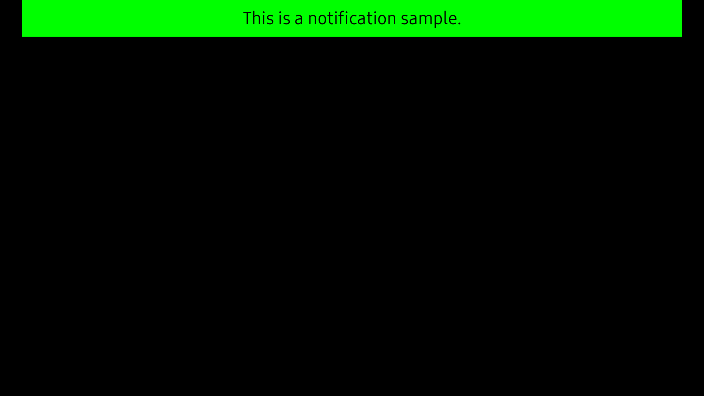

# Notification
Notification is a common component that helps to pop-up a notification window with a content view.

A Notification can contain text and can be created using property.



## Create with property

To create a notification using property, follow these steps:

1. Create notification using the default constructor:

    ```cs
    View view = new View();
    // Sets notification background color.
    view.Size2D = new Size2D(720, 100);
    view.Position = new Position(0, 0, 0);
    view.BackgroundColor = new Color(0, 255, 0, 1.0f);

    Notification notification = new Notification(view);

    ```

2. Set the notification property:

    ```cs
    // Sets a user-defined animation to play when dismissing the notification.
    Animation dismissAni = new Animation(3000);
    notification.SetAnimationOnDismiss(dismissAni);

    // Sets a user-defined animation to play when posting the notification.
    Animation postAni = new Animation(3000);
    notification.SetAnimationOnPost(postAni);

    // Sets a priority level for the specified notification window, includes: None , Base , Medium , High , Top.
    // Need to add the privilege:
    // <privilege>http://tizen.org/privilege/window.priority.set</privilege>.
    notification.SetLevel(NotificationLevel.Base);
  
    // Sets position and size of the notification window.
    Rectangle positionSize = new Rectangle(0, 0, 600, 300);
    notification.SetPositionSize(positionSize);

    // Posts a notification window with the content view.
    // Need to add the privilege:
    // <privilege>http://tizen.org/privilege/window.priority.set</privilege>.
    notification.Post(3000);
    ```

3. Set the notification content:

    ```cs
    // Sets text in notification.
    TextLabel text = new TextLabel("This is notification sample.");
    text.HorizontalAlignment = HorizontalAlignment.Center;
    text.VerticalAlignment = VerticalAlignment.Center;
    text.TextColor = Color.Black;
    text.Size2D = new Size2D(720, 100);

    // Adds text label to view.
    view.Add(text);

    // Adds view to the main window.
    Window.Instance.Add(view);

    // Posts notification for 3000ms.
    notification.Post(3000);
    ```

## Related information
- Dependencies
  -   Tizen 6.0 and Higher
