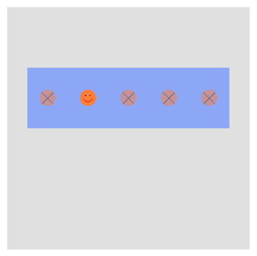

# Pagination

Pagination is a component for making navigation through multipage windows more user-friendly. It can be used to display the number of available pages and marking the currently viewed one. The following figure illustrates the use of simple pagination with 5 available pages, of which the first one is displayed currently:


Pagination can be customized for size and the background color as well as for using images or solid colors for indicators. Navigation within the pages occurs by attaching it to the window key event as described at the end of this section.

## Pagination properties

The following table lists the properties specific to the `Pagination` class:

**Table: Pagination properties**

| Property                  | Type               | Description                                          |
|---------------------------|--------------------|------------------------------------------------------|
| `IndicatorSize`           | `Size`             | The absolute size of the indicator.                  |
| `IndicatorSpacing`        | `int`              | The space between the indicators measured in pixels. |
| `IndicatorCount`          | `int`              | The count of the indicators.                         |
| `IndicatorImageUrl`       | `Selector<string>` | The background resource of the indicator.            |
| `IndicatorColor`          | `Color`            | The color of the indicator.                          |
| `SelectedIndicatorColor`  | `Color`            | The color of the selected indicator.                 |
| `SelectedIndex`           | `int`              | The index of the selected indicator.                 |

[Tizen.NUI.BaseComponents.View](https://samsung.github.io/TizenFX/latest/api/Tizen.NUI.BaseComponents.View.html) is the indirect base class of pagination, and you can also use its properties as shown in the examples:
<!-- TO BE DONE:
(the full list of a view's properties can be found in the [next section](../view.md))
-->

## Create with property

To create pagination using property, follow these steps:

1. Create an instance of a `Pagination` class using the default constructor:
    ```cs
    Pagination pagination = new Pagination();
    ```

2. Set the pagination properties:
    ```cs
   // Path to the images
   string _imageUrl = Tizen.Applications.Application.Current.DirectoryInfo.Resource + "images/";

   // Inherited properties of the pagination
   _pagination.Name = "Pagination1";
   _pagination.Size = new Size(500, 150);
   _pagination.BackgroundColor = new Color(0.4f, 0.56f, 1.0f, 0.7f);
   _pagination.ParentOrigin = ParentOrigin.Center;
   _pagination.PositionUsesPivotPoint = true;
   _pagination.PivotPoint = PivotPoint.BottomCenter;

   // Specific properties of the pagination
   var _indicatorImageUrlStyle = new PaginationStyle()
   {
      IndicatorImageUrl = new Selector<string>
      {
         Normal = _imageUrl + "circle_unselected.png",
         Selected = _imageUrl + "circle_selected.png"
      }
   };
   _pagination.ApplyStyle(_indicatorImageUrlStyle);

   _pagination.IndicatorSize = new Size(40, 40);
   _pagination.IndicatorSpacing = 60;
   _pagination.IndicatorCount = 5;
   _pagination.SelectedIndex = 1;
   ```

   To set the absolute path of the images that are used, the `Tizen.Applications.Application.Current.DirectoryInfo.Resource` path is used. For more information, see [Class Application](https://samsung.github.io/TizenFX/latest/api/Tizen.Applications.Application.html) and [Class DirectoryInfo](https://samsung.github.io/TizenFX/latest/api/Tizen.Applications.DirectoryInfo.html).

   You can also set a solid color for the indicators, instead of using images:
   ```cs
   _pagination.IndicatorColor = new Color(1.0f, 1.0f, 1.0f, 0.5f);
   _pagination.SelectedIndicatorColor = Color.Black;
   ```

3. Add pagination to the view:
   ```cs
   _rootView.Add(_pagination);
   ```

The following output is generated when the pagination is created using the property:

| Indicators with images                               | Solid color indicators                               |
|------------------------------------------------------|------------------------------------------------------|
| |  |

## Create with style

To create pagination using style, follow these steps:

1. Create a style for pagination:
    ```cs
   string _imageUrl = Tizen.Applications.Application.Current.DirectoryInfo.Resource + "images/";

    PaginationStyle _style = new PaginationStyle()
    {
        IndicatorSize = new Size(100, 100),
        IndicatorSpacing = 30,
        IndicatorImageUrl = new Selector<string>
        {
            Normal = _imageUrl + "shots.jpg",
            Selected = _imageUrl + "shots.gif"
        },
        Name = "Pagination2",
        Size = new Size(600, 200),
        BackgroundColor = new Color(0.0f, 0.0f, 0.0f, 1.0f)
    };
    ```

2. Use the style to create a new instance of a `Pagination` class:
    ```cs
    var _pagination = new Pagination(_style);
    _pagination.IndicatorCount = 3;
    _pagination.SelectedIndex = 2;
    ```

3. Add pagination to the control:
   ```cs
   _rootView.Add(_pagination);
   ```

The following output is generated when the pagination is created using style:


## Create with custom styles

You can define a style based on the User Experience (UX), and then use the style to create pagination.

1. Define a custom style inside the namespace:
    ```cs
    internal class CustomPaginationStyle : StyleBase
    {
        protected override ViewStyle GetViewStyle()
        {
            PaginationStyle _style = new PaginationStyle
            {
                IndicatorSize = new Size(100, 100),
                IndicatorSpacing = 50,
                IndicatorImageUrl = new Selector<string>
                {
                    Normal = Tizen.Applications.Application.Current.DirectoryInfo.Resource + "images/gray.png",
                    Selected = Tizen.Applications.Application.Current.DirectoryInfo.Resource + "images/blue.png"
                },
                Name = "Pagination3",
                Size = new Size(500, 200),
                BackgroundColor = new Color(1.0f, 1.0f, 1.0f, 1.0f),
            };
            return _style;
        }
    }
    ```

2. Register your custom style within your namespace:
    ```cs
    Tizen.NUI.Components.StyleManager.Instance.RegisterStyle("CustomPagination", null, typeof(<YOUR_NAME_SPACE>.CustomPaginationStyle));
    ```

3. Use your custom style to create a new `Pagination` instance:
    ```cs
    var _pagination = new Pagination("CustomPagination");
    _pagination.IndicatorCount = 3;
    _pagination.SelectedIndex = 1;
    ```

4. Add pagination to the view:
   ```cs
   _rootView.Add(_pagination);
   ```

The following output is generated when the pagination is created using the defined style:


## Respond to window key event

A [Window KeyEvent](https://samsung.github.io/TizenFX/latest/api/Tizen.NUI.Window.html#Tizen_NUI_Window_KeyEvent) is associated with the pagination by a method that handles the `Window_KeyEvent` event as shown in the following code:
```cs
Window window = NUIApplication.GetDefaultWindow();
window.KeyEvent += Window_KeyEvent;
```

The method supports pressing the `Left` or `Right` keys, which switches the pagination indicator in the appropriate direction:
```cs
private void Window_KeyEvent(object sender, Window.KeyEventArgs e)
{
    if (e.Key.State == Key.StateType.Down)
    {
        if (e.Key.KeyPressedName == "Left")
        {
            if (_pagination.SelectedIndex > 0)
            {
                _pagination.SelectedIndex = _pagination.SelectedIndex - 1;
                // Add some additional actions associated with the Left key
            }
        }
        else if (e.Key.KeyPressedName == "Right")
        {
            if (_pagination.SelectedIndex < _pagination.IndicatorCount - 1)
            {
                _pagination.SelectedIndex = _pagination.SelectedIndex + 1;
                // Add some additional actions associated with the Right key
            }
        }
    }
}
```

<!-- uncomment after the review of the sample
[Here](https://github.com/Samsung/Tizen-CSharp-Samples/tree/master/Mobile/NUI_Pagination) one can find a working example using the above code.
-->

## Related information

- Dependencies
  -   Tizen 6.0 and Higher
