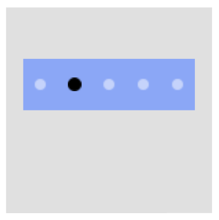

# Pagination

Pagination is a common component supporting multiple pages. It shows the number of pages available and the currently active page.


In the following sections on this guide one can find:
- [the main Pagination properties](#paginationProperties)
- how to create a Pagination
   - [using Properties](#createWithProperty)
   - [using Style](#createWithStyle)
   - [using a custom style](#createWithCustomStyle)
- [how to connect Pagination with a KeyEvent](#connectWithKeyEvent)


<a name="paginationProperties"></a>
## Pagination properties

The table below lists the properties specific for the Pagination class.

**Table: Pagination properties**

| Property                  | Type               | Description                                   |
|---------------------------|--------------------|-----------------------------------------------|
| `IndicatorSize`           | `Size`             | The absolute size of the indicator.           |
| `IndicatorSpacing`        | `int`              | The space between the indicators (in pixels). |              
| `IndicatorCount`          | `int`              | The count of the indicators/pages.            |              
| `IndicatorImageUrl`       | `Selector<string>` | The background resource of the indicator.     |              
| `IndicatorColor`          | `Color`            | The indicator's color.                        |              
| `SelectedIndicatorColor`  | `Color`            | The selected indicator's color.               |              
| `SelectedIndex`           | `int`              | The index of the select indicator.            |              


The base class for the Pagination is a [VisualView](https://docs.tizen.org/application/dotnet/guides/nui/visuals/), so it's properties can also be used, as showed in the examples below.


<a name="createWithProperty"></a>
## Create with property

To create a Pagination using property, follow these steps:

1. Create Pagination using the default constructor:

    ```cs
    Pagination pagination = new Pagination();
    ```

2. Set the Pagination properties:

    ```cs
   // path to the images 
   string _imageUrl = Tizen.Applications.Application.Current.DirectoryInfo.Resource + "images/";

   // inherited properties of the pagination 
   _pagination.Name = "Pagination1";
   _pagination.Size = new Size(500, 150);
   _pagination.BackgroundColor = new Color(0.4f, 0.56f, 1.0f, 0.7f);
   _pagination.ParentOrigin = ParentOrigin.Center;
   _pagination.PositionUsesPivotPoint = true;
   _pagination.PivotPoint = PivotPoint.BottomCenter;

   // specific properties of the Pagination
   var _indicatorImageUrlStyle = new PaginationStyle()
   {
      IndicatorImageUrl = new Selector<string>
      {
         Normal = _imageUrl + "circle_unselected.png",
         Selected = _imageUrl + "circle_selected.png"
      }
   };
   _pagination.ApplyStyle(_indicatorImageUrlStyle);

   _pagination.IndicatorSize = new Size(40, 40);
   _pagination.IndicatorSpacing = 60;
   _pagination.IndicatorCount = 5;
   _pagination.SelectedIndex = 1;
   ```

   To set the absolute path of the used images the `Tizen.Applications.Application.Current.DirectoryInfo.Resource` was used
   (for more information see
   [Class Application](https://docs.tizen.org/application/dotnet/api/tizenfx/api/Tizen.Applications.Application.html)
   and
   [Class DirectoryInfo](https://docs.tizen.org/application/dotnet/api/tizenfx/api/Tizen.Applications.DirectoryInfo.html)).

   Instead of images one can set a solid color of the indicators: 
   ```cs
   _pagination.IndicatorColor = new Color(1.0f, 1.0f, 1.0f, 0.5f);
   _pagination.SelectedIndicatorColor = Color.Black;
   ```

3. Add the Pagination to the View:

   ```cs
   _rootView.Add(_pagination);
   ```


Following output is generated when the Pagination is created using property:

| Indicators with images                               | Solid color indicators                               |
|------------------------------------------------------|------------------------------------------------------|
| |  |


<a name="createWithStyle"></a>
## Create with style

To create a Pagination using style, follow these steps:

1. Create a style for Pagination:

    ```cs
   string _imageUrl = Tizen.Applications.Application.Current.DirectoryInfo.Resource + "images/";

    PaginationStyle _style = new PaginationStyle()
    {
        IndicatorSize = new Size(100, 100),
        IndicatorSpacing = 30,
        IndicatorImageUrl = new Selector<string>
        {
            Normal = _imageUrl + "shots.jpg",
            Selected = _imageUrl + "shots.gif"
        },
        Name = "Pagination2",
        Size = new Size(600, 200),
        BackgroundColor = new Color(0.0f, 0.0f, 0.0f, 1.0f)
    };
    ```

2. Use the style to create a Pagination (regardless of the previous example):

    ```cs
    var _pagination = new Pagination(_style);
    _pagination.IndicatorCount = 3;
    _pagination.SelectedIndex = 2;
    ```

3. Add the Pagination to the parent:

   ```cs
   _rootView.Add(_pagination);
   ```


Following output is generated when the Pagination is created using style:


<a name="createWithCustomStyle"></a>
## Create with defined styles

You can define a style based on the user experience (UX) and then use this style to create a Pagination.

1. Define a custom style inside you namespace (called `YourNameSpace` in this example):

    ```cs
    internal class CustomPaginationStyle : StyleBase
    {
        protected override ViewStyle GetViewStyle()
        {
            PaginationStyle _style = new PaginationStyle
            {
                IndicatorSize = new Size(100, 100),
                IndicatorSpacing = 50,
                IndicatorImageUrl = new Selector<string>
                {
                    Normal = Tizen.Applications.Application.Current.DirectoryInfo.Resource + "images/gray.png",
                    Selected = Tizen.Applications.Application.Current.DirectoryInfo.Resource + "images/blue.png"
                },
                Name = "Pagination3",
                Size = new Size(500, 200),
                BackgroundColor = new Color(1.0f, 1.0f, 1.0f, 1.0f),
            };
            return _style;
        }
    }
    ```

2. Register your custom style:

    ```cs
    Tizen.NUI.Components.StyleManager.Instance.RegisterStyle("CustomPagination", null, typeof(YourNameSpace.CustomPaginationStyle));
    ```

3. Use your custom style to create a Pagination instance (regardless of the previous example):

    ```cs
    var _pagination = new Pagination("CustomPagination");
    _pagination.IndicatorCount = 3;
    _pagination.SelectedIndex = 1;
    ```

3. Add the Pagination to the parent:

   ```cs
   _rootView.Add(_pagination);
   ```


Following output is generated when the Pagination is created using the defined style:


<a name="connectWithKeyEvent"></a>
## Responding to window key event

A [window key event](https://samsung.github.io/TizenFX/latest/api/Tizen.NUI.Window.html#Tizen_NUI_Window_KeyEvent) can be associated with the Pagination
by the method that will handle the event (`Window_KeyEvent` in the example below):
```cs
Window window = NUIApplication.GetDefaultWindow();
window.KeyEvent += Window_KeyEvent;
```

The method supports pressing the `Left`/`Right` keys, which switches the pagination indicator in the appropriate direction:
```cs
private void Window_KeyEvent(object sender, Window.KeyEventArgs e)
{
    if (e.Key.State == Key.StateType.Down)
    {
        if (e.Key.KeyPressedName == "Left")
        {
            if (pagination.SelectedIndex > 0)
            {
                pagination.SelectedIndex = pagination.SelectedIndex - 1;
                // plus some additional actions associated with the 'Left' key
            }
        }
        else if (e.Key.KeyPressedName == "Right")
        {
            if (pagination.SelectedIndex < pagination.IndicatorCount - 1)
            {
                pagination.SelectedIndex = pagination.SelectedIndex + 1;
                // plus some additional actions associated with the 'Right' key
            }
        }
    }
}
```

<!-- uncomment after the review of the sample
[Here](https://github.com/Samsung/Tizen-CSharp-Samples/tree/master/Mobile/NUI_Pagination) one can find a working example using the above code.
-->

## Related information

- Dependencies
  -   Tizen 6.0 and Higher
