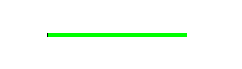

# Progress
Progress is a common component that is used to show the ongoing status using a long narrow bar.

Following are the instances where progress is used:

- To show the processing time
- To show the number of items in progress
- To show the progress rate depending on the screen layout


## Create with Property

To create a progress using property, follow these steps:

1. Create progress using the default constructor:

    ```cs
    utilityBasicProgress = new Progress();
    ```

2. Set the progress property:

    ```cs
    utilityBasicProgress.MaxValue = 100;
    utilityBasicProgress.MinValue = 0;
    utilityBasicProgress.CurrentValue = 45;
    utilityBasicProgress.TrackColor = Color.Green;
    utilityBasicProgress.ProgressColor = Color.Black;
    ```

Following output is generated when the progress is created using property:



## Related Information
- Dependencies
  -   Tizen 5.5 and Higher