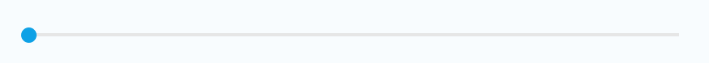

# Slider

A Slider enables you to select a value from a continuous or discrete range of values by moving the Slider thumb.

Sliders are classified into a horizontal type and a vertical type, depending on their orientation, and the number of sliders that are adjusted simultaneously.

Using a Slider you can adjust the steps or strength of settings, such as brightness and contrast.

 

## Add namespace
To implement slider, include `Tizen.NUI.Components` namespace in your application:

```cs
using Tizen.NUI;
using Tizen.NUI.Components;
```

## Create with property

To create a Slider using property, follow these steps:

1. Create Slider using the default constructor:

    ```cs
    utilityBasicSlider = new Slider();
    ```

2. Set the Slider property:

    ```cs
    utilityBasicSlider.TrackThickness = 4;
    utilityBasicSlider.BgTrackColor = new Color(0, 0, 0, 0.1f);
    utilityBasicSlider.SlidedTrackColor = new Color(0.05f, 0.63f, 0.9f, 1);
    utilityBasicSlider.ThumbImageURLSelector = new StringSelector
    {
        Normal = "controller_btn_slide_handler_normal.png",
        Pressed = "controller_btn_slide_handler_press.png"
    };
    utilityBasicSlider.ThumbSize = new Size(60, 60);
    utilityBasicSlider.Direction = Slider.DirectionType.Horizontal;
    utilityBasicSlider.MinValue = 0;
    utilityBasicSlider.MaxValue = 100;
    utilityBasicSlider.CurrentValue = 10;
    root.Add(utilityBasicSlider);
    ```

Following output is generated when the Slider is created using property:



## Create with style

To create a Slider using style, follow these steps:

1. Create a style for Slider:

    ```cs
    SliderStyle style = new SliderStyle
    {
        TrackThickness = 4,
        Track = new ImageViewStyle
        {
            BackgroundColor = new Color(0, 0, 0, 0.1f)
        },
        Progress = new ImageViewStyle
        {
            BackgroundColor = new Color(0.05f, 0.63f, 0.9f, 1)
        },
        Thumb = new ImageViewStyle
        {
            Size = new Size(60, 60),
            ResourceUrl = new Selector<string>
            {
                Normal = "controller_btn_slide_handler_normal.png",
                Pressed = "controller_btn_slide_handler_press.png"
            }
        }
    };
    ```

2. Use the style to create a Slider and add it to parent:

    ```cs
    utilityBasicSlider = new Slider(style);
    utilityBasicSlider.Size = new Size(50, 400);
    utilityBasicSlider.Direction = Slider.DirectionType.Horizontal;
    root.Add(utilityBasicSlider);
    ```

Following output is generated when the Slider is created using style:


## Create with defined styles

You can define a style based on the user experience (UX) and then use this style to create a Slider.

1. Define a custom style:

    ```cs
    internal class CustomSliderStyle : StyleBase
    {
        protected override ViewStyle GetViewStyle()
        {
            SliderStyle style = new SliderStyle
            {
                TrackThickness = 4,
                Track = new ImageViewStyle
                {
                    BackgroundColor = new Color(0, 0, 0, 0.1f)
                },
                Progress = new ImageViewStyle
                {
                    BackgroundColor = new Color(0.05f, 0.63f, 0.9f, 1)
                },
                Thumb = new ImageViewStyle
                {
                    Size = new Size(60, 60),
                    ResourceUrl = new Selector<string>
                    {
                        Normal = "controller_btn_slide_handler_normal.png",
                        Pressed = "controller_btn_slide_handler_press.png"
                    }
                }
            };
            return style;
        }
    }
    ```

2. Register your custom style:

    ```cs
    StyleManager.Instance.RegisterStyle("CustomSlider", null, typeof(YourNameSpace.CustomSliderStyle));
    ```

3. Use your custom style to create a Slider instance:

    ```cs
    utilityBasicSlider = new Slider("CustomSlider");
    utilityBasicSlider.Size = new Size(50, 400);
    utilityBasicSlider.Direction = Slider.DirectionType.Horizontal;
    root.Add(utilityBasicSlider);
    ```

Following output is generated when the Slider is created using the defined style:


## Responding to ValueChanged

When you touch or pan a Slider, the Slider instance receives a value changed event.
You can declare the value changed event handler as follows:

```cs
Slider slider = new Slider();
slider.ValueChanged += OnValueChanged;
```

```cs
private void OnValueChanged(object sender, SliderValueChangedEventArgs args)
{
    // Do something in response to Slider click
}
```

## Responding to StateChangedEvent

Slider has the following eight states: `Normal`, `Focused`, `Disabled`, `Selected`, `Pressed`, `DisabledFocused`, `SelectedFocused`, and `DisabledSelected`.  
When you change the Slider state as change focus or disable a Slider, the Slider instance receives a state changed event. You can declare the state changed event handler as follows:

```cs
Slider slider = new Slider();
slider.ControlStateChangedEvent += OnStateChanged;
```

```cs
private void OnStateChanged(object sender, Control.ControlStateChangedEventArgs e)
{
    // Do something in response to state change
}
```

## Responding to SlidingFinished

As you finish a touch or a pan operate on a Slider, the Slider instance receives a slide finished event. You can declare the slide finished event handler as follows:

```cs
Slider slider = new Slider();
slider.SlidingFinished += OnSlidingFinished;
```

```cs
private void OnSlidingFinished(object sender, SliderSlidingFinishedEventArgs args)
{
    // Do something in response to slide finished
}
```

## Related Information

- Dependencies
  -   Tizen 5.5 and Higher