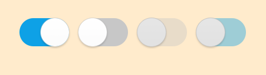

# Switch

Switch is a common component that can be used as a selector.



## Add namespace
To implement switch, include `Tizen.NUI.Components` namespace in your application:

```cs
using Tizen.NUI;
using Tizen.NUI.Components;
```

## Create with property

To create a Switch using property, follow these steps:

1. Create Switch using the default constructor:

    ```cs
    Switch[] utilitySwitch = new Switch[4];
    ```

2. Set the Switch property:

    ```cs
    int num = 4;
    for(int i = 0; i < num; i++)
    {
        utilitySwitch[i] = new Switch();
        utilitySwitch[i].Size = new Size(96, 60);
        utilitySwitch[i].Position = new Position(300 + 100 * i, 300);
        utilitySwitch[i].SwitchHandlerImageSize = new Size(60, 60);
        utilitySwitch[i].SwitchBackgroundImageURLSelector = new StringSelector
        {
            Normal = "controller_switch_bg_off.png",
            Selected = "controller_switch_bg_on.png",
            Disabled = "controller_switch_bg_off_dim.png",
            DisabledSelected = "controller_switch_bg_on_dim.png"
        };
        utilitySwitch[i].SwitchHandlerImageURLSelector = new StringSelector
        {
            Normal = "controller_switch_handler.png",
            Selected = "controller_switch_handler.png",
            Disabled = "controller_switch_handler_dim.png",
            DisabledSelected = "controller_switch_handler_dim.png"
        };
        root.Add(utilitySwitch[i]);
    }
    utilitySwitch[0].IsSelected = true;
    utilitySwitch[2].IsEnabled = false;
    utilitySwitch[3].IsEnabled = false;
    ```

Following output is generated when the Switch is created using property:


## Create with style

To create a Switch using style, follow these steps:

1. Create a style for Switch:

    ```cs
    SwitchStyle style = new SwitchStyle
    {
        IsSelectable = true,
        Track = new ImageViewStyle
        {
            ResourceURL = new StringSelector
            {
                Normal = "controller_switch_bg_off.png",
                Selected = "controller_switch_bg_on.png",
                Disabled = "controller_switch_bg_off_dim.png",
                DisabledSelected = "controller_switch_bg_on_dim.png"
            }
        },
        Thumb = new ImageViewStyle
        {
            Size2D = new Size2D(60, 60),
            ResourceURL = new StringSelector
            {
                Normal = "controller_switch_handler.png",
                Selected = "controller_switch_handler.png",
                Disabled = "controller_switch_handler_dim.png",
                DisabledSelected = "controller_switch_handler_dim.png"
            }
        }
    };
    ```

2. Use the style to create a Switch and add it to parent:

    ```cs
    int num = 4;
    for(int i = 0; i < num; i++)
    {
        utilitySwitch2[i] = new Switch(style);
        utilitySwitch2[i].Size = new Size(96, 60);
        utilitySwitch2[i].Position = new Position(300 + 100 * i, 300);
        root.Add(utilitySwitch2[i]);
    }
    utilitySwitch2[0].IsSelected = true;
    utilitySwitch2[2].IsEnabled = false;
    utilitySwitch2[3].IsEnabled = false;
    ```

Following output is generated when the Switch is created using style:


## Create with defined styles

You can define a style based on the user experience (UX) and then use this style to create a Switch.

1. Define a custom style:

    ```cs
    internal class CustomSwitchStyle : StyleBase
    {
        protected override ViewStyle GetViewStyle()
        {
            SwitchStyle style = new SwitchStyle
            {
                IsSelectable = true,
                Track = new ImageViewStyle
                {
                    ResourceURL = new StringSelector
                    {
                        Normal = "controller_switch_bg_off.png",
                        Selected = "controller_switch_bg_on.png",
                        Disabled = "controller_switch_bg_off_dim.png",
                        DisabledSelected = "controller_switch_bg_on_dim.png"
                    }
                },
                Thumb = new ImageViewStyle
                {
                    Size2D = new Size2D(60, 60),
                    ResourceURL = new StringSelector
                    {
                        Normal = "controller_switch_handler.png",
                        Selected = "controller_switch_handler.png",
                        Disabled = "controller_switch_handler_dim.png",
                        DisabledSelected = "controller_switch_handler_dim.png"
                    }
                }
            };
            return style;
        }
    }
    ```

2. Register your custom style:

    ```cs
    StyleManager.Instance.RegisterStyle("CustomSwitch", null, typeof(YourNameSpace.CustomSwitchStyle));
    ```

3. Use your custom style to create a Switch instance:

    ```cs
    int num = 4;
    for(int i = 0; i < num; i++)
    {
        switchControl[i] = new Switch("CustomSwitch");
        switchControl[i].Size = new Size(96, 60);
        switchControl[i].Position = new Position(300 + 100 * i, 300);
        root.Add(switchControl[i]);
    }
    switchControl[0].IsSelected = true;
    switchControl[2].IsEnabled = false;
    switchControl[3].IsEnabled = false;
    ```

Following output is generated when the Switch is created using the defined style:


## Responding to SelectedChanged

When you click the Switch, the popup instance receives a selected event.
You can declare the event handler as follows:

```cs
Switch switchControl = new Switch();
switchControl.SelectedChanged += OnSelectedChanged;
```

```cs
private void OnSelectedChanged(object sender, SelectedChangedEventArgs e)
{
    //Do something when user selects or unselects the Switch
}
```

## Related Information

- Dependencies
  -   Tizen 5.5 and Higher