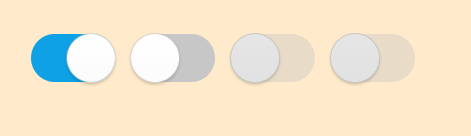

# Switch
Switch is a common component that can be used as a selector.



## Create with Property

To create a switch using property, follow these steps:

1. Create switch using the default constructor:

    ```cs
    Switch[] utilitySwitch = new Switch[4];
    ```

2. Set the switch property:

    ```cs
    int num = 4;
    for(int i = 0; i < num; i++)
    {
        utilitySwitch[i] = new Switch();
        utilitySwitch[i].Size = new Size(96, 60);
        utilitySwitch[i].Position = new Position(300 + 100 * i, 300);
        utilitySwitch[i].SwitchHandlerImageSize = new Size(60, 60);
        utilitySwitch[i].SwitchBackgroundImageURLSelector = new StringSelector
        {
            Normal = "controller_switch_bg_off.png",
            Selected = "controller_switch_bg_on.png",
            Disabled = "controller_switch_bg_off_dim.png",
            DisabledSelected = "controller_switch_bg_on_dim.png",
        };
        utilitySwitch[i].SwitchHandlerImageURLSelector = new StringSelector
        {
            Normal = "controller_switch_handler.png",
            Selected = "controller_switch_handler.png",
            Disabled = "controller_switch_handler_dim.png",
            DisabledSelected = "controller_switch_handler_dim.png",
        };
        root.Add(utilitySwitch[i]);
    }
    utilitySwitch[0].IsSelected = true;
    utilitySwitch[2].IsEnabled = false;
    utilitySwitch[3].IsEnabled = false;
    ```

Following output is generated when the switch is created using property:


## Responding to SelectedEvent
When you click the switch, the popup instance receives a selected event.
You can declare the event handler as follows:

```cs
Switch switchControl = new Switch();
switchControl.SelectedEvent += OnSelected;
```

```cs
private void OnSelected(object sender, Switch.SelectEventArgs e)
{
    //Do something when user select the switch
}
```

## Related Information
- Dependencies
  -   Tizen 5.5 and Higher