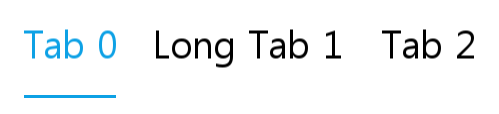
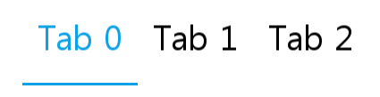
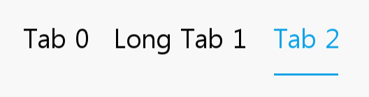

# Tab
Tab is a common component and it can be used as a menu label.

A tab makes it easy to explore and switch between different views or functional aspects of an application or to browse categorized data sets.

You can handle a tab by adding, inserting, or deleting a TabItem. A tab can contain one or more TabItem with text, usually used as a menu label. A TabItem can have different lengths.

 

> [!NOTE]
> Tab is deprecated since Tizen 6.0 and will be removed after two releases.

## Add namespace
To implement tab, include `Tizen.NUI.Components` namespace in your application:

```cs
using Tizen.NUI;
using Tizen.NUI.Components;
```

## Create with property

To create a tab using property, follow these steps:

1. Create Tab using the default constructor:

    ```cs
    Tab utilityBasicTab = new Tab();
    ```

2. Set the tab property:

    ```cs
    utilityBasicTab.Size = new Size(700, 108);
    utilityBasicTab.Position = new Position(100, 300);
    utilityBasicTab.BackgroundColor = new Color(1.0f, 1.0f, 1.0f, 0.5f);
    utilityBasicTab.UseTextNaturalSize = true;
    utilityBasicTab.ItemSpace = 40;
    utilityBasicTab.Space = new Extents(56, 56, 1, 0);
    utilityBasicTab.UnderLineSize = new Size(1, 3);
    utilityBasicTab.UnderLineBackgroundColor = Color.White;
    utilityBasicTab.PointSize = 15;
    utilityBasicTab.TextColorSelector = new ColorSelector
    {
        Normal = Color.Black,
        Selected = Color.White,
    };
    Window.Instance.Add(utilityBasicTab);

    for (int i = 0; i < 3; i++)
    {
        Tab.TabItemData item = new Tab.TabItemData();
        item.Text = "Tab " + i;
        if(i == 1)
        {
            item.Text = "Long Tab " + i;
        }
        utilityBasicTab.AddItem(item);
    }
    utilityBasicTab.SelectedItemIndex = 0;
    ```

Following output is generated when the tab is created using property:



## Responding to ItemChangedEvent
When you click an item on tab, the tab receives an item change event.
You can declare the item change event handler as follows:

```cs
Tab tab = new Tab();
tab.ItemChangedEvent += TabItemChangedEvent;
```

```cs
private void TabItemChangedEvent(object sender, Tab.ItemChangeEventArgs e)
{
    createText[0].Text = "Create Tab just by properties, Selected index from " + e.PreviousIndex + " to " + e.CurrentIndex;
}
```

## Related Information
- Dependencies
  -   Tizen 5.5 and Higher
