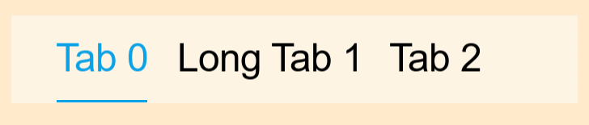

# Tab
A tab makes it easy to explore and switch between different views or functional aspects of an app or to browse categorized data sets.

 

## Overview
Tab is a kind of common component, it can be used as menu label. User can handle Tab by adding/inserting/deleting TabItem.

- Tab can contain one or more tab items with text, usually used as menu label.
- Tab item can have different length.

## Create with property
1. Create Tab by default constructor

~~~{.cs}
utilityBasicTab = new Tab();
~~~

2. Set tab property

~~~{.cs}
utilityBasicTab.IsSelectable = true;
utilityBasicTab.Size = new Size(700, 108);
utilityBasicTab.Position = new Position(100, 300);
utilityBasicTab.BackgroundColor = new Color(1.0f, 1.0f, 1.0f, 0.5f);
utilityBasicTab.UseTextNaturalSize = true;
utilityBasicTab.ItemSpace = 40;
utilityBasicTab.Space = new Extents(56, 56, 1, 0);
utilityBasicTab.UnderLineSize = new Size(1, 3);
utilityBasicTab.UnderLineBackgroundColor = color[0];
utilityBasicTab.PointSize = 25;
utilityBasicTab.TextColorSelector = new ColorSelector
{
    Normal = Color.Black,
    Selected = color[0],
};
utilityBasicTab.ItemChangedEvent += TabItemChangedEvent;
root.Add(tab);

for (int i = 0; i < 3; i++)
{
    Tab.TabItemData item = new Tab.TabItemData();
    item.Text = "Tab " + i;
    if(i == 1)
    {
        item.Text = "Long Tab " + i;
    }
    utilityBasicTab.AddItem(item);
}
utilityBasicTab.SelectedItemIndex = 0;
~~~

Tab created by property:

## Responding to ItemChangedEvent
When user click an item on Tab, the Tab receives an iten change event.
You can declare the item change event handler as following:

~~~{.cs}
Tab tab = new Tab();
tab.ItemChangedEvent += TabItemChangedEvent;
private void TabItemChangedEvent(object sender, Tab.ItemChangeEventArgs e)
{
    createText[0].Text = "Create Tab just by properties, Selected index from " + e.PreviousIndex + " to " + e.CurrentIndex;
}
~~~

## Related Information
- Dependencies
  -   Tizen 5.5 and Higher