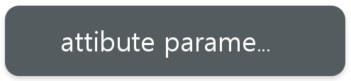
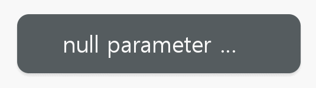

# Toast
Toast is a common component and provides simple messages.

Unlike other popups, a toast consists only of a body field as it is just used for providing simple feedback to the user’s actions.

You can use a toast to provide simple messages when the user does not need to make an additional action or confirmation. A toast will automatically disappear after a certain time.



> [!NOTE]
> Toast is deprecated since Tizen 6.0 and will be removed after two releases.

## Add namespace
To implement toast, include `Tizen.NUI.Components` namespace in your application:

```cs
using Tizen.NUI;
using Tizen.NUI.Components;
```

## Create with Property

To create a toast using property, follow these steps:

1. Create toast using the default constructor:

    ```cs
    Toast utilityBasicToast = new Toast();
    ```

2. Set the toast property:

    ```cs
    NPatchVisual nvisual = new NPatchVisual();
    nvisual.URL = DirectoryInfo.Resource + "rectangle.png";
    nvisual.Border = new Rectangle(64, 64, 4, 4);
    utilityBasicToast.Background = nvisual.OutputVisualMap;
    utilityBasicToast.Position = new Position(50, 350);
    utilityBasicToast.Size = new Size(512, 132);
    utilityBasicToast.Message = "null parameter";
    utilityBasicToast.PointSize = 15;
    utilityBasicToast.TextColor = Color.White;
    utilityBasicToast.TextPadding = new Extents(96, 96, 38, 38);
    utilityBasicToast.Duration = 1500;
    Window.Instance.Add(utilityBasicToast);
    ```

Following output is generated when the toast is created using property:



## Related Information
- Dependencies
  -   Tizen 5.5 and Higher
