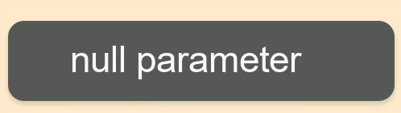

# Toast
Use a toast to provide simple messages when the user does not need to make an additional action or confirmation.

## Overview
Toast is a kind of common component and provide simple messages. Unlike other popups, a toast only has the body field as it is just used for providing simple feedback to user actions. A toast will automatically disappear after a certain time.

- Toast only show simple messages contain with text.
- Toast can be automatically disappear after a certain time.

## Create with property
1. Create Toast by default constructor

~~~{.cs}
utilityBasicToast = new Toast();
~~~

2. Set Toast property

~~~{.cs}
NPatchVisual nvisual = new NPatchVisual();
nvisual.URL = "Poptoast_background.png";
nvisual.Border = new Rectangle(64, 64, 4, 4);
utilityBasicToast.Position = new Position(50, 350);
utilityBasicToast.Size = new Size(512, 132);
utilityBasicToast.TextArray = new string[1] { "null parameter" };
utilityBasicToast.PointSize = 26;
utilityBasicToast.TextColor = Color.White;
utilityBasicToast.TextPadding = new Extents(96, 96, 38, 38);
utilityBasicToast.Duration = 1500;
~~~

Toast created by property:

## Related Information
- Dependencies
  -   Tizen 5.5 and Higher
