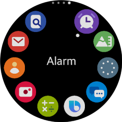
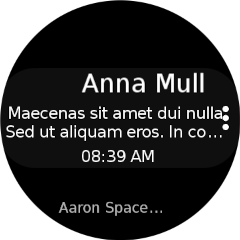
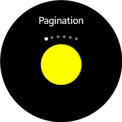

# Natural User Interface

Natural User Interface (NUI) is a C\# toolkit on top of the DALi (Dynamic Animation Library) graphics library, which is written in C++.

NUI is a rich GUI library used for creating two-dimensional or three-dimensional applications. These applications are run on a range of Tizen devices, such as mobile devices, TVs, and wearables. NUI is built on a multi-threaded architecture, enabling realistic smooth animations. In addition, a range of optimization techniques are utilized to obtain low CPU and GPU usage, further increasing graphics performance.

After you have set up the NUI development environment, you can quickly create rich UI applications with realistic effects and animations, such as:  

-   Image and video galleries
-   Music players
-   Home screens and launch pads
-   Advanced watch faces for wearable devices

NUI offers the following main features:

- [Layer](layer.md)

  Provides a mechanism for overlaying groups of views on top of each other.

- [Window](window.md)

  Creates a default window for building the main user interface of the application and provides various events such as key event and touch event to the application.

- [Layouts](layouts.md)

  Provide advanced reusable laying out capabilities.

- [UI Components](ui-components.md)

  Interactive components for layout and user interface, such as buttons, table view, text controls, image view, flex container, slider, and video view.

- [Animation](animation.md)

  Allows objects to move around and change their properties for a specified duration.

- [Resources](resources.md)

  Provides several ways to handle resource images.

- [Tizen Window System Shell](tizenshell.md)

  An interface for manipulating windows of the system Graphical User Interface (GUI) services.

- [XAML](xaml/xaml-overview.md)

  Supports almost all the features of Xamarin.Forms XAML.

The following are some reference applications:
|  |  |  |  |
|---|---|---|---|
| [WApps](https://github.com/dalihub/nui-demo/tree/master/wearable-samples/ReferenceApplication/WApps) | [WGallery](https://github.com/dalihub/nui-demo/tree/master/wearable-samples/ReferenceApplication/WGallery) | [WMessage](https://github.com/dalihub/nui-demo/tree/master/wearable-samples/ReferenceApplication/WMessage) | [WHome](https://github.com/dalihub/nui-demo/tree/master/wearable-samples/ReferenceApplication/WHome) |

## Key Concepts

To be able to use NUI in your applications, you must become familiar with the following NUI key concepts:

-   **Scene graph**: Tree data structure, consisting of a collection of nodes.
-   **Window**: Top level of the scene graph, used for displaying a tree of layers and views.
-   **View**: Primary object for interaction. Views are effectively nodes that receive input (such as touch events), and act as a container for drawable elements and other views. Views can display content, such as color shapes, images, and text.

    A NUI application uses a hierarchy of view objects to position the visible content.

-   **Layer**: Layers allow you to overlay groups of views on top of each other.

To get started with NUI development, see [NUI Quick Start](../../get-started/nui/first-app.md) page.

## Related Information
- Dependencies
  -   Tizen 4.0 and Higher
