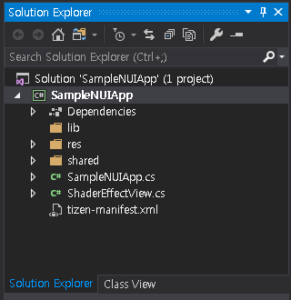
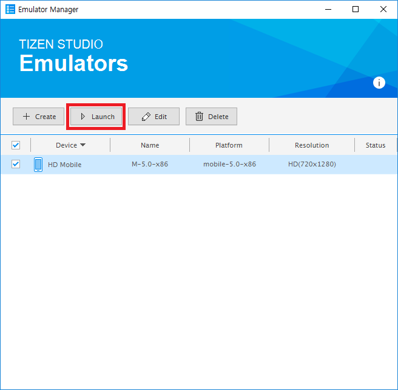

# Quickstart
This page explains how to set up, build, and run the Natural User Interface (NUI) application using Visual Studio.

## Prerequisites
- Visual Studio 2017
- [Visual Studio tools for Tizen](../../../vstools/install.md)

## Setting Up NUI Development Environment
To create a Tizen NUI app template, follow these steps:
1. [Create Project](#create-project)
2. [NUI Template Code](#nui-template-code)
3. [Build and Run NUI Application](#build-and-run-nui-application)

### Create Project
To create a Tizen NUI app, proceed as follows:

1.  In **New project** menu, select **Tizen** > **Blank App (Tizen.NUI)**. Click **OK**:

    
    

2.  The new project `SampleNUIApp` is shown in the **Solution Explorer** view:

    

    If Tizen.Net is available in NuGet packages then you can use the NUI APIs.

   > **Note**
   >
   > Tizen.Net : A set of Tizen .NET APIs. This includes all of the APIs built on top of Tizen platform.
   > You can select and install the Tizen.Net version via the nuget package manager.


### NUI Template Code
The `SampleNUIApp` is generated by Tizen project template. The project draws a "Hello Tizen NUI world" text and has a rotating animation.

You can add your code in **SampleNUIApp.cs** file:

    ```csharp
    using System;
    using Tizen.NUI;
    using Tizen.NUI.BaseComponents;

    namespace SampleNUIApp
    {
        class Program : NUIApplication
        {
            protected override void OnCreate()
            {
                base.OnCreate();
                Initialize();
            }

            void Initialize()
            {
                Window.Instance.KeyEvent += OnKeyEvent;

                TextLabel text = new TextLabel("Hello Tizen NUI World");
                text.HorizontalAlignment = HorizontalAlignment.Center;
                text.VerticalAlignment = VerticalAlignment.Center;
                text.TextColor = Color.Blue;
                text.PointSize = 12.0f;
                text.HeightResizePolicy = ResizePolicyType.FillToParent;
                text.WidthResizePolicy = ResizePolicyType.FillToParent;
                Window.Instance.GetDefaultLayer().Add(text);

                Animation animation = new Animation(2000);
                animation.AnimateTo(text, "Orientation", new Rotation(new Radian(new Degree(180.0f)), PositionAxis.X), 0, 500);
                animation.AnimateTo(text, "Orientation", new Rotation(new Radian(new Degree(0.0f)), PositionAxis.X), 500, 1000);
                animation.Looping = true;
                animation.Play();
            }

            public void OnKeyEvent(object sender, Window.KeyEventArgs e)
            {
                if (e.Key.State == Key.StateType.Down && (e.Key.KeyPressedName == "XF86Back" || e.Key.KeyPressedName == "Escape"))
                {
                    Exit();
                }
            }

            static void Main(string[] args)
            {
                var app = new Program();
                app.Run(args);
            }
        }
    }

    ```
   > **Note**
   >
   > For more Tizen NUI application information, see [NUI Hello World Tutorial](./hello-world.md).

### Build and Run NUI Application
1.  Building the solution:

    - In the Visual Studio menu, select **Build** > **Build Solution**.

    - In the Solution Explorer view, right-click the solution name and select **Build**.

2.  Launching Tizen Emulator:

    - In the Visual Studio menu, select **Tools &gt; Tizen &gt; Tizen Emulator Manager**.

    - Alternatively, click **Launch Tizen Emulator** in the Visual Studio toolbar to launch the Tizen Emulator Manager:

      

    - In the Emulator Manager, select an emulator from the list, and click **Launch**:

      

    - You must update the following emulator images to use the latest version.

3.  After you launch an emulator instance, you can select the target from the drop-down list to change the deployment target in the Visual Studio toolbar:

    

    You can deploy your NUI app to the target emulator in one of the following ways:

    1. Press the **F5** key or **Ctrl+F5** key.

    2. In the Visual Studio menu, select **Debug > Start Debugging** or **Start Without Debugging**.

    3. On the Visual Studio toolbar, click an emulator instance:

       

4.  If the deployment is successful, then the application is launched on the target emulator.

    The following are snapshots of launching this NUI app on mobile emulators:

    **Figure: NUI app on Mobile emulator**

    

    Visual Studio uses the Smart Development Bridge (SDB) to communicate with the target device or emulator.

    You can also deploy your NUI application with SDB manually:

    1.  Copy the application .tpk file from the project binary path to the SDB tool path:

        - The `SampleNUIApp` tpk file(`org.tizen.example.SampleNUIApp-1.0.0.tpk`) is located in `ProjectPath\SampleNUIApp\SampleNUIApp\bin\Debug\tizen50`.

        - To locate the project path in the Solution Explorer view, right-click the solution name and click **Open Folder in File Explorer**.

        - SDB tool is located in `c:\tizen\tools\sdb.exe`.

    2.  Launch the Tizen SDB command prompt:

        - For Windows OS, launch the Tizen SDB command prompt (**Tool** > **Tizen** > **Tizen Sdb Command Prompt**).

        - For Linux OS, you can use the SDB command directly in your project path.

    3.  Install your application using the following SDB command:

        ```
        sdb install org.tizen.example.SampleNUIApp-1.0.0.tpk
        ```


## Related Information
- Dependencies
  - Tizen 4.0 and Higher
