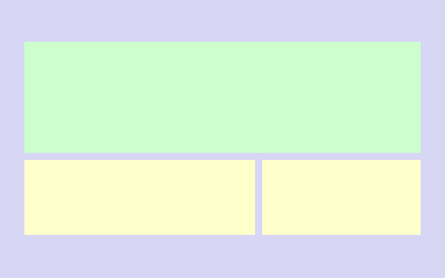
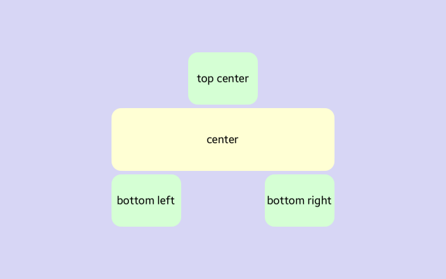
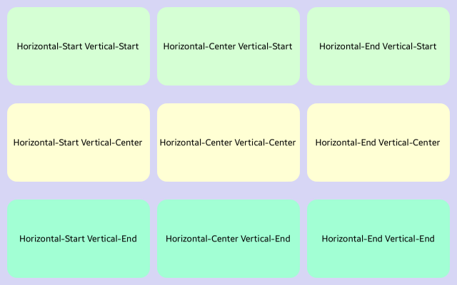
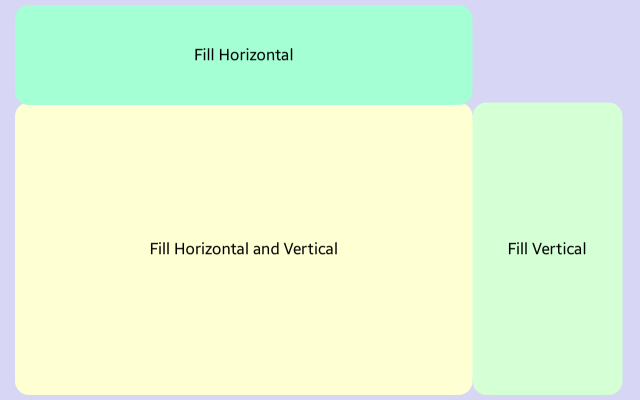

<style>
    .tabcontent img {
        border: 1px solid #555;
        max-width: 100% !important;
        max-height: 100%;
    }
</style>


# RelativeLayout 

`RelativeLayout` is a layout that displays views in the relative positions to the parent or the sibling view. This layout allows a UI creating that scales proportionally across various devices size.



## Targets and offsets

### Target

`RelativeLayout` can set a child's sides of the layout. These corners can relate to sibling view or parent view, in where the parent's view is a default value for every child's target.

| Property | Description  |
| --- | --- |
| `LeftTarget` | Sets or gets a left target of a view |
| `RightTarget` | Sets or gets a right target of a view |
| `TopTarget` | Sets or gets a top target of a view |
| `BottomTarget` | Sets a bottom target a view |


### Offsets

RelativeLayout can set relative offset regarding each target. For each relative offset, an offset value is always set to sides parent view sides, which in results the view is always by default displayed at a left top corner of the parent view.

| Property | Description |
| --- | --- |
| `LeftRelativeOffset` | Gets or sets a left target of a view |
| `RightRelativeOffset` | Gets or sets a right target of a view |
| `TopRelativeOffset` | Gets or sets a top target of a view |
| `BottomRelativeOffset` | Gets or sets a bottom target a view |

There is a possibility to add an element with its predefined size. In the case of **width** is needed to set right and left relative offset to the same value where a top left corner of a view should be displayed. In the case of **height**, the problem is similar but it's needed to set the top and bottom relative offsets to the same value.

The following example shows how to place the targets between the siblings in `RelativeLayout` and shows how to set up the view with a predefined size and how to set up targets between view's.



<div id="TabSection1">
    <div class="sampletab " id="ProjectCreateTab">
        <button id="RelativeLayout-Targets-Offsets-CSharp" class="tablinks " onclick="openTabSection(event, 'RelativeLayout-Targets-Offsets-CSharp', 'TabSection1') ">C#</button>
        <button id="RelativeLayout-Targets-Offsets-Xaml" class="tablinks " onclick="openTabSection(event, 'RelativeLayout-Targets-Offsets-Xaml', 'TabSection1') ">Xaml</button>
    </div>
    <div id="RelativeLayout-Targets-Offsets-CSharp" class="tabcontent">
        <table>
            <tbody>
                <tr>
<span style="display:block">

```csharp
View relativeLayoutView = new View
{
Layout = new RelativeLayout(),
    WidthSpecification = LayoutParamPolicies.MatchParent,
    HeightSpecification = LayoutParamPolicies.MatchParent,
    BackgroundColor = new Color("#D7D6F5FF")
};

Button center = new Button
{
    WidthSpecification = 640,
    HeightSpecification = 180,
    BackgroundColor = new Color("#FFFFD4FF"),
    Text = "center",
    TextColor = Color.Black,
    Margin = new Extents(0, 0, 10, 10)
};

relativeLayoutView.Add(center);
RelativeLayout.SetLeftRelativeOffset(center, 0.25f);
RelativeLayout.SetRightRelativeOffset(center, 0.25f);
RelativeLayout.SetTopRelativeOffset(center, 0.375f);
RelativeLayout.SetBottomRelativeOffset(center, 0.375f);

Button topCenter = new Button
{
    WidthSpecification = 200,
    HeightSpecification = 150,
    BackgroundColor = new Color("#D5FFD4FF"),
    Text = "top center",
    TextColor = Color.Black,
};

relativeLayoutView.Add(topCenter);
RelativeLayout.SetLeftTarget(topCenter, center);
RelativeLayout.SetRightTarget(topCenter, center);
RelativeLayout.SetTopTarget(topCenter, center);
RelativeLayout.SetBottomTarget(topCenter, center);
RelativeLayout.SetLeftRelativeOffset(center, 0.343f);
RelativeLayout.SetRightRelativeOffset(center, 0.343f);
RelativeLayout.SetTopRelativeOffset(center, -0.75f);
RelativeLayout.SetBottomRelativeOffset(center, -0.75f);

Button bottomLeft = new Button
{
    WidthSpecification = 200,
    HeightSpecification = 150,
    BackgroundColor = new Color("#D5FFD4FF"),
    Text = "bottom left",
    TextColor = Color.Black,
};

relativeLayoutView.Add(bottomLeft);
RelativeLayout.SetLeftTarget(bottomLeft, center);
RelativeLayout.SetRightTarget(bottomLeft, center);
RelativeLayout.SetTopTarget(bottomLeft, center);
RelativeLayout.SetBottomTarget(bottomLeft, center);
RelativeLayout.SetTopRelativeOffset(bottomLeft, 1.0f);
RelativeLayout.SetBottomRelativeOffset(bottomLeft, 1.0f);

Button bottomRight = new Button
{
    WidthSpecification = 200,
    HeightSpecification = 150,
    BackgroundColor = new Color("#D5FFD4FF"),
    Text = "bottom right",
    TextColor = Color.Black,
};

relativeLayoutView.Add(bottomRight);
RelativeLayout.SetLeftTarget(bottomRight, center);
RelativeLayout.SetRightTarget(bottomRight, center);
RelativeLayout.SetTopTarget(bottomRight, center);
RelativeLayout.SetBottomTarget(bottomRight, center);
RelativeLayout.SetLeftRelativeOffset(bottomRight, 0.6875f);
RelativeLayout.SetRightRelativeOffset(bottomRight, 0.6875f);
RelativeLayout.SetTopRelativeOffset(bottomRight, 1.0f);
RelativeLayout.SetBottomRelativeOffset(bottomRight, 1.0f);
```

</span>
                </tr>
            </tbody>
        </table>
    </div>
    <div id="RelativeLayout-Targets-Offsets-Xaml" class="tabcontent">
        <table>
            <tbody>
                <tr>
<span style="display:block">

```xml
<View WidthSpecification="-1"
    HeightSpecification="-1"
    BackgroundColor="#D7D6F5FF">

    <View.Layout>
        <RelativeLayout />
    </View.Layout>
    
    <Button x:Name="center"
        WidthSpecification="640"
        HeightSpecification="180"
        BackgroundColor="#FFFFD4FF"
        Text="center"
        TextColor="Black"
        RelativeLayout.LeftRelativeOffset="0.25"
        RelativeLayout.RightRelativeOffset="0.25"
        RelativeLayout.TopRelativeOffset="0.375"
        RelativeLayout.BottomRelativeOffset="0.375"
        Margin="0,0,10,10"/>

    <Button WidthSpecification="200"
        HeightSpecification="150"
        Text="top center"
        TextColor="Black"
        BackgroundColor="#D5FFD4FF"
        RelativeLayout.LeftTarget="center"
        RelativeLayout.RightTarget="center"
        RelativeLayout.TopTarget="center"
        RelativeLayout.BottomTarget="center"
        RelativeLayout.LeftRelativeOffset="0.343"
        RelativeLayout.RightRelativeOffset="0.343"
        RelativeLayout.TopRelativeOffset="-0.75"
        RelativeLayout.BottomRelativeOffset="-0.75"/>

    <Button WidthSpecification="200"
        HeightSpecification="150"
        Text="bottom left"
        TextColor="Black"
        BackgroundColor="#D5FFD4FF"
        RelativeLayout.LeftTarget="center"
        RelativeLayout.RightTarget="center"
        RelativeLayout.TopTarget="center"
        RelativeLayout.BottomTarget="center"
        RelativeLayout.TopRelativeOffset="1.0"
        RelativeLayout.BottomRelativeOffset="1.0"/>

    <Button WidthSpecification="200"
        HeightSpecification="150"
        BackgroundColor="#D5FFD4FF"
        Text="bottom right"
        TextColor="Black"
        RelativeLayout.LeftTarget="center"
        RelativeLayout.RightTarget="center"
        RelativeLayout.TopTarget="center"
        RelativeLayout.BottomTarget="center"
        RelativeLayout.LeftRelativeOffset="0.6875"
        RelativeLayout.RightRelativeOffset="0.6875"
        RelativeLayout.TopRelativeOffset="1.0"
        RelativeLayout.BottomRelativeOffset="1.0"/>

</View>
```

</span>
                </tr>
            </tbody>
        </table>
    </div>
</div>


## Alignment

`Alignment` handles how the layout items are positioned at a container created by targets and their offsets. By default, vertical and horizontal alignment are always aligned to **Start**.

<table>
    <thead>
        <tr>
            <th>Property</th>
            <th>Alignment</th>
            <th>Description</th>
        </tr>
    </thead>
    <tbody>
        <tr>
            <td rowspan=3><code>HorizontalAlignment<br>VerticalAlignment</code></td>
            <td><code>Begin</code></td>
            <td>At the left or right edge of the container, according to Left to Right (LTR) or Right to Left (RTL) direction for horizontal orientation</td>
        </tr>
        <tr>
            <td><code>End</code></td>
            <td>At the left or right edge of the container, according to Left to Right (LTR) or Right to Left (RTL) direction for horizontal orientation</td>
        </tr>
        <tr>
            <td><code>Center</code></td>
            <td>Center of RelativeLayout container</td>
        </tr>
    </tbody>
</table>

The following example shows how the property alignment works with the RelativeLayout. In this case, by default, every sibling's offsets are set to parent bounds.




<div id="TabSection1">
    <div class="sampletab " id="ProjectCreateTab">
        <button id="RelativeLayout-Alignment-CSharp" class="tablinks " onclick="openTabSection(event, 'RelativeLayout-Targets-Offsets-CSharp', 'TabSection1') ">C#</button>
        <button id="RelativeLayout-Alignment-Xaml" class="tablinks " onclick="openTabSection(event, 'RelativeLayout-Alignment-Xaml', 'TabSection1') ">Xaml</button>
    </div>
    <div id="RelativeLayout-Alignment-CSharp" class="tabcontent">
        <table>
            <tbody>
                <tr>
<span style="display:block">

```csharp
Color relatviveLayoutBgColor = new Color("D7D6F5FF");

var buttonsList = new Button[9];
var buttonsAligments = new[]
{
    (RelativeLayout.Alignment.Start, RelativeLayout.Alignment.Start),
    (RelativeLayout.Alignment.Start, RelativeLayout.Alignment.Center),
    (RelativeLayout.Alignment.Start, RelativeLayout.Alignment.End),
    (RelativeLayout.Alignment.Center, RelativeLayout.Alignment.Start),
    (RelativeLayout.Alignment.Center, RelativeLayout.Alignment.Center),
    (RelativeLayout.Alignment.Center, RelativeLayout.Alignment.End),
    (RelativeLayout.Alignment.End, RelativeLayout.Alignment.Start),
    (RelativeLayout.Alignment.End, RelativeLayout.Alignment.Center),
    (RelativeLayout.Alignment.End, RelativeLayout.Alignment.End)
};

var buttonsText = new[]
{
    "Horizontal-Start Vertical-Start",
    "Horizontal-Start Vertical-Center",
    "Horizontal-Start Vertical-End",
    "Horizontal-Center Vertical-Start",
    "Horizontal-Center Vertical-Center",
    "Horizontal-Center Vertical-End",
    "Horizontal-End Vertical-Start",
    "Horizontal-End Vertical-Center",
    "Horizontal-End Vertical-End"
};

Color[] backgroundColors = new[]
{
    new Color("#D5FFD4FF"),
    new Color("#FFFFD4FF"),
    new Color("#A2FFD4FF")
};

View relativeLayoutView = new View
{
    Layout = new RelativeLayout(),
    WidthSpecification = LayoutParamPolicies.MatchParent,
    HeightSpecification = LayoutParamPolicies.MatchParent,
    BackgroundColor = relatviveLayoutBgColor,
    Padding = new Extents(20, 20, 20, 20)
};

for (int i = 0; i < buttonsList.Length; i++)
{
    buttonsList[i] = new Button
    {
        WidthSpecification = 400,
        HeightSpecification = 220,
        Text = buttonsText[i],
        PointSize = 6,
        TextColor = Color.Black,
        BackgroundColor = backgroundColors[i%3]
    };

    relativeLayoutView.Add(buttonsList[i]);
    RelativeLayout.SetHorizontalAlignment(buttonsList[i], buttonsAligments[i].Item1);
    RelativeLayout.SetVerticalAlignment(buttonsList[i], buttonsAligments[i].Item2);
}
```

</span>
                </tr>
            </tbody>
        </table>
    </div>
    <div id="RelativeLayout-Alignment-Xaml" class="tabcontent">
        <table>
            <tbody>
                <tr>
<span style="display:block">

```xml
<View WidthSpecification="-1"
    HeightSpecification="-1"
    BackgroundColor="#D7D6F5FF"
    Padding="20,20,20,20">

    <View.Layout>
        <RelativeLayout />
    </View.Layout>

    <Button WidthSpecification="400"
        HeightSpecification="220"
        Text="Horizontal-Start Vertical-Start"
        PointSize="6"
        TextColor="Black"
        BackgroundColor="#D5FFD4FF"
        RelativeLayout.HorizontalAlignment="Start"/>

    <Button WidthSpecification="400"
        HeightSpecification="220"
        Text="Horizontal-Center Vertical-Start"                
        TextColor="Black"
        PointSize="6"
        BackgroundColor="#D5FFD4FF"
        RelativeLayout.HorizontalAlignment="Center"/>

    <Button WidthSpecification="400"
        HeightSpecification="220"
        Text="Horizontal-End Vertical-Start"
        PointSize="6"
        TextColor="Black"
        BackgroundColor="#D5FFD4FF"
        RelativeLayout.HorizontalAlignment="End"/>

    <Button WidthSpecification="400"
        HeightSpecification="220"
        Text="Horizontal-Start Vertical-Center"
        PointSize="6"
        TextColor="Black"
        BackgroundColor="#FFFFD4FF"
        RelativeLayout.HorizontalAlignment="Start"
        RelativeLayout.VerticalAlignment="Center"/>

    <Button WidthSpecification="400"
        HeightSpecification="220"
        Text="Horizontal-Center Vertical-Center"
        PointSize="6"
        TextColor="Black"
        BackgroundColor="#FFFFD4FF"
        RelativeLayout.HorizontalAlignment="Center"
        RelativeLayout.VerticalAlignment="Center"/>

    <Button WidthSpecification="400"
        HeightSpecification="220"
        Text="Horizontal-End Vertical-Center"
        PointSize="6"
        TextColor="Black"
        BackgroundColor="#FFFFD4FF"
        RelativeLayout.HorizontalAlignment="End"
        RelativeLayout.VerticalAlignment="Center"/>

    <Button WidthSpecification="400"
        HeightSpecification="220"
        Text="Horizontal-Start Vertical-End"
        PointSize="6"
        TextColor="Black"
        BackgroundColor="#A2FFD4FF"
        RelativeLayout.HorizontalAlignment="Start"
        RelativeLayout.VerticalAlignment="End"/>

    <Button WidthSpecification="400"
        HeightSpecification="220"
        Text="Horizontal-Center Vertical-End"
        PointSize="6"
        TextColor="Black"
        BackgroundColor="#A2FFD4FF"
        RelativeLayout.HorizontalAlignment="Center"
        RelativeLayout.VerticalAlignment="End"/>

    <Button WidthSpecification="400"
        HeightSpecification="220"
        Text="Horizontal-End Vertical-End"
        PointSize="6"
        TextColor="Black"
        BackgroundColor="#A2FFD4FF"
        RelativeLayout.HorizontalAlignment="End"
        RelativeLayout.VerticalAlignment="End"/>

</View>
```

</span>
                </tr>
            </tbody>
        </table>
    </div>
</div>


## Fill

RelativeLayout can fill the bounded container with the content of the view. It is possible to fill the container horizontally and vertically using the properties `FillHorizontal`/`FillVertical`. To fill control with the predefined size is needed to change property `WidthSpecification`/`HeightSpecification` to value **WrapContent or -2**.

The following example shows how filling works with the views constrained size by the properties `WidthSpecification`/`HeightSpecification` or `RelativeLayout` offsets. 

<!-- The center view is filled vertically and horizontally to the already set offsets bounds. The top view is adjoined to the bottom target  -->



<div id="TabSection1">
    <div class="sampletab " id="ProjectCreateTab">
        <button id="RelativeLayout-Fill-CSharp" class="tablinks " onclick="openTabSection(event, 'RelativeLayout-Fill-CSharp', 'TabSection1') ">C#</button>
        <button id="RelativeLayout-Fill-Xaml" class="tablinks " onclick="openTabSection(event, 'RelativeLayout-FIll-Xaml', 'TabSection1') ">Xaml</button>
    </div>
    <div id="RelativeLayout-Fill-CSharp" class="tabcontent">
        <table>
            <tbody>
                <tr>
<div markdown="1">

```csharp
 View relativeLayotuView = new View
{
    Layout = new RelativeLayout(),
    WidthSpecification = LayoutParamPolicies.MatchParent,
    HeightSpecification = LayoutParamPolicies.MatchParent,
    BackgroundColor = new Color("#D7D6F5FF"),
    Padding = new Extents(30, 30, 10, 10)
};

Button center = new Button
{
    WidthSpecification = LayoutParamPolicies.WrapContent,
    HeightSpecification = LayoutParamPolicies.WrapContent,
    Text = "Fill Horizontal and Vertical",
    TextColor = Color.Black,
    BackgroundColor = new Color("#FFFFD4FF")
};

relativeLayotuView.Add(center);
RelativeLayout.SetRightRelativeOffset(center, 0.75f);
RelativeLayout.SetTopRelativeOffset(center, 0.25f);
RelativeLayout.SetFillHorizontal(center, true);
RelativeLayout.SetFillVertical(center, true);

Button top = new Button
{
    WidthSpecification = LayoutParamPolicies.WrapContent,
    HeightSpecification = 200,
    Text = "Fill Horizontal and Vertical",
    TextColor = Color.Black,
    BackgroundColor = new Color("#A5FFD4FF")
};

relativeLayotuView.Add(top);
RelativeLayout.SetBottomTarget(top, center);
RelativeLayout.SetRightRelativeOffset(top, 0.75f);
RelativeLayout.SetFillHorizontal(top, true);

Button right = new Button
{
    WidthSpecification = 300,
    HeightSpecification = LayoutParamPolicies.WrapContent,
    Text = "Fill Horizontal and Vertical",
    TextColor = Color.Black,
    BackgroundColor = new Color("#D5FFD4FF")
};

relativeLayotuView.Add(right);
RelativeLayout.SetLeftTarget(right, center);
RelativeLayout.SetLeftRelativeOffset(right, 1.0f);
RelativeLayout.SetRightRelativeOffset(right, 1.0f);
RelativeLayout.SetTopRelativeOffset(right, 0.25f);
RelativeLayout.SetFillVertical(right, true);
```

</div>
                </tr>
            </tbody>
        </table>
    </div>
    <div id="RelativeLayout-Fill-Xaml" class="tabcontent">
        <table>
            <tbody>
                <tr>
                    <span style="display:block">

```xml
<View WidthSpecification="-1"
    HeightSpecification="-1"
    BackgroundColor="#D7D6F5FF"
    Padding="30,30,10,10">

    <View.Layout>
        <RelativeLayout />
    </View.Layout>

    <Button x:Name="center"
        WidthSpecification="-2"
        HeightSpecification="-2"
        Text="Fill Horizontal and Vertical"
        TextColor="Black"
        BackgroundColor="#FFFFD4FF"
        RelativeLayout.RightRelativeOffset="0.75"
        RelativeLayout.TopRelativeOffset="0.25"
        RelativeLayout.FillHorizontal="True"
        RelativeLayout.FillVertical="True"/>

    <Button x:Name="top"
        WidthSpecification="-2"
        HeightSpecification="200"
        Text="Fill Horizontal"
        TextColor="Black"
        BackgroundColor="#A5FFD4FF"
        RelativeLayout.SetBottomTarget="center"
        RelativeLayout.RightRelativeOffset="0.75"
        RelativeLayout.FillHorizontal="True"/>

    <Button x:Name="right"
        WidthSpecification="300"
        HeightSpecification="-2"
        Text="Fill Vertical"
        TextColor="Black"
        BackgroundColor="#D5FFD4FF"
        RelativeLayout.SetLeftTarget="center"
        RelativeLayout.LeftRelativeOffset="1.0"
        RelativeLayout.RightRelativeOffset="1.0"
        RelativeLayout.TopRelativeOffset="0.25"
        RelativeLayout.FillVertical="True"/>

</View>
```

</span>
                </tr>
            </tbody>
        </table>
    </div>
</div>

## Related Information
- Dependencies
  - Tizen 6.5 and Higher

<script>
    function openTabSection(evt, profileName, sectionId) {
        var i, tabcontent, tablinks, section;
        let selected = 0;

        section = document.getElementById(sectionId);
        tabcontent = section.getElementsByClassName("tabcontent");

        for (i = 0; i < tabcontent.length; i++) {
            tabcontent[i].style.display = "none";
            if (tabcontent[i].id == profileName) {
                selected = i;
            }
        }

        tablinks = section.getElementsByClassName("tablinks");

        for (i = 0; i < tablinks.length; i++) {
            tablinks[i].className = tablinks[i].className.replace(" active", "");
        }

        tabcontent[selected].style.display = "block";
        evt.currentTarget.className += " active";
    }

    document.getElementById("RelativeLayout-Alignment-CSharp").click();
    document.getElementById("RelativeLayout-Fill-CSharp").click();
    document.getElementById("RelativeLayout-Targets-Offsets-CSharp").click();
</script>
