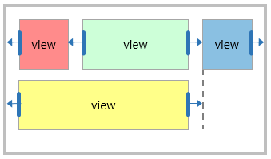

# Relative layout

The `RelativeLayout` is a layout class, in which each side of children can be specified as relative to sibling view or parent.

The `Target` and the `RelativeOffset` properties are used to define a relationship with each other. The following figure shows the relative layout position rectangles with `Target` and `RelativeOffset`. The arrows in the preview indicate where the `LeftTarget` and the `RightTarget` is pointing.

When the `Target` and the `RelativeOffset` properties are set as default, the child `RedRect` is aligned to the left side of the parent layout. The `BlueRect` is aligned to the right side of the parent layout by the `HorizontalAlignment`. The left side of `GreenRect` is set to be aligned with `RedRect` and the right side is set to be aligned with `BlueRect`. It fills the space between `RedRect` and `BlueRect` by using `FillHorizontal`. The `YellowRect` represents that each side can be set sibling view and parent layout:

**Figure 1: Preview of relative layout example with `Target` and `RelativeOffset`**



```xaml
<View x:Name="Parent">
    <View.Layout>
        <RelativeLayout/>
    </View.Layout>

    <View x:Name="RedRect"   BackgroundColor="1,0,0,1" WidthSpecification="100" HeightSpecification="100"/>
    <View x:Name="GreenRect"  BackgroundColor="0,1,0,1" HeightSpecification="100"
          RelativeLayout.LeftTarget ="RedRect" RelativeLayout.RightTarget="BlueRect" RelativeLayout.FillHorizontal="true"
          RelativeLayout.LeftRelativeOffset="1.0"/>
    <View x:Name="BlueRect"  BackgroundColor="0,0,1,1" WidthSpecification="100" HeightSpecification="100"
          RelativeLayout.RightRelativeOffset="1.0" RelativeLayout.LeftRelativeOffset="1.0"
          RelativeLayout.HorizontalAlignment="End"/>
    <View x:Name="YellowRect"  BackgroundColor="1,1,0,1" HeightSpecification="100"
          RelativeLayout.LeftTarget ="Parent" RelativeLayout.RightTarget="BlueRect" RelativeLayout.FillHorizontal="true"/>
</View>
```

Since the children of relative layout are laid out depending on their relationship, you can create a responsive UI that keeps the proportions across different screen resolutions without modifications.
The width of `RedRect` and `BlueRect` is set as `100` by specifying the `WidthSpecification` property. However, the width of `GreenRect` and `YellowRect` is resized within the layout space that is set by the `LeftTarget` and `RightTarget`:

**Figure 2: Preview of Figure 1 on different screen resolution**


The following table describes the properties of `RelativeLayout`:

| Property               | Type            | Description  |
| -----------------------| --------------- | ------------ |
| `LeftTarget`           | View            | Gets or sets the target that the child's left side will refer to.|
| `RightTarget`          | View            | Gets or sets the target that the child's right side will refer to.|
| `TopTarget`            | View            | Gets or sets the target that the child's top side will refer to.|
| `BottomTarget`         | View            | Gets or sets the target that the child's bottom side will refer to.|
| `LeftRelativeOffset`   | float           | Gets or sets the relative offset for the left target. <br /> When the value is `0`, the left edges of the left target and child view are aligned.<br/> When the value is `1`, the left edge of the child view is aligned to the right edge of the left target. |
| `RightRelativeOffset`  | float           | Gets or sets the relative offset for the right target. <br /> When the value is `0`, the right edge of the child view is aligned to the left edge of the right target.<br/> When the value is `1`, the right edges of the right target and child view are aligned.
| `TopRelativeOffset`    | float           | Gets or sets the relative offset for the top target. <br /> When the value is `0`, the top edges of the top target and child view are aligned.<br/> When the value is `1`, the top edge of the child view is aligned to the bottom edge of the top target.
| `BottomRelativeOffset` | float           | Gets or sets the relative offset for the bottom target. <br /> When the value is `0`, the bottom edge of the child view is aligned to the top edge of the bottom target.<br/>When the value is `1`, the bottom edges of the bottom target and child view are aligned.
| `HorizontalAlignment`  | RelativeLayout.Alignment| Gets or sets the horizontal alignment of the child view.|
| `VerticalAlignment`  | RelativeLayout.Alignment| Gets or sets the vertical alignment of the child view.|
| `FillHorizontal`  | bool | Gets or sets the boolean value. It indicates whether or not the child fills its horizontal space.|
| `FillVertical`  | bool | Gets or sets the boolean value. It indicates whether or not the child fills its vertical space.|

## Layout space of the child view

 The `Target` and the `RelativeOffset` properties determine the size of the layout space. The `Target` Property indicates the target view in which each edge of the layout space is aligned. The default value is `null`, which refers to the parent's relative layout.

The `RelativeOffset` moves each edge of layout space in proportion to the target view size:
- If the value is `0.0f`, the edge of the layout space is aligned with the left or top edge of the target view.
- If the value is `1.0f`, the edge of the layout space is aligned with the right or bottom edge of the target view:


## Alignment

 The `HorizontalAlignment` and the `VerticalAlignment` properties describe how to align the child's view with the layout space. The default value is `Start` for both axes:
 |Start|Center|End|
 |:---:|:---:|:---:|
 ||||

## Fill

 The `FillHorizontal` and the `FillVertical` properties are specified by boolean values. These boolean values specify whether or not to fill the layout space. The default is `false` for both axes:
 |false|true|
 |:---:|:---:|
 |||

## Related information

- Dependencies
  -  Tizen 6.5 and Higher
