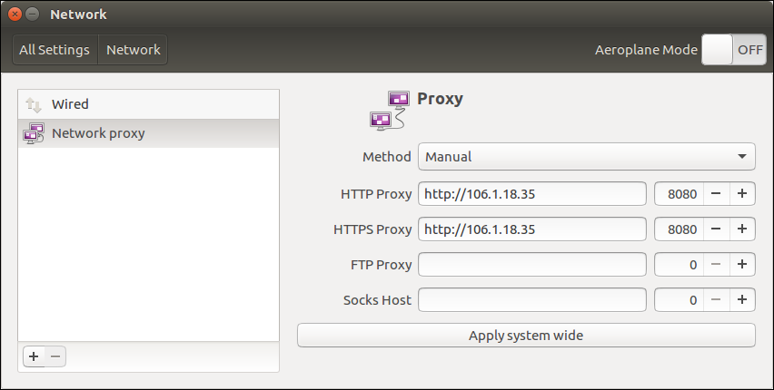

# Setting Up the NUI Development Environment on Ubuntu

This topic explains how to setup, build, and run NUI (DALi C\#) applications using Visual Studio Code (VSC). It assumes that the starting point is a completely 'clean' system, though that is not essential.

VSC can be installed on Ubuntu 14.04 and onwards.

The [NUI Hello World tutorial](hello-world.md) is used as an example. It provides an introduction into NUI application development, describing how to display text in a text label.

<a name="install"></a>
## Installing .NET Core and Visual Studio Code

To install .NET Core and Visual Studio Core (VSC):

1.  [Install .NET Core for Ubuntu](https://www.microsoft.com/net/core#linuxubuntu).
2.  Install the latest version of Visual Studio Code for Ubuntu:
    1.  Download the Debian package from <https://code.visualstudio.com>.
    2.  Install the package:

        ```
        $ sudo dpkg -i code_1.10.2xXXXXXXXXXX_amd64.deb
        ```

3.  <a name="launch_vsc"></a>Launch VSC:
    -   Launching VSC through the icon:
        1.  In the desktop launcher, select **Search your Computer &gt; Applications** for the Visual Studio Code icon.
        2.  Select the **Launch** button to open VSC.
        3.  Optionally, copy the VSC icon to the launcher, so you can start VSC by double-clicking the icon in the launcher.
    -   Launching VSC from the terminal:

        ```
        $ code // Launch VSC
        $ code  // Launch VSC in current directory
        $ code myfile // Open file in VSC
        ```

4.  Set the firewall proxy settings.

    VSC requires installation of required packages and libraries. It can be necessary to [configure the firewall proxy settings](#firewall) to enable HTTP download.

5.  Install C\# extension in the VSC **Extensions** view:

    1.  Bring up the **Extensions** view by clicking the **Extensions** icon in the Activity Bar, or by pressing **Ctrl + Shift + X**. This brings up all the extensions in the VS code marketplace.
    2.  Type "C\#" to filter the selection.
    3.  Click **Install** next to the C\# extension. After a successful install, click **Reload** to restart VSC.

    Alternatively, you can install the C\# extension through the [Visual Studio Marketplace](https://marketplace.visualstudio.com).

6.  Familiarize yourself with VSC by building the "Hello World" application. For more information, see [Get Started with C\# and Visual Studio Code](https://docs.microsoft.com/en-us/dotnet/csharp/getting-started/with-visual-studio-code).

<a name="getsrc"></a>
## Getting the NUI Source Code

To get the NUI source code from Git:

1.  Create a NUI root folder for the source code. The following example uses `~/DALiNUI`.

    ```
    $ mkdir ~/DALiNUI
    $ cd ~/DALiNUI
    ```

2.  Get the source code from GitHub:

    ```
    $ git clone git@github.com:dalihub/dali-core
    $ git clone git@github.com:dalihub/dali-adaptor
    $ git clone git@github.com:dalihub/dali-csharp-binder
    $ git clone git@github.com:dalihub/dali-toolkit
    $ git clone git@github.com:dalihub/nui
    ```

3.  Switch to the `devel/master` branch for each required repository, for example, for `dali-core`:

    ```
    $ cd ~/DALiNUI/dali-core
    $ git checkout devel/master
    ```

<a name="buildenv"></a>
## Setting Up the NUI Build Environment

To set up the NUI build environment and save the settings to a file:

```
$ cd ~/DALiNUI
$ dali-core/build/scripts/dali_env -c
$ dali-env/opt/bin/dali_env -s > setenv
$ . setenv
```

The above process only needs to be done once.

You must source your environment variables every time you open up a new terminal (or you can add them to `.bashrc`). You can do this by sourcing the `setenv` script you created above:

```
$ . setenv
```

<a name="buildsrc"></a>
## Building the NUI Source Code

To build the NUI source code:

1.  Build the DALi native repositories in the following order, following instructions in the `README` file in each repository folder:

    1.  Build `dali-core`.
    2.  Build `dali-adaptor`.
    3.  Build `dali-toolkit`.

    The shared library files (`.so`) are built and installed into the `~/DALiNUI/dali-env/opt/lib` folder.

2.  Optionally, run and test DALi Native (C++):

    1.  Get the code. This step requires the `dali_demo` repository.
    2.  Build from the README file (see the Building the Repository section).
    3.  Run `dali-demo`.

    ```
    $ git clone git@github.com:dalihub/dali-demo
    $ cd ~/DALiNUI/dali-demo
    $ git checkout devel/master

    // Build from README

    $ cd ~/DALiNUI/dali-env/opt/bin
    $ dali-demo
    ```

    If the test is successful, the DALi demo window appears.

3.  Change to the NUI C\# bindings folder:

    ```
    $ cd dali-csharp-binder
    ```

4.  Build the NUI C\# bindings:

    ```
        $ autoreconf --install
        $ ./configure --prefix=$DESKTOP_PREFIX
        $ make install -j8
    ```

5.  Copy the `nui` source folder to a new `nuirun` subfolder (for subsequent overwriting of files):

    ```
        $ cd ~/DALiNUI
        $ mkdir nuirun
        $ cp -r nui/Tizen.NUI/src nuirun
    ```

6.  Copy/overwrite 2 NUI files in `~/DALiNUI/nuirun/src/public`:

    1.  Download [CoreApplication.cs](NUIsetup/CoreApplication.cs).
    2.  Download [NUIApplication.cs](NUIsetup/NUIApplication.cs).
    3.  Place the files in your `nuirun/src/public` folder (overwrite the existing `NUIApplication.cs` file).

    Replacing the above 2 files is necessary, as NUI in Ubuntu is not fully supported just yet (as of July 2017).

7.  To subsequently clean the build (if required), see [Cleaning the Build](#buildclean).

<a name="buildrun"></a>
## Building and Running the Hello World Tutorial

To build and run the Hello World (NUI) tutorial:

1.  Create the tutorial file:

    1.  Copy the example code from the [NUI Hello World tutorial](hello-world.md) to a new file, `hello-world.cs`.
    2.  Create a `tutorials` folder.
    3.  Copy `hello-world.cs` to the `nuirun/tutorials` folder:

        ```
        $ mkdir tutorials
        $ cp hello-world.cs ~/DALiNUI/nuirun/tutorials
        ```

2.  Create a Hello World project in VSC:
    1.  [Launch VSC](#launch_vsc).
    2.  Select **File &gt; Open Folder** in the main menu.
    3.  Select the `nuirun` folder in the File dialog.
    4.  Open the command prompt by pressing **Ctrl + \`** (backtick).
    5.  In the VSC integrated terminal, enter the following commands:

        ```
        $ cd ~/DALiNUI
        $ . setenv
        $ cd ~/DALiNUI/nuirun
        $ dotnet new console
        ```

        The `setenv` is not necessary, if [the environment has been set up](#buildenv) in your `.bashrc`.

        The `dotnet new console` line creates a project, with a project file `nuirun.csproj` and a `Program.cs` file.

    6.  Delete `Program.cs` in VSC Explorer, as it is not needed.
    7.  Modify the project file by editing `nuirun.csproj`, adding the following line inside the `PropertyGroup` element:

        ```
        <DefineConstants>DOT_NET_CORE</DefineConstants>
        ```

3.  Restore the dependencies and tools of the project:

    ```
    $ dotnet restore
    ```

    Running `dotnet restore` gives you access to the required .NET Core packages that are needed to build your project.

4.  Configure VSC by creating a `tasks.json` file.

    Press **Ctrl + Shift + P** to open the command palette, type `ctr`, and select **Configure Task runner &gt; NET core**.

    A `tasks.json` file is essential, to prevent "No task runner configured" or "Error Could not find the Pre Launch Task 'build'" errors from occurring when building.

5.  Build the project:

    ```
    $ dotnet build
    ```

    > **Note**   
	> This step builds the `nui` library.

     

    The screenshot shows the key files associated with the "Hello World" project in VSC Explorer.

6.  Copy the shared library to the application runtime location (this step must be done after the build step, when the `bin` folder exists):

    ```
    cp dali-env/opt/lib/libdali-csharp-binder.so ~/DALiNUI/nuirun/bin/Debug/netcoreapp1.1/
    ```

7.  Run the project:
    -   To run the full size application in the VSC integrated terminal:

        ```
        $ dotnet run
        ```

    -   To run the adjusted size application in the VSC integrated terminal:

        ```
        $ DALI_WINDOW_WIDTH=600 DALI_WINDOW_HEIGHT=800 dotnet run
        ```

### Modifying the Hello World Application Window Size

You can configure the application Launch profile.

In VSC Explorer, open the `launch.json` file. In the **Configurations** section, add the required width and height to the environment variable:

```
"name": ".NET Core Launch (console)",

"env": {
    "DALI_WINDOW_WIDTH":"600",
    "DALI_WINDOW_HEIGHT":"800"
},
```

These settings are picked up if the application is run with F5.

<a name="firewall"></a>
## Configuring Firewall Proxy Settings

To configure the firewall proxy settings:

-   To set up the system firewall proxy settings to enable installing the VSC C\# extension package:

    1.  On the desktop, select **System Settings &gt; Network &gt; Network Proxy**.
    2.  In the **HTTP Proxy** and **HTTPS Proxy** fields, enter the IP address, including the port number.

    

-   To configure the VSC firewall proxy settings for installing library packages, such as mono runtime and .NET Core Debugger:

    1.  Select **File &gt; Preferences &gt; Settings &gt; Edit**.
    2.  Select **HTTP** in the middle pane.
    3.  Select **Edit &gt; Copy to settings**.

        The `http.proxy` is copied to the right hand pane. Add the proxy setting:

        ```
        {
            "http.proxy": "http://xxx.xxx.xxx.xxx:xxxx
        }
        ```

        The proxy settings are saved to the `settings.json` file.

        

        The screenshot shows the installed C\# extension package, with the proxy settings for the library packages in the `settings.json` file.

    Alternatively, you can set the `http_proxy` and `https_proxy` OS environment variables in a terminal from which VSC is run:

    ```
    $ export http_proxy=http://xxx.xxx.xxx.xxx
    $ export https_proxy=http://xxx.xxx.xxx.xxx
    ```

    These export variables must also be set in your `.bashrc` file.

<a name="buildclean"></a>
## Cleaning the Build

To clean the NUI build:

```
$ make maintainer-clean
```
