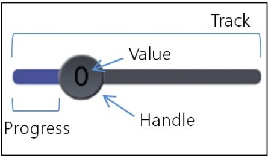

# Slider

The slider is a control used to indicate a value within a specific range. You can drag a handle to either left or right to set the current value between a specified minimum and maximum. The base class for the slider control is `Slider`.

**Figure: Slider**



In this tutorial, the following subjects are covered:

[Slider events](#1)<br>
[Creating a Slider](#2)<br>
[Customizing the Slider Appearance](#3)<br>

## Overview

The slider has two important elements, such as the following:

- The handle is the indicator sliding within the range.

  You can draw the handle using the `HandleVisual` property.

- The track is the bar along which the handle moves.

  The slider draws the track using two distinct images. The region between the start of the track and the handle is the progress region. You can draw the region using the `ProgressVisual` property. The region between the handle and the end of the track is drawn using the `TrackVisual` property.

<a name="1"></a>
## Slider events

The following table lists the basic signals provided by the `Slider` class.

**Table: Dali::Toolkit::Slider input signals**

| Input signal      | Description                              |
| ----------------- | ---------------------------------------- |
| `ValueChanged`    | Emitted when the slider value changes.   |
| `SlidingFinished` | Emitted when the sliding is finished.    |
| `MarkReached`     | Emitted when the slider handle reaches a mark. |

<a name="2"></a>
## Creating a Slider

The following basic example illustrates how to create a `Slider` object:

```
// Create a Slider instance
Window window = Window.Instance;
Slider slider = new Slider();
slider.BackgroundColor = new Color(1, 1, 0, 1);
slider.Position = new Position(0, windowHeight * 0.2, 0);
slider.PivotPoint = PivotPoint.TopLeft;
slider.Size2D = new Size2D(100, 100);
window.Add(slider);
```

<a name="3"></a>
## Customizing the Slider Appearance

The slider provides a set of default images, which are used automatically, if nothing else is specified by you.

If you want to customize the slider appearance, you can assign your own images using the `PropertyMap` class. You can set the size and image of the track, handle, progress region, popup, and popup arrow.


## Related Information
- Dependencies
  -   Tizen 4.0 and Higher
