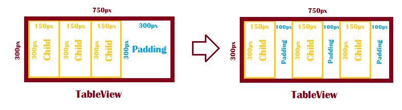

# TableView

The [TableView](https://samsung.github.io/TizenFX/latest/api/Tizen.NUI.BaseComponents.TableView.html) class is a layout container for aligning child actors in a grid like layout.
Based on `TableView` and child's size, child's X and Y position are defined. 

In case the sum of children's width in a row is lower than the width of `TableView`, then the children are positioned with equal padding. Analogous rule are used when the sum of children's height in a column is lower than the height of `TableView`:

**Figure: TableView behaviour in case of row underflow**



The Z position and depth are left intact, so that the three-dimensional model actors can also be laid out in a grid without losing their depth scaling.

## Create a TableView

The following example illustrates how to create a `TableView` object:

**Figure: TableView example**


1.  To use the `TableView` class, add the following namespaces:

    ```csharp
    using Tizen.NUI;
    using Tizen.NUI.BaseComponents;
    ```

2.  To Create `TableView` as the whole view, set the resize policy to `FillToParent`. Add `TextLabel`s as cells of `TableView`:

    ```csharp
    // Create a TableView instance
    TableView tableView = new TableView(4, 4);
    tableView.WidthResizePolicy = ResizePolicyType.FillToParent;
    tableView.HeightResizePolicy = ResizePolicyType.FillToParent;

    for (uint row = 0; row < 4; ++row)
      {
        for (uint col = 0; col < 4; ++col)
          {
            TextLabel textLabel = new TextLabel(row + "." + col);
            textLabel.Size2D = new Size2D(150, 250);
            textLabel.BackgroundColor = Color.White;
            tableView.AddChild(textLabel, new TableView.CellPosition(row, col));
          }
      }
    Window.Instance.Add(tableView);
    ```

## TableView Properties

The following table lists the available `TableView` properties:

**Table: TableView properties**

| Property        | Type         | Description                        |
|-----------------|--------------|------------------------------------|
| `Rows`          | Integer      | The amount of rows in the table.    |
| `Columns`       | Integer      | The amount of columns in the table. |
| `CellPadding`   | Vector2      | Padding between the cells.              |
| `LayoutRows`    | PropertyMap  | The number of layout rows.          |
| `LayoutColumns` | PropertyMap  | The number of layout columns.       |


## Related Information
- Dependencies
  -   Tizen 4.0 and Higher
