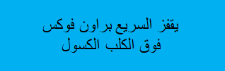

# Text

There are three Text components to display and edit text on the screen:

- The [TextLabel](#textLabel) displays a short text string.

- The [TextField](#textField) is to edit a single line text.

- The [TextEditor](#textEditor) is to edit multi-line text.

<a name="textLabel"></a>
## TextLabel

The `TextLabel` is a class that displays a short text string. `Tizen.NUI.BaseComponents` namespace contains the class.

The `TextLabel` class is lightweight, non-editable, and do not respond to user input. Text labels support multiple languages and scripts including right-to-left scripts such as Arabic. For more information on how to display a text using a text label, see [NUI Hello World Tutorial](../../get-started/nui/quickstart.md).

**Figure: Text label positioned to top left**


<a name="create"></a>
### Create TextLabel

To create a text label:

1.  Create an instance of the [Tizen.NUI.BaseComponents.TextLabel](https://samsung.github.io/TizenFX/latest/api/Tizen.NUI.BaseComponents.TextLabel.html) class and define the label text as a parameter:

    ```csharp
    Window window = Window.Instance;
    TextLabel label = new TextLabel("Hello World");
    window.Add(label);
    ```

    You can also create the `Tizen.NUI.BaseComponents.TextLabel` class instance separately and define the label text by setting its `Text` property:

    ```csharp
    TextLabel label = new TextLabel();
    label.Text = "Hello World";
    ```

    > [!CAUTION]
    > To display the label properly, the `Text` property must be a UTF-8 string. Any `CR+LF` new line characters are replaced by `LF`.

2.  Define the label position on-screen with the `ParentOrigin` property of the `Tizen.NUI.BaseComponents.TextLabel` class:

    ```csharp
    TextLabel label = new TextLabel("Hello World");
    label.ParentOrigin = ParentOrigin.TopLeft;
    ```


<a name="font"></a>
### Set Font of TextLabel

You can request a specific font using the `FontFamily`, the `FontStyle`, and the `PointSize` properties of the [Tizen.NUI.BaseComponents.TextLabel](https://samsung.github.io/TizenFX/latest/api/Tizen.NUI.BaseComponents.TextLabel.html) class:

-   `FontFamily` is a string with the font family name, such as `FreeSerif`.
-   `FontStyle` is a JSON-formatted string with the font style. The following list describes some possible keys and common values for them:
    -   The `width` key defines the spacing between glyphs. Some commonly-used values include `condensed`, `semiCondensed`, `normal`, `semiExpanded`, and `expanded`.
    -   The `weight` key defines the thickness or darkness of the glyphs. Some commonly-used values include `thin`, `light`, `normal`, `regular`, `medium`, and `bold`.
    -   The `slant` key defines whether to use italics. Some commonly-used values include `normal`, `roman`, `italic`, and `oblique`.

        > [!NOTE]
        > Usually `italic` is a separate font, while `oblique` is generated by applying a slant to the `normal` font.


-   `PointSize` is a type `float`. To calculate the point size from the height in pixels, use the following formula, where `vertical_dpi` is the vertical resolution of a device in dots per inch:

    ```csharp
    point_size = 72 * pixels / vertical_dpi;
    ```

The following example code specifies the font properties:

```csharp
label.FontFamily = "FreeSerif";

PropertyMap fontStyle = new PropertyMap();
fontStyle.Add("weight", new PropertyValue("bold"));
fontStyle.Add("slant", new PropertyValue("italic"));
label.FontStyle = fontStyle;
label.PointSize = 12.0f;
```

If no font is specified, default styles are used, and a suitable font for displaying the text label is automatically selected from the platform. However, the automatically-selected font may not render all the characters contained within the text label. For example, Latin fonts often do not provide Arabic glyphs.

### Set Font Styles of TextLabel

Setting a font size programmatically is not ideal for applications that support multiple screen resolutions, and for platforms that support multiple logical font sizes. In addition, making systemwide changes to your font settings override the font sizes that have been programmatically set.

A more flexible approach is to prepare various JSON stylesheets and request a different style for each platform. The [Tizen.NUI.NUIApplication](https://samsung.github.io/TizenFX/latest/api/Tizen.NUI.NUIApplication.html) class has constructors that take a stylesheet argument:

```csharp
class Example : NUIApplication

Example example = new Example("example-path/example.json");
```

To change the font style for standard text controls, use the following JSON syntax:

```csharp
{
   "styles":
   {
      "textlabel":
      {
         "fontFamily": "FreeSerif",
         "fontStyle":
         {
            "weight": "bold",
            "slant": "italic"
         },
         "pointSize": 8
      }
   }
}
```

However, the same `pointSize` is unlikely to be suitable for all text controls in an application. To define custom styles for existing controls, set a style name for each case, and provide a style override in a JSON stylesheet.

You can provide further flexibility for the various screens by mapping the logical size to a physical size in the stylesheet.

<a name="align"></a>
### Align Text in TextLabel

To align the text in a text label:

-   To enable text wrapping, use the `MultiLine` property of the [Tizen.NUI.BaseComponents.TextLabel](https://samsung.github.io/TizenFX/latest/api/Tizen.NUI.BaseComponents.TextLabel.html) class:

    ```csharp
    label.MultiLine = true;
    ```

-   To align the text horizontally to the beginning, center, or end of the available area, set the `HorizontalAlignment` property of the `Tizen.NUI.BaseComponents.TextLabel` class with the corresponding value of the [Tizen.NUI.HorizontalAlignment](https://samsung.github.io/TizenFX/latest/api/Tizen.NUI.HorizontalAlignment.html) enumeration:

    ```csharp
    label.HorizontalAlignment = HorizontalAlignment.Begin;
    label.HorizontalAlignment = HorizontalAlignment.Center;
    label.HorizontalAlignment = HorizontalAlignment.End;
    ```

    The following table summarizes the available values of the `Tizen.NUI.HorizontalAlignment` enumeration for both left-to-right (Latin) and right-to-left (Arabic) script. In addition, for the illustrated examples, it is assumed that the label size is greater than the minimum required size:

    |  Alignment  | Left-to-right script example    |      Right-to-left script example |
    |-------------|---------------------------------|-----------------------------------|
    |  `Begin` |    |   |
    |`Center` |   |  |
    | `End`   |   |    |


<a name="decorations"></a>
### Use Decorations for TextLabel

For text decorations, the [Tizen.NUI.BaseComponents.TextLabel](https://samsung.github.io/TizenFX/latest/api/Tizen.NUI.BaseComponents.TextLabel.html) class provides several properties. All the properties are editable and none of them are animatable:


| Property    |    Type |      Description |
|-------------|---------|------------------|
| `Text` |  String |     Specifies the text to display in UTF-8 format.|
| `FontFamily` | String |   Specifies the requested font family. |
|  `FontStyle` |  PropertyMap |      Specifies the requested font style. |
|  `MultiLine` |  Boolean  |     Specifies whether or not to use the multi-line layout option.  |
|  `HorizontalAlignment` | HorizontalAlignment | Specifies the horizontal line alignment. |
|  `VerticalAlignment` | VerticalAlignment | Specifies the vertical line alignment. |
| `TextColor`  |   Color |  Specifies the color of the text. |
|  `ShadowOffset` | Vector2 |  Specifies the shadow offset of the text. |
|  `ShadowColor` | Vector4  |  Specifies the shadow color of the text. |
| `UnderlineEnabled` | Boolean |  Specifies whether or not to use underline.  |
| `UnderlineColor` | Vector4 | Specifies the underline color of the text. |
| `UnderlineHeight` |  Float |  Specifies the height of the underline. |
|  `EnableMarkup` |  Boolean |  Specifies whether to enable or disable the markup string to process text within the markup tags using DALi application.<br>**Note**: By default, the markup string is disabled. |
| `EnableAutoScroll` |  Boolean | Specifies whether to enable or disable the auto scrolling. |
| `AutoScrollSpeed` | Integer  | Specifies the scrolling speed in pixels per second.  |
| `AutoScrollLoopCount` | Integer |    Specifies the number of complete loops to scroll, when scrolling is enabled. |
| `AutoScrollGap` | Float |   Specifies the gap before scrolling wraps. |
| `LineSpacing` |   Float | Specifies the default spacing between lines in points. |
|  `Underline` |   PropertyMap |  Specifies the default underline parameters. |
| `Shadow` | PropertyMap |      Specifies the default shadow parameters. |
|  `Emboss` |  String  |         Specifies the default emboss parameters. |
| `Outline` |  PropertyMap  |         Specifies the default outline parameters. |
| `PixelSize` |  Float  |       Specifies the size of font in pixels. |
| `Ellipsis` |   Boolean |      Specifies whether to enable or disable ellipsis, if required. |
| `AutoScrollLoopDelay` | Float |   Specifies the auto-scroll loop delay. |
| `AutoScrollStopMode` | AutoScrollStopMode | Specifies the auto-scroll stop mode.  |


To use the text-decoration, set the applicable property:

-   To change the color of the text, use the `TextColor` property:

    ```csharp
    label.Text = "Red Text";
    label.TextColor = Color.Red;
    ```

    **Figure: Colored text**

    

-   To add a drop shadow to the text, set the `Shadow` property:

    ```csharp
    window.BackgroundColor(Color.Blue);

    label1.Text = "Text with Shadow";
    PropertyMap shadow = new PropertyMap();
    shadow.Add("offset", new PropertyValue("1 1"));
    shadow.Add("color", new PropertyValue("black"));
    label1.Shadow = shadow;

    label2.Text = "Text with Bigger Shadow";
    PropertyMap shadow = new PropertyMap();
    shadow.Add("offset", new PropertyValue("2 2"));
    shadow.Add("color", new PropertyValue("black"));
    label2.Shadow = shadow;

    label3.Text = "Text with Color Shadow";
    PropertyMap shadow = new PropertyMap();
    shadow.Add("offset", new PropertyValue("1 1"));
    shadow.Add("color", new PropertyValue("red"));
    label3.Shadow = shadow;
    ```

    **Figure: Text with drop shadow (top), bigger shadow (middle), and color shadow (bottom)**

    

    

    

    Shadow parameters can also be set using a JSON string.

-   To underline the text label, set the `Underline` property:

    ```csharp
    label1.Text = "Text with Underline";

    PropertyMap textStyle = new PropertyMap();
    textStyle.Add("enable", new PropertyValue("true"));
    label1.Underline = textStyle;
    ```

    By default, the underline height is based on the font metrics. For example, the following text figures are in one pixel height:

    **Figure: Text with underline**

    

    You can set the underline color and height using a property map:

    ```csharp
    label2.Text = "Text with Color Underline";

    PropertyMap textStyle = new PropertyMap();
    textStyle.Add("enable", new PropertyValue("true"));
    textStyle.Add("color", new PropertyValue(Color.Green));
    textStyle.Add("height", new PropertyValue(2.0f)); /// 2-pixel height
    label2.Underline = textStyle;
    ```

    **Figure: Text with colored underline**

    


<a name="scrolling"></a>
-   To enable text scrolling, set the `EnableAutoScroll` property to `true`:

    ```csharp
    label.EnableAutoScroll = true;
    ```

    After scrolling is enabled, scrolling continues until the loop count is reached or `EnableAutoScroll` is set to `false`. When `EnableAutoScroll` is set to `false`, the text completes its current scrolling loop before it stops scrolling.

    **Figure: Auto-scrolling text**

    

    Auto-scrolling enables text to scroll within the text table. You can use it to show the full content if the text exceeds the boundary of the control. You can also scroll text that is smaller than the control. To ensure that the same part of the text is not visible in more than one place at the same time, you can configure the gap between repetitions. The left-to-right text always scrolls left and the right-to-left text always scrolls right.

    You can set the scroll speed, gap, and loop count in the stylesheet or using the following properties:

    -   `AutoScrollSpeed` property defines the scrolling speed in pixels per second.
    -   `AutoScrollLoopCount` property specifies the number of times the text completes a full scroll cycle. For example, if this property is set to `3`, the text scrolls across the control three times and then stops. If this property is set to `0`, the text scroll continues until `EnableAutoScroll` is set to `false`.
        - If `EnableAutoScroll` is set to `false`, the text stops to scroll and maintains the original loop count value for the next start.
    -   `AutoScrollGap` property specifies the amount of whitespace in pixels. The whitespace gets displayed before the scrolling text appears again. This gap automatically increases, if the given value is not large enough to prevent the same part of the text from appearing twice at the same time.

    Auto-scrolling does not work with multi-line text; it is shown with the `Begin` alignment instead.

<a name="markup"></a>
### Use Markup Styling to Style TextLabel

You can use markup elements to change the style of the text. Since the text controls do not process markup elements by default, you must first set the `EnableMarkup` property of the [Tizen.NUI.BaseComponents.TextLabel](https://samsung.github.io/TizenFX/latest/api/Tizen.NUI.BaseComponents.TextLabel.html) class to `true`:

```csharp
TextLabel label = new TextLabel("Hello World");
label.EnableMarkup = true;
```

> [!NOTE]
> The markup processor does not check for markup validity, and styles are rendered in priority order. Incorrect or incompatible elements can cause the text to be rendered incorrectly.

The following markup elements are currently supported:

-   `<color>`

    Sets the color for the characters inside the element. Use the `value` attribute to define the color. The supported attribute values are `red`, `green`, `blue`, `yellow`, `magenta`, `cyan`, `white`, `black`, and `transparent`. Web colors and colors represented in 32-bit hexadecimal `0xAARRGGBB` format are also supported.

    The following examples show text in red color:

    ```csharp
    label.Text = "<color value='red'>Red Text</color>"; /// Color coded with a text constant
    ```

    ```csharp
    label.Text = "<color value='0xFFFF0000'>Red Text</color>"); /// Color packed inside an ARGB hexadecimal value
    ```

-   `<font>`

    Sets the font values for the characters inside the element.

    The following attributes are supported:

    -   `family`: Font name
    -   `size`: Font size in points
    -   `weight`: Font weight
    -   `width`: Font width
    -   `slant`: Font slant

    For more information on the attribute values, see [Select Font](#font).

    The following example sets the font family and weight:

    ```csharp
    label.Text = "<font family='SamsungSans' weight='bold'>Hello world</font>";
    ```


<a name="textField"></a>
## TextField

The `TextField` class provides a control that allows single line editable text field.

**Figure: TextField**


<a name="textField1"></a>
### TextField Events

The following table lists the basic signals provided by the `TextField` class:


| Input signal        | Description                                 |
| ------------------- | ------------------------------------------- |
| `TextChanged`       | Emitted when the text changes.              |
| `MaxLengthReached`  | Emitted when the inserted text exceeds the maximum character limit. |

<a name="textField2"></a>
### Create TextField

Before the text is entered, the `TextField` class displays a placeholder text. An alternative placeholder is displayed when `TextField` gets the keyboard focus. For example, the `TextField` that is used to enter a username initially displays the text `Unknown Name` and then the text `Enter Name`, when the cursor is visible.

The following example illustrates the creation of a `TextField` object:

```csharp
Window window = Window.Instance;
TextField field = new TextField();
PropertyMap propertyMap = new PropertyMap();
propertyMap.Add("placeholderText", new PropertyValue("Unknown Name"));
propertyMap.Add("placeholderTextFocused", new PropertyValue("Enter Name."));
field.Placeholder = propertyMap;
window.Add(field);
```

When the `TextField` is tapped, it automatically gets the keyboard focus. Key events correspond to entering the text. Additionally, the placeholder text is removed as soon as the text is entered. The text entered can be retrieved by using the `TEXT` property:

```csharp
Property::Value fieldText = field.GetProperty( TextField::Property::TEXT );
std::string fieldTextString = fieldText.Get< std::string >();
```

<a name="textField3"></a>
### Align Text in TextField

The `TextField` class displays a single line of text that scrolls in either of the following case:

-  If there is not enough space for the text to get displayed.

-  If there is enough space, the text is aligned horizontally to the beginning, end, or center of the available area.

The following example illustrates text alignment:

```csharp
// Begin, Center, or End
field.HorizontalAlignment = HorizontalAlignment.Begin;
```

<a name="textField4"></a>
### TextField Properties

To change the look and feel of the text and text related elements, use the `TextField` properties.

### Use Decorations for TextField

For text decorations, the following [Tizen.NUI.BaseComponents.TextField](https://samsung.github.io/TizenFX/latest/api/Tizen.NUI.BaseComponents.TextField.html) class properties are available. All properties are editable and none of them are animatable:


| Property                           | Type        | Description                              |
| ---------------------------------- | ----------- | ---------------------------------------- |
| `Text`                             | String      | Specifies the text to display in UTF-8 format.     |
| `PlaceholderText`                  | String      | Specifies the text to display when the `TextField` is empty and inactive. |
| `PlaceholderTextFocused`           | String      | Specifies the text to display when the `TextField` is empty with key-input focus. |
| `FontFamily`                       | String      | Specifies the requested font family.               |
| `FontStyle`                        | PropertyMap | Specifies the requested font style.                |
| `PointSize`                        | Float       | Specifies the size of font in points.              |
| `MaxLength`                        | Integer     | Specifies the maximum number of characters that can be inserted. |
| `ExceedPolicy`                     | Integer     | Specifies how the text is truncated when it does not fit. |
| `HorizontalAlignment`              | HorizontalAlignment | Specifies the horizontal line alignment.   |
| `VerticalAlignment`                | VerticalAlignment   | Specifies the vertical line alignment.     |
| `TextColor`                        | Color       | Specifies the color of the text.                          |
| `PlaceholderTextColor`             | Vector4     | Specifies the color of the placeholder text.               |
| `PrimaryCursorColor`               | Vector4     | Specifies the color that is applied to the primary cursor.  |
| `SecondaryCursorColor`             | Vector4     | Specifies the color that is applied to the secondary cursor.   |
| `EnableCursorBlink`                | Boolean     | Specifies whether to enable or disable the cursor blink.      |
| `CursorBlinkInterval`              | Float       | Specifies the time interval in seconds between the cursor on or off states. |
| `CursorBlinkDuration`              | Float       | Specifies the time duration in seconds after which the cursor stops blinking. |
| `CursorWidth`                      | Integer     | Specifies the width of the cursor.                        |
| `GrabHandleImage`                  | String      | Specifies the image to display for the grab handle. |
| `GrabHandlePressedImage`           | String      | Specifies the image to display when the grab handle is pressed. |
| `ScrollThreshold`                  | Float       | Specifies whether the horizontal scrolling will occur, if the cursor is closer to the control border. |
| `ScrollSpeed`                      | Float       | Specifies the scroll speed in pixels per second.   |
| `SelectionHandleImageLeft`         | PropertyMap | Specifies the display image used for the left selection handle.  |
| `SelectionHandleImageRight`        | PropertyMap | Specifies the display image used for the right selection handle. |
| `SelectionHandlePressedImageLeft`  | PropertyMap | Specifies the display image used when the left handle is pressed. |
| `SelectionHandlePressedImageRight` | PropertyMap | Specifies the display image used when the right handle is pressed. |
| `SelectionHandleMarkerImageLeft`   | PropertyMap | Specifies the display image used for left selection handle marker.  |
| `SelectionHandleMarkerImageRight`  | PropertyMap | Specifies the display image used for right selection handle marker.  |
| `SelectionHighlightColor`          | Vector4     | Specifies the selected highlight color.     |
| `DecorationBoundingBox`            | Rectangle   | Specifies the position of decoration such as handles and so on within the on-screen area. |
| `InputMethodSettings`              | PropertyMap | Specifies the settings related to the System Input Method, Key, and Value.  |
| `InputColor`                       | Vector4     | Specifies the color of the new input text.         |
| `EnableMarkup`                     | Boolean     | Specifies whether to enable or disable the markup string to process text within the markup tags using DALi application.<br>**Note**: By default, the markup string is disabled.  |
| `InputFontFamily`                  | String      | Specifies the font family of the new input text. |
| `InputFontStyle`                   | PropertyMap | Specifies the font style of the new input text.  |
| `InputPointSize`                   | Float       | Specifies the font size of the new input text in points. |
| `Underline`                        | PropertyMap | Specifies the default underline parameters.        |
| `InputUnderline`                   | String      | Specifies the underline parameters of the new input text. |
| `Shadow`                           | PropertyMap | Specifies the default shadow parameters.            |
| `InputShadow`                      | String      | Specifies the shadow parameters of the new input text. |
| `Emboss`                           | String      | Specifies the default emboss parameters.         |
| `InputEmboss`                      | String      | Specifies the emboss parameters of the new input text. |
| `Outline`                          | PropertyMap | Specifies the default outline parameters.          |
| `InputOutline`                     | String      | Specifies the outline parameters of the new input text. |
| `HiddenInputSettings`              | PropertyMap | Specifies hiding the input characters and showing default character for the password or pin entry. |
| `PixelSize`                        | Float       | Specifies the size of font in pixels.              |
| `EnableSelection`                  | Boolean     | Specifies whether to enable or disable text selection.                   |
| `Placeholder`                      | PropertyMap | Specifies the attributes of the `Placeholder` property. The attributes of this property are text, color, font family, font style, point size, and pixel size. |
| `Ellipsis`                         | Boolean     | Specifies whether to enable or disable ellipsis, if required.  |
| `TranslatablePlaceholderText`      | String      | Specifies the `TranslatablePlaceholderText` property that sets the SID value.  |
| `TranslatableText`                 | String      | Specifies the `TranslatableText` property that sets the SID value. |


<a name="textEditor"></a>
## TextEditor

The `TextEditor` class provides a control that allows multi-line text editing. It is similar to the [TextField](#textField) control, where different formatting can be applied to different parts of the text. For example, you can change the font color, font style, point size, and font family.

The `TextEditor` also supports markup, and text can be scrolled vertically within it.

**Figure: TextEditor**


<a name="textEditor1"></a>
### TextEditor Events

The following table lists the basic signals provided by the `TextEditor` class:


| Input signal         | Description                              |
| -------------------- | ---------------------------------------- |
| `TextChanged`        | Emitted when the text changes.           |
| `ScrollStateChanged` | Emitted when TextEditor scrolling is started or finished. |

<a name="textEditor2"></a>
### Create TextEditor

The following example shows how to create a `TextEditor` object:

```csharp
// Create a TextEditor instance
Window window = Window.Instance;
TextEditor editor = new TextEditor();
editor.Position2D = new Position2D(10, 700);
editor.Size2D = new Size2D(400, 90);
editor.BackgroundColor = Color.Red;
editor.PointSize = 20;
editor.TextColor = Color.White;
editor.Text = "This is a multiline text.\n I can write several lines.\n"
window.Add(editor);
```

<a name="textEditor3"></a>
### TextEditor Properties

You can modify the `TextEditor` appearance and behavior using its properties.

The following table lists the available [Tizen.NUI.BaseComponents.TextEditor](https://samsung.github.io/TizenFX/latest/api/Tizen.NUI.BaseComponents.TextEditor.html) properties:


| Property                           | Type        | Description                              |
| ---------------------------------- | ----------- | ---------------------------------------- |
| `Text`                             | String      | Specifies the text to display in UTF-8 format.      |
| `TextColor`                        | Vector4     | Specifies the color of the text.                           |
| `FontFamily`                       | String      | Specifies the requested font family.                |
| `FontStyle`                        | PropertyMap | Specifies the requested font style.                 |
| `PointSize`                        | Float       | Specifies the size of font in points.               |
| `HorizontalAlignment`              | HorizontalAlignment | Specifies the horizontal line alignment.            |
| `ScrollThreshold`                  | Float       | Specifies whether the horizontal scrolling will occur, if the cursor is closer to the control border. |
| `ScrollSpeed`                      | Float       | Specifies the scroll speed in pixels per second.    |
| `PrimaryCursorColor`               | Vector4     | Specifies the color that is applied to the primary cursor. |
| `SecondaryCursorColor`             | Vector4     | Specifies the color that is applied to the secondary cursor. |
| `EnableCursorBlink`                | Boolean     | Specifies whether to enable or disable the cursor blink.   |
| `CursorBlinkInterval`              | Float       | Specifies the time interval in seconds between cursor on or off states. |
| `CursorBlinkDuration`              | Float       | Specifies the time duration in seconds after which the cursor stops blinking. |
| `CursorWidth`                      | Integer     | Specifies the width of the cursor.                         |
| `GrabHandleImage`                  | String      | Specifies the display image used for the grab handle. |
| `GrabHandlePressedImage`           | String      | Specifies the display image used when the grab handle is pressed. |
| `SelectionHandleImageLeft`         | PropertyMap | Specifies the display image used for the left selection handle.  |
| `SelectionHandleImageRight`        | PropertyMap | Specifies the display image used for the right selection handle. |
| `SelectionHandlePressedImageLeft`  | PropertyMap | Specifies the display image used when the left handle is pressed.  |
| `SelectionHandlePressedImageRight` | PropertyMap | Specifies the display image used when the right handle is pressed. |
| `SelectionHandleMarkerImageLeft`   | PropertyMap | Specifies the display image used for the left selection handle marker. |
| `SelectionHandleMarkerImageRight`  | PropertyMap | Specifies the display image used for the right selection handle marker. |
| `SelectionHighlightColor`          | Vector4     | Specifies the selected highlight color.     |
| `DecorationBoundingBox`            | Rectangle   | Specifies the position of decoration such as handles and so on within the on-screen area.|
| `EnableMarkup`                     | Boolean     | Specifies whether to enable or disable the markup string to process text within the markup tags using DALi application.<br>**Note**: By default, the markup string is disabled. |
| `InputColor`                       | Vector4     | Specifies the color of the new input text.          |
| `InputFontFamily`                  | String      | Specifies the font family of the new input text.  |
| `InputFontStyle`                   | PropertyMap | Specifies the font style of the new input text.   |
| `InputPointSize`                   | Float       | Specifies the font size of the new input text in points. |
| `LineSpacing`                      | Float       | Specifies the default extra space between lines in points. |
| `InputLineSpacing`                 | Float       | Specifies the extra space between lines in points.  |
| `Underline`                        | PropertyMap | Specifies the default underline parameters.         |
| `InputUnderline`                   | String      | Specifies the underline parameters of the new input text. |
| `Shadow`                           | PropertyMap | Specifies the default shadow parameters.            |
| `InputShadow`                      | String      | Specifies the shadow parameters of the new input text. |
| `Emboss`                           | String      | Specifies the default emboss parameters.            |
| `InputEmboss`                      | String      | Specifies the emboss parameters of the new input text. |
| `Outline`                          | PropertyMap | Specifies the default outline parameters.           |
| `InputOutline`                     | String      | Specifies the outline parameters of the new input text. |
| `SmoothScroll`                     | Boolean     | Specifies whether to enable or disable the smooth scroll animation. |
| `SmoothScrollDuration`             | Float       | Specifies the duration of smooth scroll animation. |
| `EnableScrollBar`                  | Boolean     | Specifies whether to enable or disable the scroll bar.          |
| `ScrollBarShowDuration`            | Float       | Specifies the duration of the scroll bar to show.  |
| `ScrollBarFadeDuration`            | Float       | Specifies the duration of the scroll bar to fade out. |
| `PixelSize`                        | Float       | Specifies the size of font in pixels.               |
| `LineCount`                        | Integer     | Specifies the line count of text.                   |
| `EnableSelection`                  | Boolean     | Specifies whether to enable or disable text selection.                 |
| `Placeholder`                      | PropertyMap | Specifies the attributes of the `Placeholder` property. The attributes of this property are text, color, font family, font style, point size, and pixel size. |
| `LineWrapMode`                     | LineWrapMode | Specifies the line wrap mode when text lines are greater than the layout width. |
| `TranslatablePlaceholderText`      | String      | Specifies the `TranslatablePlaceholderText` property that sets the SID value. |
| `TranslatableText`                 | String      | Specifies the `TranslatableText` property that sets the SID value. |


## Related Information
- Dependencies
  -   Tizen 4.0 and Higher