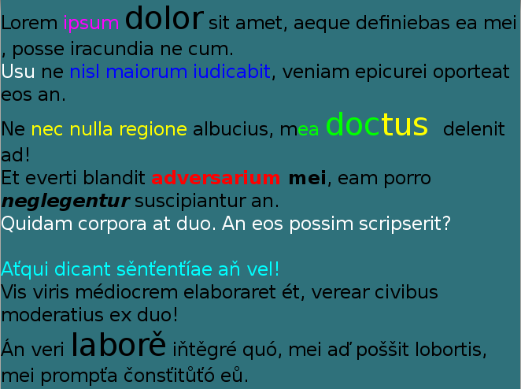

# TextEditor

The `TextEditor` class provides a control that allows multi line text editing. It is similar to the [TextField](./textfield.md) control, where a different formatting can be applied to different parts of the text. You can change, for example, the font color, font style, point size, and font family.

The `TextEditor` also supports markup, and text can be scrolled vertically within it.

**Figure: TextEditor**



In this tutorial, the following subjects are covered:

[TextEditor events](#1)<br>
[Creating a TextEditor](#2)<br>
[TextEditor Properties](#3)<br>

<a name="1"></a>
## TextEditor events

The following table lists the basic signals provided by the `TextEditor` class.

**Table: TextEditor input signals**

| Input signal         | Description                              |
| -------------------- | ---------------------------------------- |
| `TextChanged`        | Emitted when the text changes.           |
| `ScrollStateChanged` | Emitted when TextEditor scrolling is started or finished. |

<a name="2"></a>
## Creating a TextEditor

The following basic example shows how to create a `TextEditor` object:

```
// Create a TextEditor instance
Window window = Window.Instance;
TextEditor editor = new TextEditor();
editor.Position2D = new Position2D(10, 700);
editor.Size2D = new Size2D(400, 90);
editor.BackgroundColor = Color.Red;
editor.PointSize = 20;
editor.TextColor = Color.White;
editor.Text = "This is a multiline text.\n I can write several lines.\n"
window.Add(editor);
```

<a name="3"></a>
## TextEditor Properties

You can modify the `TextEditor` appearance and behavior through its properties.

The following table lists the available `TextEditor` properties.

**Table: TextEditor properties**

| Property                           | Type        | Description                              |
| ---------------------------------- | ----------- | ---------------------------------------- |
| `Text`                             | String      | The text to display in UTF-8 format.      |
| `TextColor`                        | Vector4     | The color of the text.                           |
| `FontFamily`                       | String      | The requested font family.                |
| `FontStyle`                        | PropertyMap | The requested font style.                 |
| `PointSize`                        | Float       | The size of font in points.               |
| `HorizontalAlignment`              | String      | The horizontal line alignment.            |
| `ScrollThreshold`                  | Float       | Horizontal scrolling will occur, if the cursor is closer to the control border. |
| `ScrollSpeed`                      | Float       | The scroll speed is in pixels per second.    |
| `PrimaryCursorColor`               | Vector4     | The color to apply to the primary cursor. |
| `SecondaryCursorColor`             | Vector4     | The color to apply to the secondary cursor. |
| `EnableCursorBlink`                | Boolean     | Enable or disable the cursor blink.   |
| `CursorBlinkInterval`              | Float       | The time interval in seconds between cursor on or off states. |
| `CursorBlinkDuration`              | Float       | The cursor will stop blinking after this number of seconds. |
| `CursorWidth`                      | Integer     | The width of the cursor.                         |
| `GrabHandleImage`                  | String      | The image to display for the grab handle. |
| `GrabHandlePressedImage`           | String      | The image to display when the grab handle is pressed. |
| `SelectionHandleImageLeft`         | PropertyMap | The image to display for the left selection handle. |
| `SelectionHandleImageRight`        | PropertyMap | The image to display for the right selection handle. |
| `SelectionHandlePressedImageLeft`  | PropertyMap | The image to display for the left selection handle. |
| `SelectionHandlePressedImageRight` | PropertyMap | The image to display for the right selection handle. |
| `SelectionHandleMarkerImageLeft`   | PropertyMap | The image to display for the left selection handle marker. |
| `SelectionHandleMarkerImageRight`  | PropertyMap | The image to display for the right selection handle marker. |
| `SelectionHighlightColor`          | Vector4     | The color of the selection is highlighted.     |
| `DecorationBoundingBox`            | Rectangle   | The decorations (handles etc) within the on-screen area will be positioned. |
| `EnableMarkup`                     | Boolean     | Enable the Markup string, to process text within the Markup tags using DALi application.<br>**Note**: By default, the Markup string is disabled. |
| `InputColor`                       | Vector4     | The color of the new input text.          |
| `InputFontFamily`                  | String      | The font's family of the new input text.  |
| `InputFontStyle`                   | PropertyMap | The font's style of the new input text.   |
| `InputPointSize`                   | Float       | The font's size of the new input text in points. |
| `LineSpacing`                      | Float       | The default extra space between lines in points. |
| `InputLineSpacing`                 | Float       | The extra space between lines in points.  |
| `Underline`                        | PropertyMap | The default underline parameters.         |
| `InputUnderline`                   | String      | The underline parameters of the new input text. |
| `Shadow`                           | PropertyMap | The default shadow parameters.            |
| `InputShadow`                      | String      | The shadow parameters of the new input text. |
| `Emboss`                           | String      | The default emboss parameters.            |
| `InputEmboss`                      | String      | The emboss parameters of the new input text. |
| `Outline`                          | PropertyMap | The default outline parameters.           |
| `InputOutline`                     | String      | The outline parameters of the new input text. |
| `SmoothScroll`                     | Boolean     | Enable or disable the smooth scroll animation. |
| `SmoothScrollDuration`             | Float       | Sets the duration of smooth scroll animation. |
| `EnableScrollBar`                  | Boolean     | Enable or disable the scroll bar.         |
| `ScrollBarShowDuration`            | Float       | Sets the duration of scroll bar to show.  |
| `ScrollBarFadeDuration`            | Float       | Sets the duration of scroll bar to fade out. |
| `PixelSize`                        | Float       | The size of font in pixels.               |
| `LineCount`                        | Integer     | The line count of text.                   |
| `EnableSelection`                  | Boolean     | Enable or disable Text selection.                   |
| `Placeholder`                      | PropertyMap | Sets the placeholder : text, color, font family, font style, point size, and pixel size. |
| `LineWrapMode`                     | LineWrapMode | Line wrap mode when text lines are greater than the layout width. |
| `TranslatablePlaceholderText`      | String      | The TranslatablePlaceholderText property can set the SID value. |
| `TranslatableText`                 | String      | The TranslatableText property can set the SID value. |


## Related Information
- Dependencies
  -   Tizen 4.0 and Higher
