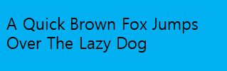

# TextLabel

`TextLabel` is a NUI control that renders a short text string. Text labels are lightweight, non-editable, and do not respond to user input. They can support multiple languages and scripts, including right-to-left scripts, such as Arabic.

The [Hello World tutorial](hello-world.md) describes how to display text using a `TextLabel`.

<a name="create"></a>
## Creating a TextLabel

A `TextLabel` must be added to a Window, or to a View which is on the Window. The position of the label on-screen is specified by the `parentOrigin` property.

```
TextLabel label = new TextLabel("Hello World");
Window window = Window.Instance;
window.Add(label);
```

The following figure shows a text label with `ParentOrigin.TopLeft`.

**Figure: `TextLabel` aligned to top left**


To display a `TextLabel` object properly, the `Text` property must be a UTF-8 string. Note that `CR+LF` new line characters are replaced by `LF`.

<a name="font"></a>
## Selecting Fonts

By default, the `TextLabel` automatically selects a suitable font from the platform. Note that the selected font may not support all characters in your input text. For example, Latin fonts often do not provide Arabic glyphs.

Alternatively, you can request a font using the `FontFamily`, `FontStyle`, and `PointSize` properties:

-   `FontFamily` is a string with the font family name, for example, "FreeSerif".
- `FontStyle` is a JSON-formatted string with the font style. The following lists some possible keys and common values for them:
    -   The `width` key defines the spacing between glyphs. Some commonly-used values include `condensed`, `semiCondensed`, `normal`, `semiExpanded`, and `expanded`.
    - The `weight` key defines the thickness or darkness of the glyphs. Some commonly-used values include `thin`, `light`, `normal`, `regular`, `medium`, and `bold`.
    - The `slant` key defines whether to use italics. Some commonly-used values include `normal` or `roman`, `italic`, and `oblique`.

        Usually `italic` is a separate font, while `oblique` is generated by slanting the `normal` font.

- `PointSize` is a float with the font size in points. To calculate the point size from the height in pixels, use the following formula, where `vertical_dpi` is the device's vertical resolution in dots per inch:

    ```
    point_size = 72 * pixels / vertical_dpi
    ```

```
label.FontFamily = "FreeSerif";

PropertyMap fontStyle = new PropertyMap();
fontStyle.Add( "weight", new PropertyValue("bold") );
fontStyle.Add( "slant", new PropertyValue("italic") );
label.FontStyle = fontStyle;
label.PointSize = 12.0f;
```

If fonts are not specified, styling defaults are used.

### Font Styles

Setting a font size programmatically is not ideal for applications which support multiple screen resolutions, and platforms which support multiple logical font sizes. Also, any changes to the platform font settings override any sizes that have been programmatically set.

A more flexible approach is to prepare various JSON stylesheets, and request a different style for each platform. The `NUIApplication` class has constructors which take a stylesheet argument:

```
class Example : NUIApplication

Example example = new Example("example-path/example.json");
```

To change the font for standard text controls, the following JSON syntax can be used:

```
{
  "styles":
  {
    "textlabel":
    {
      "fontFamily":"FreeSerif",
      "fontStyle":
      {
        "weight":"bold",
        "slant":"italic"
      },
      "pointSize":8
    }
  }
}
```

However, the same `pointSize` is unlikely to be suitable for all text controls in an application. To define custom styles for existing controls, simply set a style name for each case, and provide a style override in JSON.

Mapping the logical size to a physical size, in the stylesheet, can provide further flexibility for the end user.

<a name="align"></a>
## Aligning Text

Text wrapping can be enabled using the `MultiLine` property:

```
label.MultiLine = true;
```

The text can be aligned horizontally to the beginning, center, or end of the available area:

```
label.HorizontalAlignment = HorizontalAlignmentType.Left;
label.HorizontalAlignment = HorizontalAlignmentType.Center;
label.HorizontalAlignment = HorizontalAlignmentType.Right;
```


| Alignment | Left-to-right script example             | Right-to-left script example             |
| --------- | ---------------------------------------- | ---------------------------------------- |
| BEGIN     |  |  |
| CENTER    |  |  |
| END       |  |  |

The above examples assume that the label size is greater than the minimum required.

<a name="decorations"></a>
## Using Decorations

For text decorations, `TextLabel` provides several properties. All properties are writable and none are animatable.

**Table: TextLabel properties**

| Property              | Type               | Description                              |
| --------------------- | ------------------ | ---------------------------------------- |
| `Text`                | string             | The text to display in UTF-8 format.     |
| `FontFamily`          | string             | The requested font family to use.        |
| `FontStyle`           | Map                | The requested font style to use.         |
| `PointSize`           | float              | The font size in points.                 |
| `MultiLine`           | bool               | Whether to use the multi-line layout option. |
| `HorizontalAlignment` | string             | The line horizontal alignment.           |
| `VerticalAlignment`   | string             | The line vertical alignment.             |
| `TextColor`           | Color              | The text color.                          |
| `ShadowOffset`        | Vector2            | The text shadow offset.                  |
| `ShadowColor`         | Vector4            | The text shadow color.                   |
| `UnderlineEnabled`    | bool               | Gets/sets whether to use underline.      |
| `UnderlineColor`      | Vector4            | Gets/sets the underline color.           |
| `UnderlineHeight`     | float              | Gets/sets the underline height.          |
| `EnableMarkup`        | bool               | Whether markup processing is enabled.    |
| `EnableAutoScroll`    | bool               | Starts or stops auto-scrolling.          |
| `AutoScrollSpeed`     | int                | The scrolling speed, in pixels per second. |
| `AutoScrollLoopCount` | int                | Number of complete loops to scroll, when scrolling is enabled. |
| `AutoScrollGap`       | float              | The gap before scrolling wraps.          |
| `LineSpacing`         | float              | The default spacing between lines, in points. |
| `Underline`           | Map                | The default underline parameters.        |
| `Shadow`              | Map                | The default shadow parameters.           |
| `Emboss`              | Map                | The default emboss parameters.           |
| `Outline`             | Map                | The default outline parameters.          |
| `PixelSize`           | float              | The font size in pixels.                 |
| `Ellipsis`            | bool               | Gets/sets whether to enable ellipsis.    |
| `AutoScrollLoopDelay` | float              | Gets/sets the auto-scroll loop delay.    |
| `AutoScrollStopMode`  | AutoScrollStopMode | Gets/sets the auto-scroll stop mode.     |

### Color

To change the color of the text, use the `TextColor` property. Note that unlike the View `Color` property, this does not affect child actors added to the `TextLabel`.

```
label.Text = "Red Text";
label.TextColor = Color.Red;
```

**Figure: Colored text**


### Drop Shadow

To add a drop-shadow to the text, set the `Shadow` property. Shadow parameters can also be set through a JSON string:

```
window.BackgroundColor( Color.Blue );

label1.Text = "Plain Text";

label2.Text = "Text with Shadow";
PropertyMap shadow = new PropertyMap();
shadow.Add("offset", new PropertyValue("1 1"));
shadow.Add("color", new PropertyValue("black"));
pixelLabel.Shadow = shadow;

label3.Text = "Text with Bigger Shadow";
PropertyMap shadow = new PropertyMap();
shadow.Add("offset", new PropertyValue("2 2"));
shadow.Add("color", new PropertyValue("black"));
label3.Shadow = shadow;

label4.Text = "Text with Color Shadow" );
PropertyMap shadow = new PropertyMap();
shadow.Add("offset", new PropertyValue("1 1"));
shadow.Add("color", new PropertyValue("red"));
label4.Shadow = shadow;
```

**Figure: Text with drop shadow**


**Figure: Text with bigger shadow**


**Figure: Text with color shadow**


### Underline

Text underline properties can be set using a property map:

```
label1.Text = "Text with Underline";

PropertyMap textStyle = new PropertyMap();
textStyle.Add("enable", new PropertyValue("true"));
label1.Underline = textStyle;
```

You can set the underline color and height:

```
label2.Text = "Text with Color Underline";

PropertyMap textStyle = new PropertyMap();
textStyle.Add("enable", new PropertyValue("true"));
textStyle.Add("color", new PropertyValue(Color.Green));
label2.Underline = textStyle;
```

**Figure: Text with underline**


**Figure: Text with color underline**


By default the underline height is derived from the font metrics, however this can be overridden:

```
PropertyMap textStyle = new PropertyMap();
textStyle.Add("enable", new PropertyValue("true"));
textStyle.Add("height", new PropertyValue(2.0f)); // 2 pixel height
label1.Underline = textStyle;
```

The underline text figures above have a 1 pixel height.

<a name="scrolling"></a>
### Auto-scrolling

**Figure: Auto-scrolling text**


Auto-scrolling enables text to scroll within the `TextLabel` control. You can use it if the text exceeds the boundary of the control, to show the full content. Auto-scrolling can also scroll text that is smaller than the control. To ensure that the same part of the text is not visible more than once at the same time, you can configure the gap between repetitions.

Multi-line text does not scroll, and the text is shown with 'Begin' alignment.

The `AutoScrollLoopCount` property sets the number of times the text scrolls. For example, if `AutoScrollLoopCount` is set to 3, the text scrolls across the control 3 times, then stops. If `AutoScrollLoopCount` is 0, then once started, scrolling continues until requested to stop.

To enable text scrolling, set the `EnableAutoScroll` property to `true`:

```
label.EnableAutoScroll = true;
```

Once enabled, scrolling continues until the loop count is reached, or `EnableAutoScroll` is set to `false`. When `EnableAutoScroll` is set to `false`, the text completes its current scrolling loop before stopping.

The scroll speed, gap, and loop count can be set in the stylesheet, or through the following properties:

-   Auto-scroll speed

    The `AutoScrollSpeed` property defines the scrolling speed in pixels/second.

- Auto-scroll loop count

    `AutoScrollLoopCount` specifies how many times the text completes a full scroll cycle. If this property is 0, scrolling continues until `EnableAutoScroll` is set to `false`.

    Setting `EnableAutoScroll` to `false` stops scrolling, whilst maintaining the original loop count value for the next start.

- Auto-scroll gap

    `AutoScrollGap` specifies the amount of whitespace, in pixels, to display before the scrolling text is shown again. This gap is automatically increased if the given value is not large enough to prevent the same part of the text from being visible twice at the same time.

- Scroll Direction

    The scroll direction is defined by the following rules:

    -   Left-to-right text: Scroll left
    -   Right-to-left text: Scroll right

<a name="markup"></a>
## Using Markup Styling

You can use markup elements to change the style of the text. By default, the text controls do not process markup strings. To process markup tags, the `EnableMarkup` property must be set to `true`.

```
TextLabel label = new TextLabel("Hello World");
label.EnableMarkup = true;
Window window = Window.Instance;
window.Add(label);
```

Note that the markup processor does not check for markup validity. This can cause the text to be badly rendered.

There are priorities when styles are applied while rendering text.

The following elements are currently supported:

-   `<color>`

    Sets the color for the characters inside the tag. Use the `value` attribute to define the color. The supported attribute values are 'red', 'green', 'blue', 'yellow', 'magenta', 'cyan', 'white', 'black' and 'transparent'. Web colors and colors defined in 32-bit hexadecimal 0xAARRGGBB format are also supported.

    The following examples both create text in red:

    ```
    label.Text = "<color value='red'>Red Text</color>" ); // Color coded with a text constant
    ```

    ```
    label.Text = "<color value='0xFFFF0000'>Red Text</color>" ); // Color packed inside an ARGB hexadecimal value
    ```

- `<font>`

    Sets the font values for the characters inside the tag.

    The following attributes are supported:

    -   `family`: Font name.
    -   `size`: Font size in points.
    -   `weight`: Font weight.
    -   `width`: Font width
    -   `slant`: Font slant.

    For information on attribute values, see [Selecting Fonts](#font).

    ```
    label.Text = "<font family='SamsungSans' weight='bold'>Hello world</font>";
    ```

## Related Information
* Dependencies
  -   Tizen 4.0 and Higher
