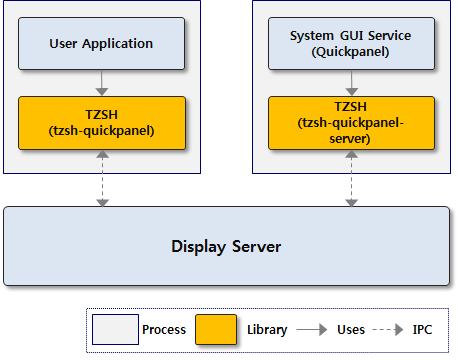

# Tizen Window System Shell
Tizen Window System Shell (TZSH) is an interface for manipulating windows of the system Graphical User Interface (GUI) services such as Quickpanel. It provides C and C# libraries that allow you to control windows of system GUI services and get notifications about the state changes of each window within an application.

The system GUI service runs different processes. Therefore, all the operations of TZSH are performed using the inter-process communication (IPC). It is needed to enable communication between the system GUI service processes and separated user application process using the display server. The following figure illustrates a simple software architecture of TZSH:



To support each system GUI service in Tizen, TZSH provides the following library:
* **[Quickpanel](./quickpanelclient.md)**: For the Quickpanel window that shows notifications and system setup widgets.
Most applications do not need to use the TZSH’s functionalities. However, in some cases, certain applications may require to perform manipulation of system GUI service window. For example, media player application needs to close the Quickpanel window during playback of video. In this case, you can use the Quickpanel client library.

## Prerequisites
To use the functions and structures of the [TZSH API](https://samsung.github.io/TizenFX/latest/api/Tizen.NUI.WindowSystem.Shell.TizenShell.html), use `Tizen.NUI.WindowSystem.Shell` in your application:
```
using Tizen.NUI.WindowSystem.Shell;
```

## Create TizenShell handle
After you have created the main window of your application, call `Shell.TizenShell()` with a window to create the handle. To create the `TizenShell` handler, use the following code:
```
public void TizenShell_INIT()
{
    try
    {
        /* Create tzsh handler */
        TizenShell tzsh = new TizenShell();
    }
    catch (NotSupportedException e)
    {
        /* Not supported catched */
        Log("NotSupportedException: device not support Quickpanel.");
    }
    catch (InvalidOperationException e)
    {
        /* InvalidOperation catched */
        Log("InvalidOperationException: device has no quickpanel service.");
    }
}
```

## Related information
- Dependencies
  - Tizen 6.0 and Higher
  - Tizen .NET SDK 1.1.5 and Higher
