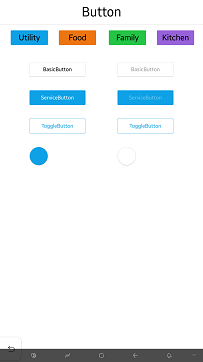
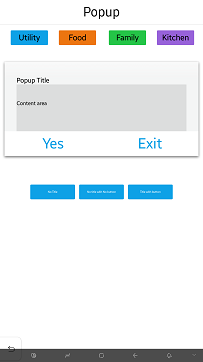

# UI Components

UI components are interactive components for layout and user interface. NUI provides UI components, such as buttons, table view, text controls, image view, flex container, slider, and video view.

**Figure: UI components**

 

The following table lists the available UI components:

**Table: UI components**

| Control                              | Description                              | Related classes                          |
| ------------------------------------ | ---------------------------------------- | ---------------------------------------- |
| [Button](./nui-components/Button.md) | A button that can set action when user select it. | `Button`                |
| [CheckBox](./nui-components/CheckBox.md) | A CheckBox that can set selected or unselected status when user selects it. | `CheckBox`                |
| [ImageView](./imageview.md)          | An image view is a class for displaying an image resource.   | `ImageView`                   |
| [Loading](./nui-components/Loading.md) | A loading is used to give information about the ongoing operations. | `Loading`                |
| [LottieAnimationView](./nui-components/LottieAnimationView.md) | A LottieAnimationView is used to show a vector animation. | `LottieAnimationView`                |
| [Notification](./nui-components/Notification.md) | A notification is used to pop-up a notification window with a content view. | `Notification`                |
| [Pagination](./nui-components/Pagination.md) | A Pagination is used to show the number of pages available and the currently active page. | `Pagination`                |
| [Popup](./nui-components/Popup.md) | A popup is used as a popup window. | `Popup`                |
| [Progress](./nui-components/Progress.md) | A progress is used to show the ongoing status using a long narrow bar. | `Progress`                |
| [RadioButton](./nui-components/RadioButton.md) | A RadioButton that can set selected or unselected status when user selects it. | `RadioButton`                |
| [ScrollableBase](./nui-components/ScrollableBase.md) | A ScrollableBase that can support scrolling. | `ScrollableBase`                   |
| [Slider](./nui-components/Slider.md) | A slider that indicates a modifiable value within a specific range. | `Slider`                   |
| [Switch](./nui-components/Switch.md) | A switch that can be used as a selector. | `Switch`                |
| [Tab](./nui-components/Tab.md) | A tab is easy to explore and switch between different views. | `Tab`                |
| [TableView](./tableview.md)          | A table view that can align child actors in a grid like layout. | `TableView`             |
| [Text](./text.md)                    | A text that renders a short text string and provides a editable text. | `TextLabel`, `TextField`, `TextEditor`  |
| [Toast](./nui-components/Toast.md) | A toast is used to provide simple messages. | `Toast`                |
| [VideoView](./videoview.md)          | A video view that controls and displays video playback. | `VideoView`                 |
| [WebView](./webview.md)          | A web view for showing web content. | `WebView`                 |

The base class for the components is `View`. This class can also be used to create your own custom UI components. For more information on the view class, see [View](./view.md). In this UI Components guide, both the terms **control** and **component** are used to refer to a UI component.

You can [customize the look of the UI components with stylesheets](./styling-controls-with-xaml.md). For a reusable rendering logic that can be used by all UI components, take advantage of [visuals](./visuals.md).

## Related Information
- Dependencies
  -   Tizen 4.0 and Higher
