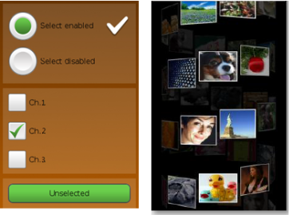

# UI Components

UI components are interactive components for layout and scrolling the user interface. NUI provides UI components, such as buttons, scroll view, table view, text controls, image view, flex container, slider, and video view.

**Figure: UI components**

The following table lists the available UI components:

**Table: UI components**

| Control                              | Description                              | Related classes                          |
| ------------------------------------ | ---------------------------------------- | ---------------------------------------- |
| [Buttons](./button.md)               | The Button class is a base class for different kinds of buttons. | `Button`, `PushButton`, `CheckBoxButton`, `RadioButton`, `ToggleButton` |
| [FlexContainer](./flexcontainer.md)  | A FlexContainer implements a subset of the flexbox spec. | `FlexContainer`              |
| [ImageView](./imageview.md)          | An image view is a class for displaying an image resource.   | `ImageView`                   |
| [ScrollView](./scrollview.md)        | A scroll view contains views that can be scrolled manually. | `ScrollView`, `Scrollable`, `ScrollViewEffect`, `ScrollViewPagePathEffect` |
| [Slider](./slider.md)                | A slider that indicates a modifiable value within a specific range. | `Slider`                   |
| [TableView](./tableview.md)          | A table view that can align child actors in a grid like layout. | `TableView`             |
| [TextLabel](./textlabel.md)          | A text label that renders a short text string. | `TextLabel`                |
| [TextField](./textfield.md)          | A text field that provides a single line editable text. | `TextField`                 |
| [TextEditor](./texteditor.md)        | A text editor that provides a multi line editable text. | `TextEditor`                |
| [VideoView](./videoview.md)          | A video view that controls and displays video playback. | `VideoView`                 |

The base class for the components is `View`. This class can also be used to create your own custom UI components. For more information on the view class, see [View](./view.md). In this UI Components guide, both the terms **control** and **component** are used to refer to a UI component.

You can [customize the look of the UI components with stylesheets](./styling-controls-with-JSON.md). For a reusable rendering logic that can be used by all UI components, take advantage of [visuals](./visuals.md).

## Related Information
- Dependencies
  -   Tizen 4.0 and Higher